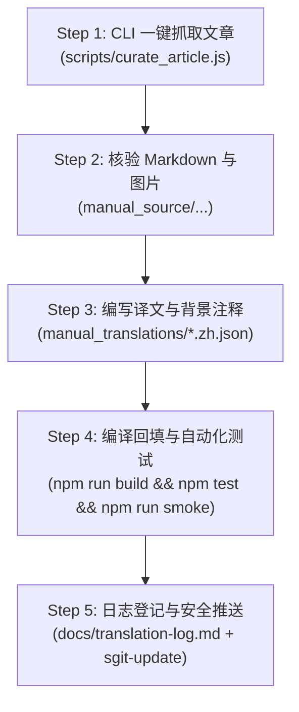

# 🏛️ 日常文章采集、翻译与背景注释标准作业程序 (Daily Curation SOP)

> **版本**：v1.0 (2026-08)  
> **适用对象**：后续接手本项目的任意 **AI Agent** 或 **人类开发者**  
> **核心目标**：将全球顶级英文期刊（The Atlantic, The New Yorker, Wired, The Economist 等）的最新深度长文，标准化地转化为**中英双语对照、配备时代背景/语言双关解释框、具备高保真内联图与排版**的高品质数字出版物，并一键安全部署上线。

---

## 目录
1. [一、支持刊物与推荐采集节奏](#一支持刊物与推荐采集节奏)
2. [二、运行环境与前置准备](#二运行环境与前置准备)
3. [三、五步全流程标准作业程序 (SOP)](#三五步全流程标准作业程序-sop)
   - [Step 1: 选篇与自动化采集](#step-1-选篇与自动化采集)
   - [Step 2: 源码文件规范与段落核验](#step-2-源码文件规范与段落核验)
   - [Step 3: 高品质翻译与背景/双关注释编写](#step-3-高品质翻译与背景双关注释编写)
   - [Step 4: 编译回填与全维质检验收](#step-4-编译回填与全维质检验收)
   - [Step 5: 日志登记、版本 Bump 与 SafeGit 推送](#step-5-日志登记版本-bump-与-safegit-推送)
4. [四、背景/双关注释（`.zh-annotation`）质量红线与分类规范](#四背景双关注释zh-annotation质量红线与分类规范)
5. [五、异常处理与排错排障清单 (Troubleshooting)](#五异常处理与排错排障清单-troubleshooting)

---

## 一、支持刊物与推荐采集节奏

| 刊物名称 | 标识符 (`website`) | 默认主题色 | 重点题材范畴 |
|:---|:---|:---|:---|
| **The Atlantic** | `TheAtlantic` | `#b91c1c` (深红) | 政治反思、社会哲学、教育文化、宏观思潮 |
| **The New Yorker** | `NewYorker` | `#c0392b` (红黑) | 深度人物特写、文艺批评、长篇报道、影视美学 |
| **Wired** | `Wired` | `#111111` (极黑) | 前沿 AI 具身智能、信息安全攻防、数码文化、科技商业 |
| **The Economist** | `TheEconomist` | `#e3120b` (经典红) | 全球地缘政治、宏观金融/债券、科学发现、前沿生命伦理 |
| **Financial Times** | `FT` | `#0d7680` (海蓝) | 国际商业金融、跨国并购、产业政策 |
| **Bloomberg** | `Bloomberg` | `#2f54eb` (科技蓝) | 资本市场动态、全球大宗商品、宏观经济分析 |

### 推荐采集节奏
* **日常例行（Daily Track）**：每日挑选 **1 ~ 3 篇** 当日最新、最具深度讨论价值的重磅长文。
* **周度/专题批次（Weekly / Feature Batch）**：每周或特定热点事件爆发时，按专题集中采集 **5 ~ 10 篇** 多维度分析文章。

---

## 二、运行环境与前置准备

1. **工作树根目录**：`D:\Desktop\WorkSpace\BilingualReader`
2. **海外访问环境**：
   - 依赖本地代理服务（默认端口 `127.0.0.1:7897` 或 Ladder 服务 `127.0.0.1:8080`）。
3. **浏览器引擎**：
   - Windows 环境下内置使用系统 Microsoft Edge（`C:\Program Files (x86)\Microsoft\Edge\Application\msedge.exe`），通过 `playwright-core` 执行无头/有头渲染以绕过反爬与动态 JS 渲染。

---

## 三、五步全流程标准作业程序 (SOP)



### Step 1: 选篇与自动化采集

使用项目内置的标准化采集 CLI 脚本：

```bash
node scripts/curate_article.js --website <Website> --url <ArticleURL>
```

**参数说明**：
* `--website, -w`：刊物代号（`TheAtlantic` | `NewYorker` | `Wired` | `TheEconomist` 等）。
* `--url, -u`：目标文章完整 URL。
* `--date, -d`（可选）：发布日期（默认今天 `YYYY-MM-DD`）。
* `--month, -m`（可选）：月份归档目录（默认当前月 `YYYY-MM`）。

**自动化产出**：
1. `manual_source/<Website>/<YYYY-MM>/<YYYY-MM-DD>_<SafeTitle>.md`（含 Frontmatter、内联图引用、正文段落）。
2. `manual_source/<Website>/<YYYY-MM>/assets/<YYYY-MM-DD>_<SafeTitle>/`（文章封面/内联插图）。
3. `manual_translations/<slug>.zh.json`（自动初始化的侧车骨架文件）。

---

### Step 2: 源码文件规范与段落核验

打开生成的 `.md` 文件，确保 Frontmatter 格式严密：

```markdown
---
title: "Why the Closing of Harvard’s Writing Center Matters"
author: "Faith Hill"
date: "2026-08-20"
website: "TheAtlantic"
month: "2026-08"
source: "https://www.theatlantic.com/..."
saved_at: "2026-08-20 12:00:00"
---

# Why the Closing of Harvard’s Writing Center Matters

> **作者**: Faith Hill | **发布日期**: 2026-08-20 | **来源**: [TheAtlantic](https://...)


*图注说明（斜体行会被解析为嵌入卡片的 caption）*

---

First paragraph in English...

Second paragraph in English...
```

**段落核对原则**：
- 空行严格分段；
- 引用块（`>`）与分隔线（`---`）会自动忽略；
- 每张内联图后紧随的首个 `*斜体行*` 自动绑定为该图的图注。

---

### Step 3: 高品质翻译与背景/双关注释编写

在 `manual_translations/<slug>.zh.json` 中填充中文翻译与段落专属注释：

```json
{
  "paragraphs": [
    "第一段的准确中文译文...",
    "第二段的准确中文译文..."
  ],
  "captions": [
    "第一张内联图的中文图注..."
  ],
  "notes": {
    "0": "💡【时代背景】阐述第一段所涉及的重大历史事件或宏观政治背景...",
    "3": "🧩【语言双关】解析该段作者巧妙运用的修辞双关、一词多义或俚语暗梗..."
  }
}
```

* **严格索引映射**：`paragraphs` 数组索引与正文段落从 `0` 开始严格 1:1 一一对应。
* **稀疏字典注释**：`notes` 采用稀疏字典键值对（`"段落索引": "徽章+内容"`），**仅在确有必要解释的段落添加，无背景的段落严禁注水**。

---

### Step 4: 编译回填与全维质检验收

在终端运行完整构建与测试流水线：

```bash
# 1. 编译 JS、回填 Markdown 译文/注释、生成主门户
npm run build

# 2. 静态代码规范检查 (要求 0 error)
npm run lint

# 3. 运行极限引擎与断言测试 (要求 26/26 全部通过)
npm test

# 4. 运行无头浏览器交互冒烟测试 (要求 12/12 全部通过)
npm run smoke
```

* 确认终端输出中出现：`✓ 译文回填 N 段 / M 图注 / K 注释`。

---

### Step 5: 日志登记、版本 Bump 与 SafeGit 推送

1. **登记日志**：在 [`docs/translation-log.md`](translation-log.md) 的状态表追加本批次文章（登记 slug、标题、段数、图注数、译者、日期与状态）。
2. **版本升级**：在 [`src/core.js`](../src/core.js) 中根据变更幅度升级 `VERSION`（如 `2.7.0` $	o$ `2.7.1`），并在 [`CHANGELOG.md`](../CHANGELOG.md) 顶部记录。
3. **SafeGit 推送（禁止裸 git push）**：

```powershell
Import-Module D:\Desktop\SafeGit\SafeGit.psd1
sgit-update "feat: curate [刊物名] [文章名] with bilingual translation & notes"
```

4. **CI 校验**：推送后访问 GitHub Actions，确认 `CI` 与 `pages build and deployment` 状态均为 `success`。

---

## 四、背景/双关注释（`.zh-annotation`）质量红线与分类规范

## 四、背景/双关注释（`.zh-annotation`）质量红线与高阶细读指南

为确保阅读器达到**名刊导师级导读（Deep Reading & Rhetorical Analysis）**的学术质感，注释必须遵循**“精准、精炼、见解深刻、拆解透彻、严禁废话”**原则。

---

### 🌟 金牌标杆范例（Gold Standard Benchmark）

以《The Mysterious Art of Conducting》开篇第一段为例：

> **英文原文**：  
> *"The conductor is a con artist. Or: The conductor is God. Musicians frequently encounter both of these extreme views of music’s most mysterious profession. It’s not surprising that conductors elicit suspicion as well as adulation. The very act of conducting—waving a wand to summon ravishing or ethereal or earsplitting sounds—can look like either inexplicable magic or embarrassing nonsense, a kind of tuxedoed air guitar."*

> **标准深度注释输出（Sidecar JSON `notes["0"]`）**：  
> ```
> 🧩【语言双关与修辞拆解】
> • 原文“The conductor is a con artist”：作者运用了极其精妙的**头韵与词源双关（Paronomasia）**——“指挥家”（conductor）本身在舞台上不发一声却独享掌声，在怀疑者眼中就成了“骗术大师”（con artist），暗讽其将乐手劳作据为己有。
> • 原文“a kind of tuxedoed air guitar”：**荒谬并置修辞（Incongruous Juxtaposition）**——将古典交响乐至高殿堂的“燕尾服”（tuxedo）与摇滚青年狂热虚无的“空气吉他”（air guitar，无实物拟奏）强行融合，极尽讽刺地戳破了指挥动作在门外汉眼中的虚张声势。
> 
> 🏛️【美学与历史背景】
> • 自 19 世纪瓦格纳、门德尔松确立近代独立指挥职能以来，古典乐界就分裂为“神性造物主”（Maestro）与“多余傀儡”两大极端偏见。
> ```

---

### 🏷️ 4 大官方徽章前缀与解读维度

| 徽章前缀 | 解读维度 | 核心剖析点 | 范例场景 |
|:---|:---|:---|:---|
| `🧩【语言双关/修辞拆解】` | 双关语、词根谐音、反讽、荒谬并置、通感隐喻 | 剖析英文独有的语言修辞巧思与文字游戏，点明作者深层反讽意图 | `conductor` 与 `con artist` 头韵双关；`tuxedoed air guitar` 荒诞并置 |
| `💡【时代背景】` | 宏观时代思潮、产业技术突破、社会学理论 | 阐述当下的技术演进节点、生活方式变迁与前沿思想辩论 | 具身智能 `In-Context Learning`；`Calm Tech` 沉静技术；`Pronatalism` 思潮 |
| `🏛️【政治/历史背景】` | 宪政博弈、学术丑闻、关键法案、地缘冲突 | 追溯制度源头、历史事件原貌与权力博弈格局 | 剑桥大学阿戴学术造假案与 DEI 异化；`Bond Vigilantes` 华尔街债券义警 |
| `🌍【文化典故/哲学反差】` | 希腊神话、艺术史理论、后现代解构、思想实验 | 提炼文本背后的跨学科哲学内涵与人类学隐喻 | 莫拉维克悖论；本雅明“机械复制时代的灵光（Aura）”；柏拉图洞穴寓言 |

---

### ⛔ 注释质量三大红线
1. ❌ **严禁复述段落表面文字**：如果注释只是把段落中文翻译再换个句式说一遍，一律删除。
2. ❌ **严禁空洞的情感抒情**：避免出现“这段写得非常生动”、“作者表达了强烈的感情”等无信息增量的废话。
3. ⚠️ **控制单篇密度**：一篇 15 段左右的文章，高价值注释以 **2 ~ 5 处** 最具信息增量的节点为最佳，确保读者阅读流畅，不产生视觉喧宾夺主。

---

## 五、异常处理与排错排障清单 (Troubleshooting)

### 1. 遇到 Cloudflare 盾或 403 拦截怎么办？
- **原因**：部分媒体（如 The Economist）启用了严格的 TLS 指纹识别，直接用 `httpx`/`curl` 会被拦截。
- **解法**：直接使用 `node scripts/curate_article.js`，该脚本调用基于系统 Edge 内核的 Playwright 真实浏览器环境，自动注入真实 User-Agent 与 Headers，可无感通过人机验证。

### 2. 文章出现付费墙截断（只有 1~2 段）？
- **排查**：检查页面是否在加载后通过客户端 JS 渲染了遮罩层或延迟加载正文。
- **解法**：可配合启动本地 Ladder 引擎（`D:\Desktop\Tools\Ladder\ladder.exe -r ruleset.yaml`），利用其内置的 Googlebot User-Agent 与 CSS 广告/遮罩剔除规则获取全文。

### 3. 图片无法加载或 GitHub Pages 上 404？
- **排查**：确认 `manual_assets/<原文件夹名>/` 目录是否存在且被 `git add`。
- **注意**：资源文件夹名需保留**原始大小写与下划线**（例如 `2026-08-20_A_Culture_War_in_the_Bedroom`），切勿将其自行转换为连字符 slug，否则会导致 Markdown 路径失效。

### 4. 运行 `npm run build:md` 报错或段落数对不齐？
- **排查**：运行以下单行命令快速比对段落总数与侧车数组长度：
  ```bash
  python -c "import json; d=json.load(open('manual_issues.json',encoding='utf-8')); tr=json.load(open('manual_translations/<slug>.zh.json',encoding='utf-8')); segs=[s for s in d['md-<slug>']['pages'][0]['segments'] if s.get('type')=='paragraph']; print(f'MD段数: {len(segs)}, 译文段数: {len(tr["paragraphs"])}')"
  ```
- 确保两者长度严格相等即可解决。
