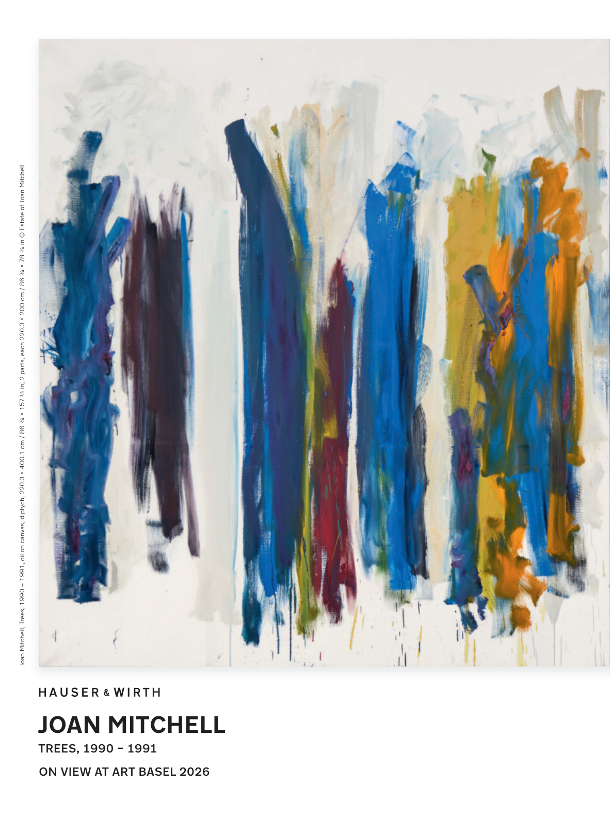

# The Atlantic — July 2026

## Page 2

---

Joan Mitchell, Trees, 1990 – 1991, oil on canvas, diptych, 220.3 × 400.1 cm / 86 ¾ × 157 ½ in, 2 parts, each 220.3 × 200 cm / 86 ¾ × 78 ¾ in © Estate of Joan Mitchell

**【中文翻译】** 琼·米切尔，《树》，1990 – 1991，布面油画，双联画，220.3 × 400.1 厘米 / 86 3/4 × 157 ½ 英寸，2 部分，每部分 220.3 × 200 厘米 / 86 3/4 × 78 3/4 英寸 © Estate of Joan Mitchell

### JOAN MITCHELL

**【标题翻译】** 琼·米切尔

TREES, 1990 – 1991 ON VIEW AT ART BASEL 2026

**【中文翻译】** 2026 年巴塞尔艺术展上展出的《树木，1990 – 1991》
