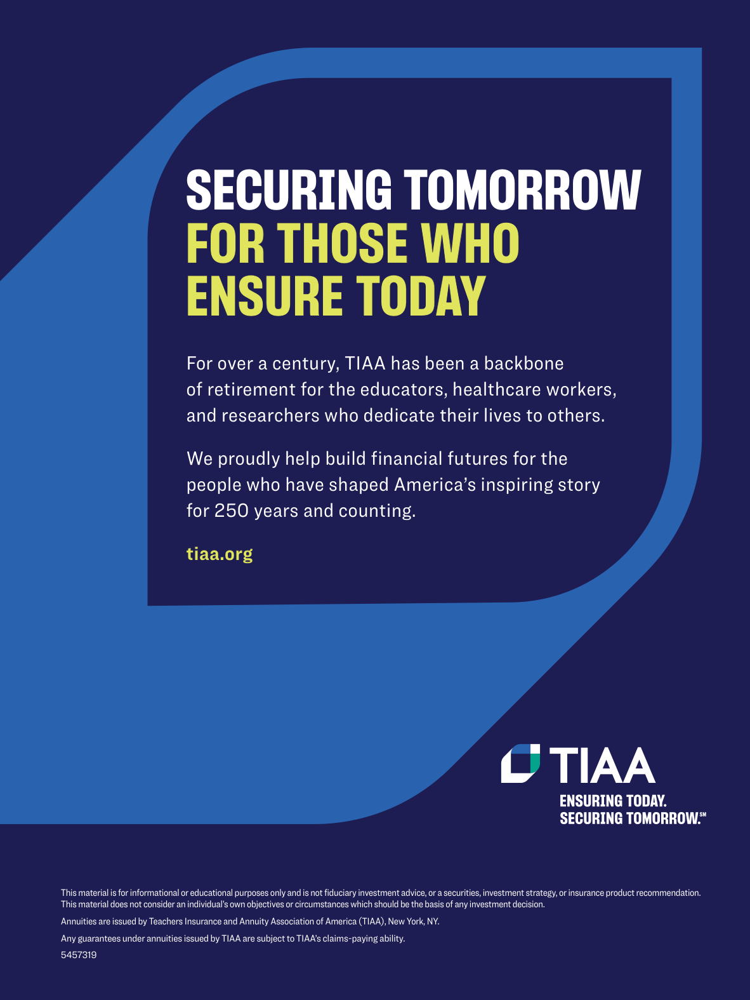

# The Atlantic — July 2026

## Page 6

---

### SECURING TOMORROW

**【标题翻译】** 确保明天

### FOR THOSE WHO

**【标题翻译】** 对于那些谁

### ENSURE TODAY

**【标题翻译】** 确保今天

#### For over a century, TIAA has been a backbone

**【副标题翻译】** 一个多世纪以来，TIAA 一直是支柱

#### of retirement for the educators, healthcare workers,

**【副标题翻译】** 教育工作者、医疗保健工作者的退休，

#### and researchers who dedicate their lives to others.

**【副标题翻译】** 以及为他人奉献一生的研究人员。

#### We proudly help build financial futures for the

**【副标题翻译】** 我们自豪地帮助建立金融未来

#### people who have shaped America’s inspiring story

**【副标题翻译】** 塑造了美国鼓舞人心的故事的人们

#### for 250 years and counting.

**【副标题翻译】** 250 年了，而且还在继续。

#### tiaa.org

**【副标题翻译】** tiaa.org

This material is for informational or educational purposes only and is not fiduciary investment advice, or a securities, investment strategy, or insurance product recommendation.

**【中文翻译】** 本材料仅供参考或教育目的，并非信托投资建议、证券、投资策略或保险产品推荐。

This material does not consider an individual’s own objectives or circumstances which should be the basis of any investment decision. Annuities are issued by Teachers Insurance and Annuity Association of America (TIAA), New York, NY. Any guarantees under annuities issued by TIAA are subject to TIAA’s claims-paying ability. 5457319

**【中文翻译】** 本材料未考虑个人的目标或情况，而这些目标或情况应作为任何投资决策的基础。年金由纽约州纽约市的美国教师保险和年金协会 (TIAA) 发行。 TIAA 签发的年金项下的任何担保均取决于 TIAA 的索赔支付能力。 5457319
