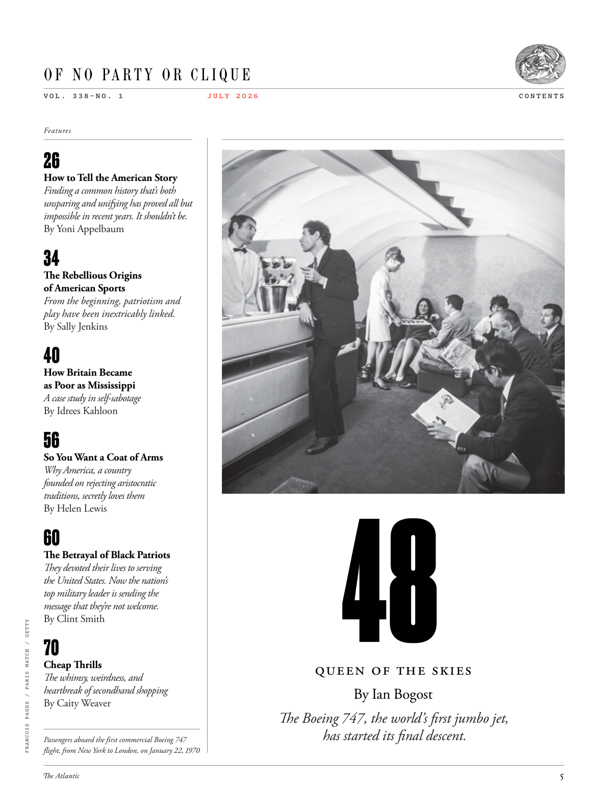

# The Atlantic — July 2026

## Page 7

---

#### O F N O PA R T Y O R C L I Q U E

**【副标题翻译】** 无党派或集团

V O L . 3 3 8 – N O . 1 How to Tell the American Story Finding a common history that’s both unsparing and unifying has proved all but impossible in recent years. It shouldn’t be.

**【中文翻译】** 音量。 3 3 8 – 否。 1 如何讲述美国故事 近年来，事实证明找到一段既不留情又统一的共同历史几乎是不可能的。不应该的。

By Yoni Appelbaum The Rebellious Origins of American Sports From the beginning, patriotism and play have been inextricably linked. By Sally Jenkins How Britain Became as Poor as Mississippi A case study in self-sabotage By Idrees Kahloon So You Want a Coat of Arms Why America, a country founded on rejecting aristocratic traditions, secretly loves them By Helen Lewis The Betrayal of Black Patriots They devoted their lives to serving the United States. Now the nation’s top military leader is sending the message that they’re not welcome.

**【中文翻译】** 作者：Yoni Appelbaum 美国体育的反叛起源 从一开始，爱国主义和比赛就有着千丝万缕的联系。作者：莎莉·詹金斯 《英国如何变得像密西西比州一样贫穷》 自我破坏的案例研究 作者：伊德里斯·卡隆 所以你想要一件徽章 为什么美国这个建立在拒绝贵族传统基础上的国家却暗中喜爱他们 作者：海伦·刘易斯 黑人爱国者的背叛 他们毕生致力于为美国服务。现在，该国最高军事领导人正在发出这样的信息：他们不受欢迎。

By Clint Smith

**【中文翻译】** 克林特·史密斯

*FRANCOIS PAGES / PARIS MATCH / GETTY*

*【图注与署名】弗朗索瓦·佩吉斯/巴黎比赛/盖蒂图片社*

Cheap Thrills The whimsy, weirdness, and heartbreak of secondhand shopping By Caity Weaver Passengers aboard the first commercial Boeing 747 flight, from New York to London, on January 22, 1970 J U L Y 2 0 2 6

**【中文翻译】** 便宜的刺激 二手购物的奇思怪想、怪异和心碎 作者：Caity Weaver 1970 年 1 月 22 日，从纽约飞往伦敦的第一架商用波音 747 航班上的乘客 J U L Y 2 0 2 6

#### Queen of the Skies

**【副标题翻译】** 天空女王

#### By Ian Bogost

**【副标题翻译】** 伊恩·博格斯特

#### The Boeing 747, the world’s first jumbo jet,

**【副标题翻译】** 世界上第一架大型喷气式飞机波音 747

#### has started its final descent.

**【副标题翻译】** 已经开始最后的下降。

C O N T E N T S

**【中文翻译】** 内容
