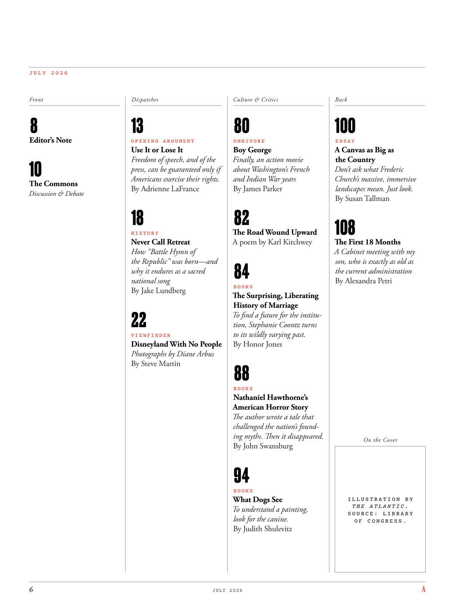

# The Atlantic — July 2026

## Page 8

---

J U L Y 2 0 2 6 Front Editor’s Note O P E N I N G A R G U M E N T Use It or Lose It Freedom of speech, and of the press, can be guaranteed only if Americans exercise their rights.

**【中文翻译】** J U L Y 2 0 2 6 Front 编者注 开放论点 使用它或失去它 只有美国人行使自己的权利，言论和新闻自由才能得到保障。

The Commons By Adrienne LaFrance Discussion & Debate H I S T O R Y Never Call Retreat How “Battle Hymn of the Republic” was born—and why it endures as a sacred national song By Jake Lundberg V I E W F I N D E R Disneyland With No People Photographs by Diane Arbus By Steve Martin O M N I V O R E Boy George Finally, an action movie about Washington’s French and Indian War years By James Parker The Road Wound Upward A poem by Karl Kirchwey B O O K S The Surprising, Liberating History of Marriage To find a future for the institution, Stephanie Coontz turns to its wildly varying past.

**【中文翻译】** 下议院 作者：艾德丽安·拉弗朗斯 讨论与辩论 H I S O R Y 永不撤退 《共和国战歌》是如何诞生的——以及为什么它作为一首神圣的国歌经久不衰 作者：杰克·伦德伯格 V I E W F I N D E R 没有人的迪士尼乐园 摄影：黛安·阿布斯 作者：史蒂夫·马丁 O M N I V O R E 男孩乔治 最后，一部关于华盛顿法国和印度战争年代的动作片 作者：詹姆斯·帕克 道路向上 A卡尔·基尔奇韦 (Karl Kirchwey) 的诗《令人惊讶的、解放的婚姻历史》 为了寻找婚姻制度的未来，斯蒂芬妮·孔茨 (Stephanie Coontz) 回顾了其千变万化的过去。

By Honor Jones B O O K S Nathaniel Hawthorne’s American Horror Story The author wrote a tale that challenged the nation’s founding myths. Then it disappeared.

**【中文翻译】** 作者：霍桑尼尔·霍桑 (Nathaniel Hawthorne) 的《美国恐怖故事》作者霍桑·琼斯 (Honor Jones) 所著的《美国恐怖故事》作者写了一个挑战建国神话的故事。然后它就消失了。

By John Swansburg B O O K S What Dogs See To understand a painting, look for the canine. By Judith Shulevitz Back E S S A Y A Canvas as Big as the Country Don’t ask what Frederic Church’s massive, immersive landscapes mean. Just look.

**【中文翻译】** 作者：John Swansburg B O O K S 狗所见 要理解一幅画，首先要寻找狗。作者：朱迪思·舒莱维茨 返回 E S S A Y 与国家一样大的画布 不要问弗雷德里克教堂巨大的、身临其境的景观意味着什么。看看吧。

By Susan Tallman The First 18 Months A Cabinet meeting with my son, who is exactly as old as the current administration By Alexandra Petri On the Cover I L L U S T R A T I O N B Y T H E A T L A N T I C . S O U R C E : L I B R A R Y O F C O N G R E S S .

**【中文翻译】** 作者：苏珊·托尔曼 (Susan Tallman) 前 18 个月 与我儿子举行的内阁会议，我的儿子与现任政府同龄。 作者：亚历山德拉·佩特里 (Alexandra Petri) 封面上的文字是“大西洋”。资料来源：国会图书馆。
