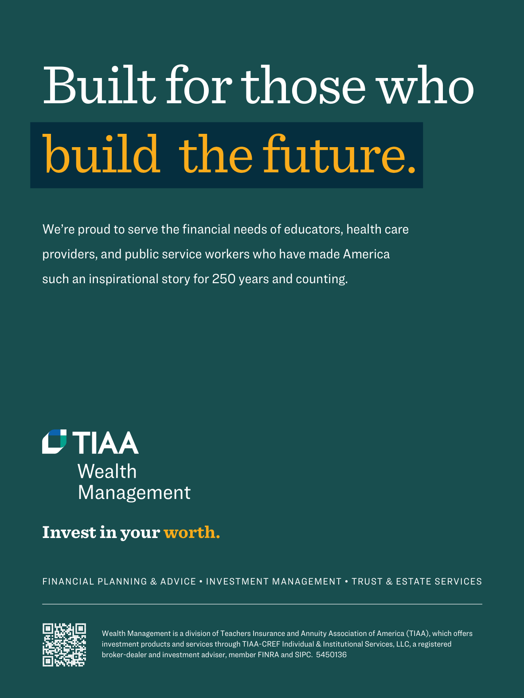

# The Atlantic — July 2026

## Page 9

---

### Built for those who

**【标题翻译】** 专为那些

### build the future.

**【标题翻译】** 建设未来。

#### We’re proud to serve the financial needs of educators, health care

**【副标题翻译】** 我们很自豪能够满足教育工作者、医疗保健的财务需求

#### providers, and public service workers who have made America

**【副标题翻译】** 创造了美国的提供者和公共服务工作者

#### such an inspirational story for 250 years and counting.

**【副标题翻译】** 这样一个励志故事已经存在了 250 年，而且还在继续。

### Invest in your worth.

**【标题翻译】** 投资你的价值。

FINANCIAL PLANNING & ADVICE • INVESTMENT MANAGEMENT • TRUST & ESTATE SERVICES Wealth Management is a division of Teachers Insurance and Annuity Association of America (TIAA), which offers investment products and services through TIAA-CREF Individual & Institutional Services, LLC, a registered broker-dealer and investment adviser, member FINRA and SIPC. 5450136

**【中文翻译】** 财务规划和建议 • 投资管理 • 信托和遗产服务 财富管理是美国教师保险和年金协会 (TIAA) 的一个部门，通过 TIAA-CREF 个人和机构服务有限责任公司（一家注册经纪交易商和投资顾问、FINRA 和 SIPC 成员）提供投资产品和服务。 5450136
