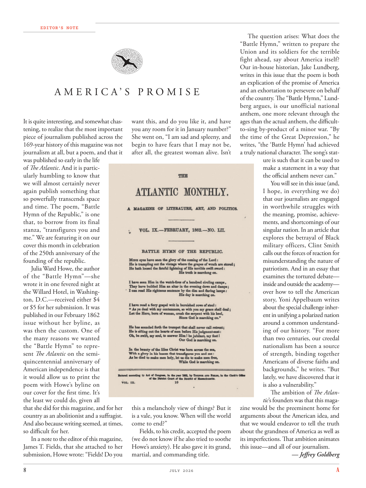

# The Atlantic — July 2026

## Page 10

---

EDITOR’S NOTE

**【中文翻译】** 编者注

#### A M E R I C A ’ S P R O M I S E

**【副标题翻译】** 美国的承诺

It is quite interesting, and somewhat chastening, to realize that the most important piece of journalism published across the 169-year history of this magazine was not journalism at all, but a poem, and that it was published so early in the life of The Atlantic . And it is particularly humbling to know that we will almost certainly never again publish something that so powerfully transcends space and time. The poem, “Battle Hymn of the Republic,” is one that, to borrow from its final stanza, “transfigures you and me.” We are featuring it on our cover this month in celebration of the 250th anniversary of the founding of the republic.

**【中文翻译】** 认识到这本杂志 169 年历史上发表的最重要的新闻文章根本不是新闻报道，而是一首诗，而且它是在《大西洋月刊》创刊之初就发表的，这很有趣，也有些令人心痛。尤其令人感到羞愧的是，我们几乎肯定不会再发表如此强大地超越空间和时间的东西。借用其最后一节的话说，《共和国战歌》这首诗“改变了你和我”。我们本月将其作为封面，庆祝共和国成立 250 周年。

Julia Ward Howe, the author of the “Battle Hymn”—she wrote it in one fevered night at the Willard Hotel, in Washington, D.C.—received either $4 or $5 for her submission. It was published in our February 1862 issue without her byline, as was then the custom. One of the many reasons we wanted the “Battle Hymn” to represent The Atlantic on the semiquincentennial anniversary of American independence is that it would allow us to print the poem with Howe’s byline on our cover for the first time. It’s the least we could do, given all that she did for this magazine, and for her country as an abolitionist and a suff ragist.

**【中文翻译】** 《战歌》的作者朱莉娅·沃德·豪 (Julia Ward Howe) 在华盛顿特区的威拉德酒店 (Willard Hotel) 在一个狂热的夜晚写下了这本书，她提交的作品收到了 4 美元或 5 美元的报酬。该文章发表在我们 1862 年 2 月号上，按照当时的惯例，没有她的署名。我们希望《战歌》能够代表《大西洋月刊》庆祝美国独立五十周年纪念日，其原因有很多，其中之一就是它能让我们第一次在封面上印上带有豪署名的这首诗。鉴于她作为废奴主义者和施暴者为这本杂志以及她的国家所做的一切，这是我们至少能做的。

And also because writing seemed, at times, so diffi cult for her. In a note to the editor of this magazine, James T. Fields, that she attached to her submission, Howe wrote: “Fields! Do you want this, and do you like it, and have you any room for it in January number?”

**【中文翻译】** 还因为写作有时对她来说似乎很困难。豪在给本杂志编辑詹姆斯·T·菲尔兹 (James T. Fields) 的投稿附上的一封便条中写道：“菲尔兹！你想要这个吗？你喜欢它吗？一月号有空间吗？”

She went on, “I am sad and spleeny, and begin to have fears that I may not be, after all, the greatest woman alive. Isn’t this a melancholy view of things? But it is a vale, you know. When will the world come to end?”

**【中文翻译】** 她继续说道，“我感到悲伤和愤怒，并开始担心自己可能不是世界上最伟大的女人。这不是一种忧郁的看待事物的方式吗？但你知道，这是一个山谷。世界什么时候会终结？”

Fields, to his credit, accepted the poem (we do not know if he also tried to soothe Howe’s anxiety). He also gave it its grand, martial, and commanding title.

**【中文翻译】** 值得赞扬的是，菲尔兹接受了这首诗（我们不知道他是否也试图缓解豪的焦虑）。他还赋予它宏伟、军事、统帅的称号。

The question arises: What does the “Battle Hymn,” written to prepare the Union and its soldiers for the terrible fight ahead, say about America itself?

**【中文翻译】** 问题出现了：为联邦及其士兵准备迎接未来可怕战斗而写的“战歌”对美国本身有何评价？

Our in-house historian, Jake Lundberg, writes in this issue that the poem is both an explication of the promise of America and an exhortation to persevere on behalf of the country. The “Battle Hymn,” Lundberg argues, is our un official national anthem, one more relevant through the ages than the actual anthem, the diffi cultto-sing by-product of a minor war. “By the time of the Great Depression,” he writes, “the ‘Battle Hymn’ had achieved a truly national character. The song’s stature is such that it can be used to make a statement in a way that the offi cial anthem never can.”

**【中文翻译】** 我们的内部历史学家杰克·伦德伯格（Jake Lundberg）在本期中写道，这首诗既阐述了美国的承诺，又劝诫人们为国家而坚持下去。伦德伯格认为，“战歌”是我们的联合国官方国歌，它比实际的国歌更具有相关性，而实际的国歌是一场小规模战争中难以演唱的副产品。 “到了大萧条时期，”他写道，“‘战歌’已经真正具有了民族特色。这首歌的地位如此之高，以至于它可以用官方国歌永远无法做到的方式来表达自己的观点。”

You will see in this issue (and, I hope, in everything we do) that our journalists are engaged in worthwhile struggles with the meaning, promise, achievements, and shortcomings of our singular nation. In an article that explores the betrayal of Black military officers, Clint Smith calls out the forces of reaction for mis understanding the nature of patriotism. And in an essay that examines the tortured debate— inside and outside the academy— over how to tell the American story, Yoni Appelbaum writes about the special challenge inherent in unifying a polarized nation around a common understanding of our history. “For more than two centuries, our creedal nationalism has been a source of strength, binding together Americans of diverse faiths and backgrounds,” he writes. “But lately, we have discovered that it is also a vulnerability.”

**【中文翻译】** 你会在本期杂志中（我希望在我们所做的每一件事中）看到，我们的记者正在为我们这个单一国家的意义、承诺、成就和缺点进行有价值的斗争。在一篇探讨黑人军官背叛的文章中，克林特·史密斯指出了反动势力对爱国主义本质的误解。约尼·阿佩尔鲍姆在一篇文章中探讨了学术界内外关于如何讲述美国故事的激烈辩论，他写到了将一个两极分化的国家统一到对我们历史的共同理解上所面临的特殊挑战。 “两个多世纪以来，我们的信仰民族主义一直是力量的源泉，将不同信仰和背景的美国人团结在一起，”他写道。 “但最近，我们发现这也是一个漏洞。”

The ambition of The Atlantic ’s founders was that this magazine would be the preeminent home for arguments about the American idea, and that we would endeavor to tell the truth about the grandness of America as well as its im perfections. Th at ambition animates this issue—and all of our journalism. — Jeff rey Goldberg

**【中文翻译】** 《大西洋月刊》创始人的抱负是，该杂志将成为讨论美国理念的卓越场所，我们将努力讲述美国的伟大和不完美的真相。这种雄心壮志激发了这个问题以及我们所有的新闻工作。 — 杰夫·雷·戈德堡
