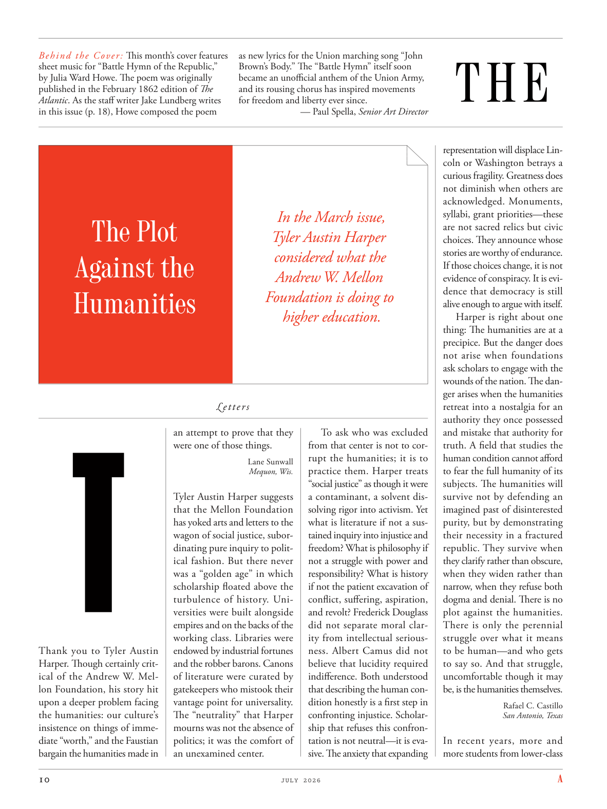

# The Atlantic — July 2026

## Page 12

---

Behind the Cover: This month’s cover features sheet music for “Battle Hymn of the Republic,” by Julia Ward Howe. The poem was originally published in the February 1862 edition of The Atlantic . As the staff writer Jake Lundberg writes in this issue (p. 18), Howe composed the poem

**【中文翻译】** 封面背后：本月的封面收录了朱莉娅·沃德·豪 (Julia Ward Howe) 的《共和国战歌》乐谱。这首诗最初发表在 1862 年 2 月版的《大西洋月刊》上。正如特约撰稿人杰克·伦德伯格（Jake Lundberg）在本期（第 18 页）中所写，豪创作了这首诗

### The Plot

**【标题翻译】** 情节

### Against the

**【标题翻译】** 反对

### Humanities

**【标题翻译】** 人文学科

### T

an attempt to prove that they were one of those things. Tyler Austin Harper suggests that the Mellon Foundation has yoked arts and letters to the wagon of social justice, subordinating pure inquiry to political fashion. But there never was a “golden age” in which scholarship floated above the turbulence of history. Universities were built alongside empires and on the backs of the working class. Libraries were Thank you to Tyler Austin endowed by industrial fortunes Harper. Though certainly critand the robber barons. Canons ical of the Andrew W. Melof literature were curated by lon Foundation, his story hit gate keepers who mistook their upon a deeper problem facing vantage point for universality. the humanities: our culture’s The “neutrality” that Harper insistence on things of immemourns was not the absence of diate “worth,” and the Faustian politics; it was the comfort of bargain the humanities made in an un examined center. as new lyrics for the Union marching song “John Brown’s Body.” The “Battle Hymn” itself soon became an unofficial anthem of the Union Army, and its rousing chorus has inspired movements for freedom and liberty ever since. — Paul Spella, Senior Art Director

**【中文翻译】** 试图证明它们是其中之一。泰勒·奥斯汀·哈珀认为，梅隆基金会将艺术和文学与社会正义的马车联系在一起，使纯粹的探究服从于政治时尚。但从来没有一个“黄金时代”可以让学术凌驾于历史的动荡之上。大学是与帝国并肩、在工人阶级的支持下建立的。图书馆感谢泰勒·奥斯汀 (Tyler Austin) 的工业财富哈珀 (Harper) 的捐赠。虽然肯定会批评强盗大亨。安德鲁·W·梅洛夫 (Andrew W. Melof) 的经典文学作品由隆基金会 (lon Foundation) 策划，他的故事打击了那些误以为面临着普遍性有利地位的更深层次问题的看门人。人文学科：我们文化的“中立性”，哈珀坚持对不可记忆的事物的坚持，并不是缺乏“价值”，也不是浮士德式的政治；这是人文学科在未经审查的中心做出的讨价还价的安慰。作为联邦进行曲“约翰·布朗的身体”的新歌词。 《战歌》本身很快就成为联邦军的非正式国歌，其振奋人心的合唱从此激发了争取自由和自由的运动。 — Paul Spella，高级艺术总监

#### In the March issue,

**【副标题翻译】** 在三月号中，

#### Tyler Austin Harper

**【副标题翻译】** 泰勒·奥斯汀·哈珀

#### considered what the

**【副标题翻译】** 考虑了什么

#### Andrew W. Mellon

**【副标题翻译】** 安德鲁·W·梅隆

#### Foundation is doing to

**【副标题翻译】** 基金会正在做的是

#### higher education.

**【副标题翻译】** 高等教育。

Letters To ask who was excluded from that center is not to corrupt the humanities; it is to Lane Sunwall practice them. Harper treats Mequon, Wis.

**【中文翻译】** 信件询问谁被排除在该中心之外并不是破坏人文学科；而是那就去Sunwall里练练吧。哈珀在威斯康星州梅肯市接受治疗。

“social justice” as though it were a contaminant, a solvent dissolving rigor into activism. Yet what is literature if not a sustained inquiry into injustice and freedom? What is philosophy if not a struggle with power and responsibility? What is history if not the patient excavation of conflict, suffering, aspiration, and revolt? Frederick Douglass did not separate moral clarity from intellectual seriousness. Albert Camus did not believe that lucidity required in difference. Both understood that describing the human condition honestly is a first step in confronting injustice. Scholarship that refuses this confrontation is not neutral—it is evasive. The anxiety that expanding

**【中文翻译】** “社会正义”就好像它是一种污染物，一种溶解激进主义的溶剂。然而，如果不是对不公正和自由的持续探究，文学又是什么？如果哲学不是权力与责任的斗争，那哲学是什么？如果历史不是对冲突、痛苦、渴望和反抗的耐心挖掘，那么历史又算什么呢？弗雷德里克·道格拉斯（Frederick Douglass）并没有将道德的清晰性与理智的严肃性分开。阿尔贝·加缪并不认为差异需要清晰。两人都明白，诚实地描述人类状况是对抗不公正的第一步。拒绝这种对抗的学术界并不是中立的——而是回避的。不断扩大的焦虑

### THE

**【标题翻译】** 这

representation will displace Lincoln or Washington betrays a curious fragility. Greatness does not diminish when others are acknowledged. Monuments, syllabi, grant priorities—these are not sacred relics but civic choices. They announce whose stories are worthy of endurance.

**【中文翻译】** 代表权将取代林肯或华盛顿，这暴露了一种奇怪的脆弱性。当他人得到认可时，伟大并不会减弱。纪念碑、教学大纲、授予优先权——这些不是神圣的遗迹，而是公民的选择。他们宣布谁的故事值得持久。

If those choices change, it is not evidence of conspiracy. It is evidence that democracy is still alive enough to argue with itself. Harper is right about one thing: The humanities are at a precipice. But the danger does not arise when foundations ask scholars to engage with the wounds of the nation. The danger arises when the humanities retreat into a nostalgia for an authority they once possessed and mistake that authority for truth. A field that studies the human condition cannot afford to fear the full humanity of its subjects. The humanities will survive not by defending an imagined past of disinterested purity, but by demonstrating their necessity in a fractured republic. They survive when they clarify rather than obscure, when they widen rather than narrow, when they refuse both dogma and denial. There is no plot against the humanities.

**【中文翻译】** 如果这些选择发生变化，这并不是阴谋的证据。这证明民主仍然充满活力，足以与自己争论。哈珀在一件事上是正确的：人文学科正处于悬崖边。但当基金会要求学者们关注国家的创伤时，危险就不会出现。当人文学科退回到对他们曾经拥有的权威的怀旧之中，并误认为该权威是真理时，危险就会出现。研究人类状况的领域不能担心其研究对象的全部人性。人文学科的生存不是通过捍卫想象中的无私纯洁的过去，而是通过证明它们在一个四分五裂的共和国中的必要性。当他们澄清而不是晦涩难懂，当他们拓宽而不是缩小，当他们拒绝教条和否认时，他们就能生存。没有违背人文的阴谋。

There is only the perennial struggle over what it means to be human—and who gets to say so. And that struggle, un comfortable though it may be, is the humanities themselves. Rafael C. Castillo San Antonio, Texas In recent years, more and more students from lower-class

**【中文翻译】** 关于人类的意义以及谁有权这么说，存在着长期的斗争。尽管这种斗争可能令人不舒服，但这种斗争就是人文学科本身。 Rafael C. Castillo 得克萨斯州圣安东尼奥市 近年来，越来越多来自低层阶级的学生
