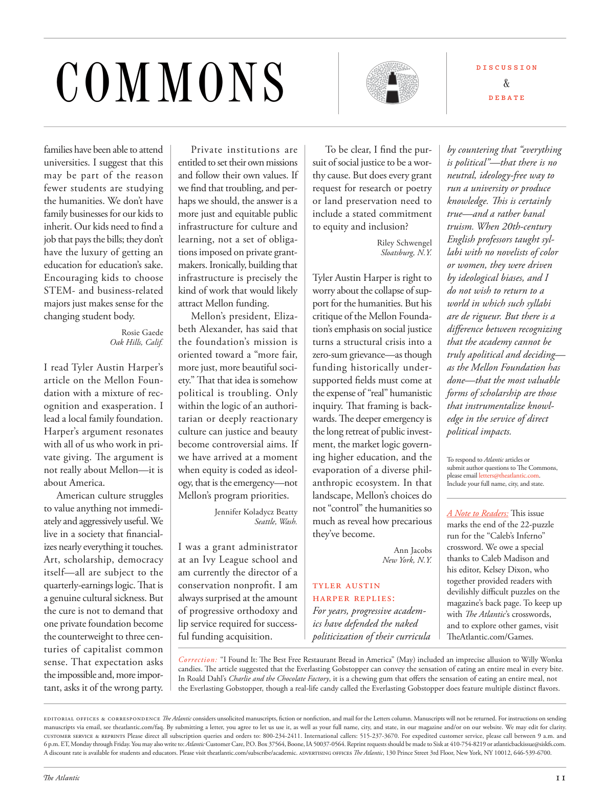

# The Atlantic — July 2026

## Page 13

---

### COMMONS

**【标题翻译】** 公共资源

families have been able to attend Private institutions are universities. I suggest that this en titled to set their own missions may be part of the reason and follow their own values. If fewer students are studying we find that troubling, and perthe humanities. We don’t have haps we should, the answer is a family businesses for our kids to more just and equitable public inherit. Our kids need to find a infrastructure for culture and job that pays the bills; they don’t learning, not a set of obligahave the luxury of getting an tions imposed on private granteducation for education’s sake. makers. Ironically, building that Encouraging kids to choose infrastructure is precisely the STEMand business-related kind of work that would likely majors just makes sense for the attract Mellon funding. changing student body.

**【中文翻译】** 家庭能够就读的私立机构是大学。我建议，这可能是设定自己的使命并遵循自己的价值观的部分原因。如果学习的学生减少，我们会发现这令人不安，这也是人文学科的问题。我们没有我们应该做的事情，答案是我们的孩子可以更公正、更公平地继承家族企业。我们的孩子需要找到能够维持生计的文化基础设施和工作；他们不学习，也没有一群义务人有幸为了教育而对私人教育施加限制。制造商。具有讽刺意味的是，建立鼓励孩子们选择基础设施正是 STEM 和商业相关的工作，这些工作可能对吸引梅隆大学的资金有意义。改变学生群体。

Mellon’s president, Elizabeth Alexander, has said that Rosie Gaede the foundation’s mission is Oak Hills, Calif. oriented toward a “more fair, I read Tyler Austin Harper’s more just, more beautiful sociarticle on the Mellon Founety.” Th at that idea is somehow dation with a mixture of recpolitical is troubling. Only ognition and exasperation. I within the logic of an authorilead a local family foundation. tarian or deeply reactionary Harper’s argument resonates culture can justice and beauty with all of us who work in pribecome controversial aims. If vate giving. The argument is we have arrived at a moment not really about Mellon—it is when equity is coded as ideolabout America. ogy, that is the emergency— not American culture struggles Mellon’s program priorities. to value anything not immediately and aggressively useful. We live in a society that financialI was a grant administrator izes nearly everything it touches. at an Ivy League school and Art, scholarship, democracy am currently the director of a itself—all are subject to the conservation nonprofi t. I am quarterlyearnings logic. Th at is always surprised at the amount a genuine cultural sickness. But of progressive orthodoxy and the cure is not to demand that lip service required for successone private foundation become ful funding acquisition. the counter weight to three centuries of capitalist common Correction: “I Found It: The Best Free Restaurant Bread in America” (May) included an imprecise allusion to Willy Wonka sense. That expectation asks candies. The article suggested that the Everlasting Gobstopper can convey the sensation of eating an entire meal in every bite. the impossible and, more imporIn Roald Dahl’s Charlie and the Chocolate Factory , it is a chewing gum that offers the sensation of eating an entire meal, not tant, asks it of the wrong party. the Everlasting Gobstopper, though a real-life candy called the Everlasting Gobstopper does feature multiple distinct fl avors.

**【中文翻译】** 梅隆基金会主席伊丽莎白·亚历山大 (Elizabeth Alexander) 表示，罗西·盖德 (Rosie Gaede) 基金会的使命是加州橡树山，旨在实现“更公平，我读了泰勒·奥斯汀·哈珀 (Tyler Austin Harper) 关于梅隆基金会的更公正、更美丽的社会文章”。这种想法在某种程度上与共政治主义混合在一起，这令人不安。只剩下好奇和愤怒。按照作者的逻辑，我领导着一个当地的家庭基金会。哈珀的论点是保守派或极度反动的，它与我们所有致力于成为有争议目标的人产生了文化正义和美丽的共鸣。如果给予。争论的焦点是，我们已经到达了一个与梅隆无关的时刻——此时公平被编码为关于美国的理想。 ogy，这就是紧急情况——不是美国文化与梅隆项目的优先事项作斗争。重视任何不是立即有用的东西。我们生活在一个金融社会，几乎所有涉及到的事情都被金融化了。在常春藤联盟学校，艺术、学术、民主目前是其自身的主管——所有这些都受保护性非营利组织的管辖。我是季报逻辑。人们总是对真正的文化病的数量感到惊讶。但就进步的正统观念而言，解决办法并不是要求私人基金会成功所需的口头承诺成为充分的资金收购。三个世纪的资本主义共同修正的平衡：“我找到了：美国最好的免费餐厅面包”（五月）包括对威利·旺卡意义的不精确暗示。这种期望需要糖果。文章指出，永恒的大块塞可以传达每一口都吃完一整顿饭的感觉。不可能的，更重要的是，在罗尔德·达尔的《查理和巧克力工厂》中，它是一种口香糖，它提供了吃整顿饭的感觉，而不是tant，要求它是错误的一方。永恒的大块糖，尽管现实生活中名为“永恒的大块糖”的糖果确实具有多种不同的口味。

editorial offices t correspondence The Atlantic considers unsolicited manuscripts, fiction or nonfiction, and mail for the Letters column. Manuscripts will not be returned. For instructions on sending manuscripts via email, see theatlantic.com/faq. By submitting a letter, you agree to let us use it, as well as your full name, city, and state, in our magazine and/or on our website. We may edit for clarity. customer service t reprints Please direct all subscription queries and orders to: 800-234-2411. International callers: 515-237-3670. For expedited customer service, please call between 9 a.m. and 6 p.m. ET, Monday through Friday. You may also write to: Atlantic Customer Care, P.O. Box 37564, Boone, IA 50037-0564. Reprint requests should be made to Sisk at 410-754-8219 or atlanticbackissue@siskfs.com.

**【中文翻译】** 编辑部和信件 《大西洋月刊》考虑来信专栏的未经请求的手稿、小说或非小说以及邮件。稿件将不予退还。有关通过电子邮件发送稿件的说明，请参阅 theatlantic.com/faq。提交信件即表示您同意我们在我们的杂志和/或网站上使用该信件以及您的全名、城市和州。为了清楚起见，我们可能会进行编辑。客户服务 重印 请直接将所有订阅查询和订单发送至：800-234-2411。国际电话：515-237-3670。如需加急客户服务，请在上午 9 点至下午 6 点之间致电。东部时间，周一至周五。您也可以写信给：Atlantic Customer Care, P.O.信箱 37564，布恩，IA 50037-0564。请致电 410-754-8219 或发送电子邮件至 atlanticbackissue@siskfs.com 向 Sisk 提出重印请求。

A discount rate is available for students and educators. Please visit theatlantic.com/subscribe/academic. advertising offices The Atlantic , 130 Prince Street 3rd Floor, New York, NY 10012, 646-539-6700.

**【中文翻译】** 学生和教育工作者可享受折扣率。请访问 theatlantic.com/subscribe/academic。大西洋广告公司，130 Prince Street 3rd Floor, New York, NY 10012, 646-539-6700。

To be clear, I find the pursuit of social justice to be a worthy cause. But does every grant request for research or poetry or land preservation need to include a stated commitment to equity and inclusion?

**【中文翻译】** 需要明确的是，我发现追求社会正义是一项有价值的事业。但是，每项研究、诗歌或土地保护的资助请求是否都需要包括对公平和包容性的明确承诺？

Riley Schwengel Sloatsburg, N.Y. Tyler Austin Harper is right to worry about the collapse of support for the humanities. But his critique of the Mellon Foundation’s emphasis on social justice turns a structural crisis into a zero-sum grievance— as though funding historically undersupported fi elds must come at the expense of “real” humanistic inquiry. Th at framing is backwards. The deeper emergency is the long retreat of public investment, the market logic governing higher education, and the evaporation of a diverse philanthropic eco system. In that landscape, Mellon’s choices do not “control” the humanities so Jennifer Koladycz Beatty much as reveal how precarious Seattle, Wash. they’ve become.

**【中文翻译】** 莱利·施文格尔 (Riley Schwengel) 纽约州斯洛茨堡 (Riley Schwengel Sloatsburg) 泰勒·奥斯汀·哈珀 (Tyler Austin Harper) 对人文学科支持崩溃的担忧是正确的。但他对梅隆基金会强调社会正义的批评将结构性危机变成了零和不满——仿佛对历史上支持不足的领域的资助必须以牺牲“真正的”人文探究为代价。这个框架是倒退的。更深层次的危机是公共投资的长期退却、高等教育的市场逻辑以及多元慈善生态系统的消失。在这种情况下，梅隆的选择并不能“控制”人文学科，因此詹妮弗·科拉迪茨·比蒂（Jennifer Koladycz Beatty）很大程度上揭示了华盛顿州西雅图的人文学科已经变得多么不稳定。

Ann Jacobs New York, N.Y. Tyler Austin Harper replies: For years, progressive academics have defended the naked politicization of their curricula D I S C U S S I O N & D E B A T E by countering that “everything is political”—that there is no neutral, ideology-free way to run a university or produce knowledge. This is certainly true—and a rather banal truism. When 20th-century English professors taught syllabi with no novelists of color or women, they were driven by ideological biases, and I do not wish to return to a world in which such syllabi are de rigueur. But there is a diff erence between recognizing that the academy cannot be truly apolitical and deciding— as the Mellon Foundation has done—that the most valuable forms of scholarship are those that instrumentalize knowledge in the service of direct political impacts.

**【中文翻译】** 安·雅各布斯 (Ann Jacobs) 纽约州纽约市 泰勒·奥斯汀·哈珀 (Tyler Austin Harper) 回复道： 多年来，进步学者一直为他们的课程“讨论与辩论”赤裸裸的政治化辩护，反驳“一切都是政治的”——不存在中立的、不受意识形态影响的方式来管理大学或产生知识。这当然是事实——而且是一个相当平庸的老生常谈。当 20 世纪的英语教授在没有有色人种或女性小说家的情况下教授教学大纲时，他们受到意识形态偏见的驱使，我不想回到这样的世界，在这个世界中，这种教学大纲是必要的。但是，认识到学院不可能真正做到非政治性，和像梅隆基金会所做的那样，决定最有价值的学术形式是那些将知识用于直接政治影响的学术形式，两者之间是有区别的。

To respond to Atlantic articles or submit author questions to The Commons, please email letters@theatlantic.com . Include your full name, city, and state.

**【中文翻译】** 要回复《大西洋月刊》的文章或向 The Commons 提交作者问题，请发送电子邮件至 letter@theatlantic.com。包括您的全名、城市和州。

A Note to Readers: This issue marks the end of the 22-puzzle run for the “Caleb’s Inferno” crossword. We owe a special thanks to Caleb Madison and his editor, Kelsey Dixon, who together provided readers with devilishly diffi cult puzzles on the magazine’s back page. To keep up with The Atlantic ’s crosswords, and to explore other games, visit Th eAtlantic.com/Games.

**【中文翻译】** 读者须知：本期标志着“迦勒的地狱”填字游戏 22 个谜题的结束。我们要特别感谢凯莱布·麦迪逊和他的编辑凯尔西·迪克森，他们一起在杂志的封底为读者提供了极其困难的谜题。要了解《大西洋月刊》的填字游戏并探索其他游戏，请访问 The eAtlantic.com/Games。
