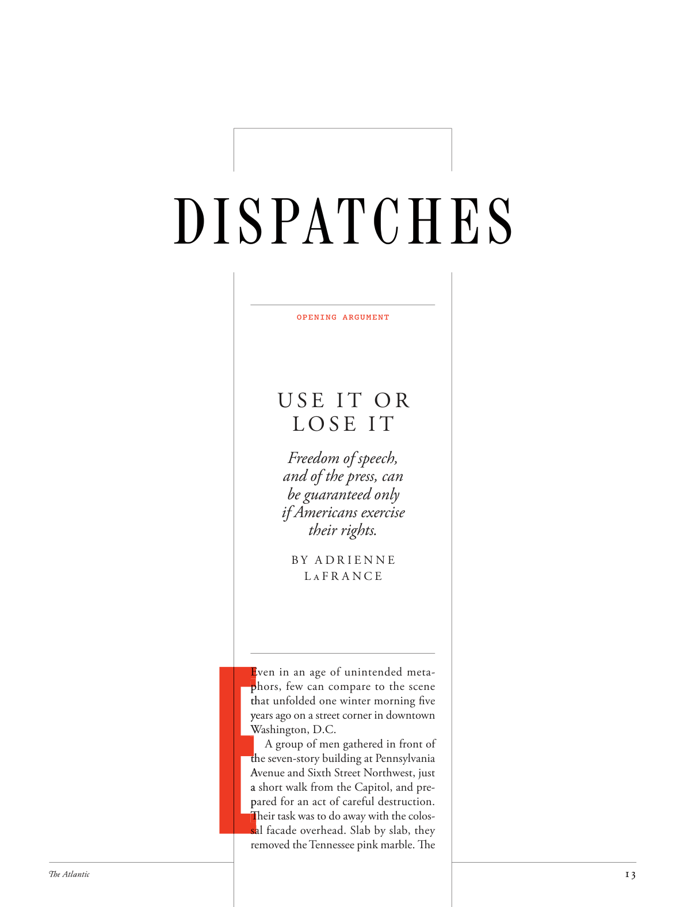

# The Atlantic — July 2026

## Page 15

---

OPENING ARGUMENT

**【中文翻译】** 开庭陈词

### U S E I T O R

**【标题翻译】** 用户

### L O S E I T

**【标题翻译】** 失去它

#### Freedom of speech,

**【副标题翻译】** 言论自由，

#### and of the press, can

**【副标题翻译】** 和新闻界，可以

#### be guaranteed only

**【副标题翻译】** 只能保证

#### if Americans exercise

**【副标题翻译】** 如果美国人锻炼身体

#### their rights.

**【副标题翻译】** 他们的权利。

B Y A D R I E N N E L a F R A N C E

**【中文翻译】** 作者：A DRIENNE LA 法国

### E

Even in an age of unintended metaE phors, few can compare to the scene p that unfolded one winter morning five th years ago on a street corner in downtown ye

**【中文翻译】** 即使在一个无意识的隐喻时代，也很少有人能与五年前一个冬日早晨在市中心街角所发生的场景相比。

*— Washington, D.C.*

*【作者署名】华盛顿特区*

W A group of men gathered in front of the seven-story building at Pennsylvania th Avenue and Sixth Street Northwest, just A a short walk from the Capitol, and prea pared for an act of careful destruction. p Th eir task was to do away with the colosTh Th sal facade overhead. Slab by slab, they sa sa removed the Tennessee pink marble. Th e

**【中文翻译】** 一群人聚集在宾夕法尼亚大道和西北第六街交汇处的七层建筑前，距离国会大厦仅几步之遥，准备进行精心破坏。他们的任务是拆除头顶上巨大的立面。他们一块一块地拆除了田纳西州的粉红色大理石。这
