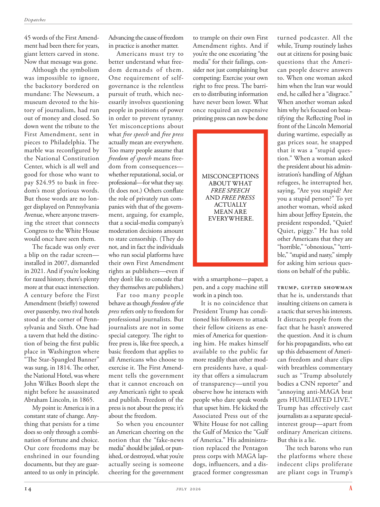

# The Atlantic — July 2026

## Page 16

---

45 words of the First AmendAdvancing the cause of freedom ment had been there for years, in practice is another matter. giant letters carved in stone.

**【中文翻译】** 第一修正案的 45 条“推进自由事业”已经存在多年，但实际上却是另一回事。石头上刻着巨大的字母。

Americans must try to Now that message was gone. better understand what freeAlthough the symbolism dom demands of them. was impossible to ignore, One requirement of selfthe backstory bordered on governance is the relentless mundane: The Newseum, a pursuit of truth, which necmuseum devoted to the hisessarily involves questioning tory of journalism, had run people in positions of power out of money and closed. So in order to prevent tyranny. down went the tribute to the Yet mis conceptions about what free speech and free press First Amendment, sent in pieces to Philadelphia. The actually mean are everywhere. marble was reconfigured by Too many people assume that freedom of speech means freethe National Constitution Center, which is all well and dom from consequences— good for those who want to whether reputational, social, or pay $24.95 to bask in freeprofessional— for what they say. dom’s most glorious words.

**【中文翻译】** 美国人必须努力现在这个消息已经消失了。更好地理解自由象征主义对他们的要求。不容忽视的是，与治理相关的背景故事对自我的一个要求是无情的世俗：新闻博物馆，一个追求真理的博物馆，专门致力于对新闻业的质疑，它让掌权者失去了金钱并关闭了。所以为了防止暴政。对言论自由和新闻自由第一修正案的错误观念的赞扬被分批发送到费城。其实卑鄙的东西无处不在。太多人认为言论自由意味着国家宪法中心的自由，这对那些想要名誉、社会或支付 24.95 美元享受自由职业的人来说是好事，因为他们所说的话不受后果影响。 dom最光辉的话语。

(It does not.) Others conflate But those words are no lonthe role of privately run comger displayed on Pennsylvania panies with that of the governAvenue, where anyone traversment, arguing, for example, ing the street that connects that a social-media company’s Congress to the White House moderation decisions amount would once have seen them. to state censorship. (They do The facade was only ever not, and in fact the individuals a blip on the radar screen— who run social platforms have installed in 2007, dismantled their own First Amendment in 2021. And if you’re looking rights as publishers— even if for razed history, there’s plenty they don’t like to concede that more at that exact inter section. they themselves are publishers.) A century before the First Far too many people behave as though freedom of the Amendment (briefly) towered press refers only to freedom for over passersby, two rival hotels stood at the corner of Pennprofessional journalists. But sylvania and Sixth. One had journalists are not in some a tavern that held the distincspecial category. The right to tion of being the first public free press is, like free speech, a place in Washington where basic freedom that applies to “The Star-Spangled Banner” all Americans who choose to was sung, in 1814. The other, exercise it. The First Amendthe National Hotel, was where ment tells the government John Wilkes Booth slept the that it cannot encroach on any American’s right to speak night before he assassinated Abraham Lincoln, in 1865. and publish. Freedom of the My point is: America is in a press is not about the press; it’s constant state of change. Anyabout the freedom. thing that persists for a time So when you encounter does so only through a combian American cheering on the nation of fortune and choice. notion that the “fake-news Our core freedoms may be media” should be jailed, or punenshrined in our founding ished, or destroyed, what you’re documents, but they are guaractually seeing is someone anteed to us only in principle. cheering for the government to trample on their own First Amendment rights. And if you’re the one excoriating “the media” for their failings, consider not just complaining but competing: Exercise your own right to free press. The barriers to distributing information have never been lower. What once required an expensive printing press can now be done MISCONCEPTIONS ABOUT WHAT FREE SPEECH AND FREE PRESS ACTUALLY MEAN ARE EVERYWHERE.

**【中文翻译】** （事实并非如此。）其他人将这些词混为一谈。但这些词不再是宾夕法尼亚州公司中展示的私营comger的角色与政府大道的角色，任何人在这条街上行走、争论，例如，在连接社交媒体公司的国会和白宫调节决策金额的街道上都会看到它们。国家审查制度。 （他们的外表只是从来没有，事实上，雷达屏幕上的一个亮点——运营社交平台的人在 2007 年建立了自己的第一修正案，并在 2021 年废除了他们自己的第一修正案。如果你以出版商的身份寻找权利——即使是为了抹平历史，他们也不愿意在那个特定的交汇点承认更多。他们自己就是出版商。） 第一修正案之前的一个世纪 太多人的行为就像是自由的修正案（简而言之）耸立的新闻界仅指过路人的自由，两家竞争对手的酒店站在宾夕法尼亚州专业记者的拐角处。但是希尔瓦尼亚和第六。记者们不在某家拥有特殊类别的小酒馆里。成为第一个公共自由媒体的权利，就像言论自由一样，在 1814 年华盛顿的一个地方，适用于所有选择唱“星条旗”的美国人的基本自由。另一个，行使它。第一修正案国家酒店是约翰·威尔克斯·布斯 (John Wilkes Booth) 睡觉的地方，他们告诉政府，它不能侵犯任何美国人在 1865 年刺杀亚伯拉罕·林肯 (Abraham Lincoln) 前一天晚上的言论和出版权利。我的观点是：美国处于媒体之中，这并不是关于新闻界；而是关于新闻界。这是不断变化的状态。任何关于自由。持续一段时间的事情因此，当你遇到这种情况时，只能通过一个混合美国人为这个拥有财富和选择的国家欢呼而实现。 “我们的核心自由可能是媒体的假新闻”的观念应该被监禁，或者在我们的建国之初受到惩罚，或者销毁你的文件，但他们实际上看到的是只在原则上支持我们的人。为政府践踏自己的第一修正案权利而欢呼。如果你是那个谴责“媒体”失败的人，那么不仅要考虑抱怨，还要考虑竞争：行使你自己的新闻自由权利。传播信息的障碍从未如此之低。曾经需要昂贵的印刷机才能完成的事情现在可以完成 对于言论自由和新闻自由的实际含义的误解无处不在。

with a smartphone— paper, a pen, and a copy machine still work in a pinch too. It is no coincidence that President Trump has conditioned his followers to attack their fellow citizens as enemies of America for questioning him. He makes himself available to the public far more readily than other modern presidents have, a quality that offers a simulacrum of transparency— until you observe how he interacts with people who dare speak words that upset him. He kicked the Associated Press out of the White House for not calling the Gulf of Mexico the “Gulf of America.” His administration replaced the Pentagon press corps with MAGA lapdogs, influencers, and a disgraced former congressman turned podcaster. All the while, Trump routinely lashes out at citizens for posing basic questions that the American people deserve answers to. When one woman asked him when the Iran war would end, he called her a “disgrace.”

**【中文翻译】** 有了智能手机——纸、笔和复印机在紧要关头仍然可以工作。特朗普总统让他的追随者因为质疑他而攻击他们的同胞，将他们视为美国的敌人，这并非巧合。他比其他现代总统更容易向公众展示自己，这种品质提供了一种透明度的模拟——直到你观察他如何与那些敢于说出令他不安的话的人互动。他因美联社没有将墨西哥湾称为“美洲湾”而将其赶出白宫。他的政府用“MAGA”哈巴狗、有影响力的人和一位名誉扫地的前国会议员转型为播客，取代了五角大楼记者团。一直以来，特朗普经常猛烈抨击公民提出美国人民应该得到答案的基本问题。当一名妇女问他伊朗战争何时结束时，他称她为“耻辱”。

When another woman asked him why he’s focused on beautifying the Reflecting Pool in front of the Lincoln Memorial during wartime, especially as gas prices soar, he snapped that it was a “stupid question.” When a woman asked the president about his administration’s handling of Afghan refugees, he interrupted her, saying, “Are you stupid? Are you a stupid person?” To yet another woman, who’d asked him about Jeffrey Epstein, the president responded, “Quiet!

**【中文翻译】** 当另一位女士问他为什么在战时、特别是在汽油价格飙升的情况下专注于美化林肯纪念堂前的倒影池时，他厉声说这是一个“愚蠢的问题”。当一名妇女向总统询问他的政府如何处理阿富汗难民时，他打断了她，说：“你是傻子吗？你是个傻子吗？”另一位女士向他询问杰弗里·爱泼斯坦的情况，总统回答说：“安静！

Quiet, piggy.” He has told other Americans that they are “horrible,” “obnoxious,” “terrible,” “stupid and nasty,” simply for asking him serious questions on behalf of the public.

**【中文翻译】** 安静点，小猪。”他告诉其他美国人，他们“可怕”、“令人讨厌”、“可怕”、“愚蠢和令人讨厌”，只是因为他们代表公众向他提出了严肃的问题。

Trump, gifted showman that he is, understands that insulting citizens on camera is a tactic that serves his interests. It distracts people from the fact that he hasn’t answered the question. And it is chum for his propagandists, who eat up this debasement of American freedom and share clips with breathless commentary such as “Trump absolutely bodies a CNN reporter” and “annoying anti-MAGA brat gets HUMILIATED LIVE.”

**【中文翻译】** 特朗普是一位才华横溢的表演家，他明白在镜头前侮辱公民是一种符合他利益的策略。这分散了人们对他没有回答问题这一事实的注意力。这对他的宣传人员来说也很友好，他们接受了这种对美国自由的贬低，并在分享视频时发表了令人窒息的评论，比如“特朗普绝对是一名 CNN 记者”和“讨厌的反 MAGA 小子被现场羞辱。”

Trump has effectively cast journalists as a separate specialinterest group— apart from ordinary American citizens. But this is a lie. The tech barons who run the platforms where these indecent clips proliferate are pliant cogs in Trump’s

**【中文翻译】** 特朗普实际上将记者视为一个独立于普通美国公民之外的特殊利益群体。但这是一个谎言。运营这些不雅视频泛滥的平台的科技巨头是特朗普政府中顺从的齿轮。
