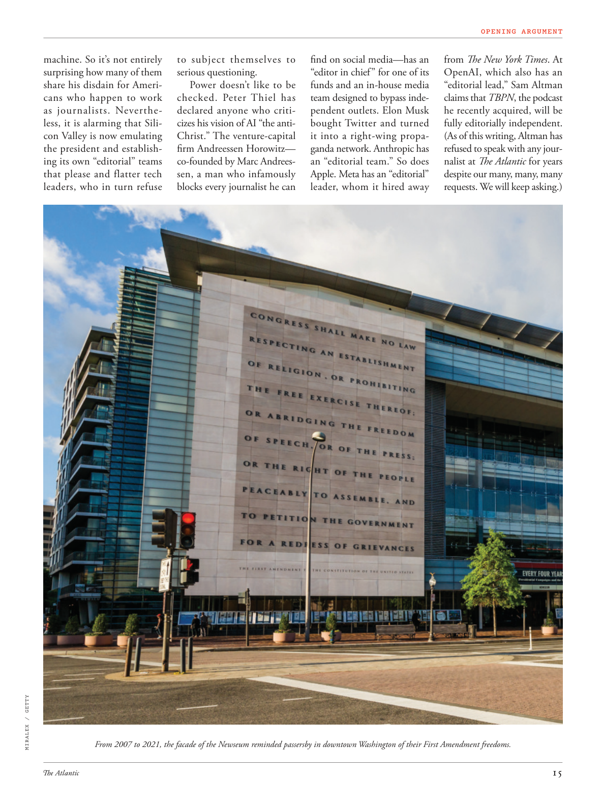

# The Atlantic — July 2026

## Page 17

---

machine. So it’s not entirely to subject themselves to surprising how many of them serious questioning. share his disdain for AmeriPower doesn’t like to be cans who happen to work checked. Peter Thiel has as journalists. Neverthedeclared anyone who critiless, it is alarming that Silicizes his vision of AI “the anticon Valley is now emulating Christ.” The venturecapital the president and establishfirm Andreessen Horowitz— ing its own “editorial” teams co-founded by Marc Andreesthat please and flatter tech sen, a man who infamously leaders, who in turn refuse blocks every journalist he can

**【中文翻译】** 机器。因此，这并不完全是让他们自己受到如此多的严肃质疑。分享他对 AmeriPower 的蔑视，他不喜欢成为碰巧工作的罐子。彼得泰尔曾担任记者。从来没有人宣称任何人都无批判性，但令人震惊的是，硅化了他对人工智能的愿景“反保守派山谷现在正在效仿基督”。风险投资公司总裁兼老牌公司安德森·霍洛维茨 (Andreessen Horowitz) 拥有由马克·安德烈斯 (Marc Andrees) 共同创立的自己的“编辑”团队，他们取悦并奉承科技参议员，这位臭名昭著的领导者反过来又拒绝屏蔽所有他能屏蔽的记者。

*MIRALEX / GETTY*

*【图注与署名】米拉莱克斯/盖蒂图片社*

From 2007 to 2021, the facade of the Newseum reminded passersby in downtown Washington of their First Amendment freedoms. find on social media— has an “editor in chief” for one of its funds and an in-house media team designed to bypass independent outlets. Elon Musk bought Twitter and turned it into a right-wing propaganda network. Anthropic has an “editorial team.” So does Apple. Meta has an “editorial” leader, whom it hired away from The New York Times . At Open AI, which also has an “editorial lead,” Sam Altman claims that TBPN , the podcast he recently acquired, will be fully editorially independent.

**【中文翻译】** 从 2007 年到 2021 年，新闻博物馆的外观提醒华盛顿市中心的路人第一修正案赋予他们的自由。在社交媒体上找到——旗下一只基金有一名“主编”，还有一个旨在绕过独立媒体的内部媒体团队。埃隆·马斯克 (Elon Musk) 收购了 Twitter，并将其变成了一个右翼宣传网络。 Anthropic 有一个“编辑团队”。苹果也是如此。 Meta 有一位“编辑”领导者，是从《纽约时报》聘请来的。在同样拥有“编辑主管”的 Open AI 中，山姆·奥尔特曼 (Sam Altman) 声称，他最近收购的播客 TBPN 将完全独立于编辑。

(As of this writing, Altman has refused to speak with any journalist at The Atlantic for years despite our many, many, many requests. We will keep asking.)

**【中文翻译】** （截至撰写本文时，奥特曼多年来一直拒绝与《大西洋月刊》的任何记者交谈，尽管我们提出了很多很多的要求。我们将继续询问。）
