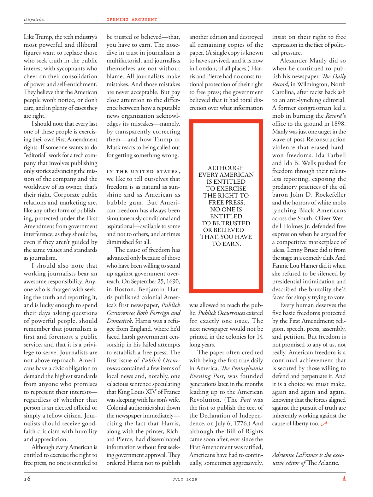

# The Atlantic — July 2026

## Page 18

---

Like Trump, the tech industry’s be trusted or believed— that, most powerful and illiberal you have to earn. The nosefigures want to replace those dive in trust in journalism is who seek truth in the public multi factorial, and journalists interest with sycophants who themselves are not without cheer on their consolidation blame. All journalists make of power and self-enrichment. mistakes. And those mistakes They believe that the American are never acceptable. But pay people won’t notice, or don’t close attention to the differcare, and in plenty of cases they ence between how a reputable are right. news organization acknowlI should note that every last edges its mistakes— namely, one of these people is exercisby transparently correcting ing their own First Amendment them— and how Trump or rights. If someone wants to do Musk reacts to being called out “editorial” work for a tech comfor getting something wrong. pany that involves publishing In thi Unitid Statis , only stories advancing the mission of the company and the we like to tell ourselves that worldview of its owner, that’s freedom is as natural as suntheir right. Corporate public shine and as American as relations and marketing are, bubble gum. But Amerilike any other form of publishcan freedom has always been ing, protected under the First simultaneously conditional and Amendment from government aspirational— available to some interference, as they should be, and not to others, and at times even if they aren’t guided by diminished for all. the same values and standards The cause of freedom has as journalism. advanced only because of those I should also note that who have been willing to stand working journalists bear an up against government overawesome responsibility. Anyreach. On September 25, 1690, one who is charged with seekin Boston, Benjamin Haring the truth and reporting it, ris published colonial America’s first newspaper, Publick and is lucky enough to spend Occurrences Both Forreign and their days asking questions Domestick . Harris was a refuof powerful people, should remember that journalism is gee from England, where he’d first and foremost a public faced harsh government censervice, and that it is a privisorship in his failed attempts lege to serve. Journalists are to establish a free press. The first issue of Publick Occur­ not above reproach. Amerirences contained a few items of cans have a civic obligation to demand the highest standards local news and, notably, one from anyone who promises salacious sentence speculating to represent their interests— that King Louis XIV of France regardless of whether that was sleeping with his son’s wife. person is an elected official or Colonial authorities shut down simply a fellow citizen. Jourthe newspaper immediately— nalists should receive goodciting the fact that Harris, faith criticism with humility along with the printer, Richand appreciation. ard Pierce, had disseminated Although every American is information without first seekentitled to exercise the right to ing government approval. They free press, no one is entitled to ordered Harris not to publish another edition and destroyed all remaining copies of the paper. (A single copy is known to have survived, and it is now in London, of all places.) Harris and Pierce had no constitutional protection of their right to free press; the government believed that it had total discretion over what information ALTHOUGH EVERY AMERICAN IS EN TITLED TO EXERCISE THE RIGHT TO FREE PRESS, NO ONE IS ENTITLED TO BE TRUSTED OR BELIEVED— THAT, YOU HAVE TO EARN.

**【中文翻译】** 就像特朗普一样，科技行业是值得信任或相信的——最强大和最不自由的你必须赢得。鼻子人物想要取代那些对新闻业充满信任的人，他们在公共多因素中寻求真相，而记者们对谄媚者感兴趣，而他们自己也对他们的整合指责不无欢呼。所有记者都利用权力和自我充实。错误。而那些错误他们认为是美国人永远无法接受的。但人们不会注意到，或者不会密切关注其中的差异，而且在很多情况下，他们会在信誉良好的人是否正确之间犹豫不决。新闻机构承认，我应该指出，每一个最后都犯了错误——也就是说，其中一个人正在通过透明地纠正他们自己的第一修正案来行使权力——以及特朗普或权利如何。如果有人想做科技行业的“编辑”工作，马斯克的反应就是犯错。涉及出版的公司在Unitid Statis中，只有推进公司使命的故事，我们喜欢告诉自己，其所有者的世界观，即自由就像他们的权利一样自然。企业公众大放异彩，就像美国的关系和营销一样，泡泡糖。但美国与任何其他形式的出版自由一样，始终受到第一条同时有条件和修正案的保护，免受政府的渴望——可以受到某些人的干扰，这是应该的，而不是其他人，有时即使他们没有受到所有人的削弱的指导。自由事业与新闻业具有相同的价值观和标准。之所以先进只是因为那些我还应该指出的是，那些愿意忍受工作的记者承担着对抗政府的巨大责任。任何到达。 1690 年 9 月 25 日，负责在波士顿寻求真相并进行报道的本杰明·哈林 (Benjamin Haring) 出版了美国殖民时期的第一份报纸《公共报》(Publick)，并且很幸运能够在国外和国内询问问题。哈里斯是一个拒绝强权的人，应该记住，新闻业是来自英国的，在那里他首先是公众面临严厉的政府谴责，而这是他失败的尝试中的一个私人服务。记者要建立新闻自由。 《Publick》第一期的出现并非无可非议。 Amerirences 包含一些罐头物品，这些罐头有公民义务要求最高标准的当地新闻，尤其是任何承诺代表自己利益的淫秽判决的人 - 法国国王路易十四，无论他是否与他的儿子的妻子上床。该人是民选官员或殖民当局关闭的只是同胞公民。立即在报纸上发表评论——候选人应该受到哈里斯的赞扬，谦虚地接受批评，并与印刷商理查德赞赏。尽管每个美国人都有权获得信息，但没有首先寻求行使获得政府批准的权利。他们新闻自由，没有人有权命令哈里斯不要出版另一版本并销毁该报纸的所有剩余副本。 （众所周知，只有一份副本幸存下来，现在在伦敦，在所有地方。） 哈里斯和皮尔斯的新闻自由权没有受到宪法保护；他们的言论自由权受到宪法保护。政府认为，它对哪些信息拥有完全的自由裁量权，尽管每个美国人都有权行使新闻自由的权利，但没有人有权被信任或相信——这是你必须赢得的。

was allowed to reach the public. Publick Occurrences existed for exactly one issue. The next newspaper would not be printed in the colonies for 14 long years.

**【中文翻译】** 被允许接触公众。 Publick Occurrences 的存在正是为了一个问题。下一份报纸将在长达 14 年的时间里不再在殖民地印刷。

The paper often credited with being the first true daily in America, The Pennsylvania Evening Post , was founded generations later, in the months leading up to the American Revolution. (The Post was the first to publish the text of the Declaration of Independence, on July 6, 1776.) And although the Bill of Rights came soon after, ever since the First Amendment was ratified, Americans have had to continually, sometimes aggressively, insist on their right to free expression in the face of political pressure.

**【中文翻译】** 《宾夕法尼亚晚报》经常被认为是美国第一家真正的日报，它是在几代人之后、美国独立战争前的几个月里创办的。 （《华盛顿邮报》于 1776 年 7 月 6 日率先发表了《独立宣言》的文本。）尽管权利法案很快出台，但自从第一修正案获得批准以来，美国人在面对政治压力时就不得不不断地、有时甚至是积极地坚持自己的言论自由权。

Alexander Manly did so when he continued to publish his newspaper, The Daily Record , in Wilmington, North Carolina, after racist backlash to an antilynching editorial.

**【中文翻译】** 亚历山大·曼利（Alexander Manly）在一篇反私刑社论遭到种族主义强烈反对后，继续在北卡罗来纳州威尔明顿出版他的报纸《每日纪事报》（The Daily Record），他这样做了。

A former congress man led a mob in burning the Record ’s office to the ground in 1898. Manly was just one target in the wave of postReconstruction violence that erased hardwon freedoms. Ida Tarbell and Ida B. Wells pushed for freedom through their relentless reporting, exposing the predatory practices of the oil baron John D. Rockefeller and the horrors of white mobs lynching Black Americans across the South. Oliver Wendell Holmes Jr. defended free expression when he argued for a competitive marketplace of ideas. Lenny Bruce did it from the stage in a comedy club. And Fannie Lou Hamer did it when she refused to be silenced by presidential intimidation and described the brutality she’d faced for simply trying to vote.

**【中文翻译】** 1898 年，一名前国会议员带领暴徒烧毁了唱片公司的办公室。曼利只是重建后暴力浪潮中的一个目标，这场暴力浪潮抹去了来之不易的自由。艾达·塔贝尔（Ida Tarbell）和艾达·B·威尔斯（Ida B. Wells）通过不懈的报道推动自由，揭露石油大亨约翰·D·洛克菲勒（John D. Rockefeller）的掠夺行为，以及白人暴徒在南方各地对美国黑人私刑的恐怖。小奥利弗·温德尔·霍姆斯 (Oliver Wendell Holmes Jr.) 在主张竞争性思想市场时捍卫言论自由。莱尼·布鲁斯在喜剧俱乐部的舞台上表演了这一切。范妮·卢·哈默（Fannie Lou Hamer）拒绝因总统的恐吓而保持沉默，并描述了她仅仅因为试图投票而面临的残酷行为，就做到了这一点。

Every human deserves the five basic freedoms protected by the First Amendment: religion, speech, press, assembly, and petition. But freedom is not promised to any of us, not really. American freedom is a continual achievement that is secured by those willing to defend and perpetuate it. And it is a choice we must make, again and again and again, knowing that the forces aligned against the pursuit of truth are inherently working against the cause of liberty too. Adrienne LaFrance is the exec­ utive editor of The Atlantic .

**【中文翻译】** 每个人都应该享有第一修正案保护的五项基本自由：宗教、言论、新闻、集会和请愿。但我们并没有向我们任何人承诺自由，事实上并非如此。美国的自由是一项持续的成就，是由那些愿意捍卫和延续它的人所保障的。这是我们必须一次又一次做出的选择，因为我们知道反对追求真理的力量本质上也在反对自由事业。艾德丽安娜·拉弗朗斯 (Adrienne LaFrance) 是《大西洋月刊》的执行主编。
