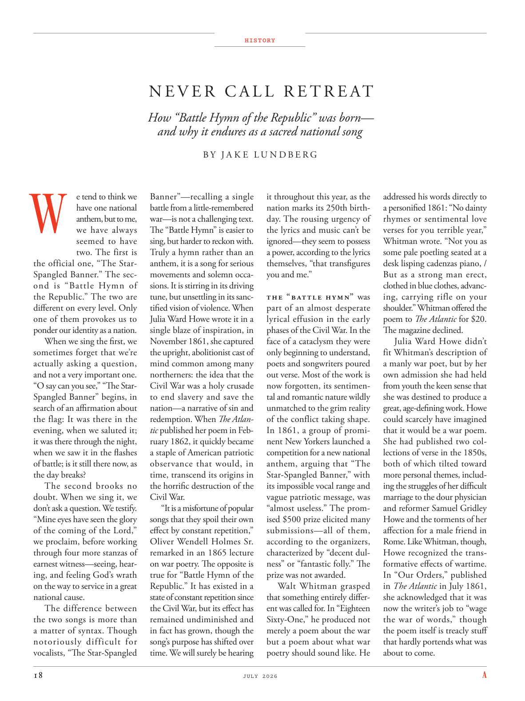

# The Atlantic — July 2026

## Page 20

---

### N E V E R C A L L R E T R E AT

**【标题翻译】** 切勿致电撤退

#### How “Battle Hymn of the Republic” was born—

**【副标题翻译】** 《共和国战歌》是如何诞生的——

#### and why it endures as a sacred national song

**【副标题翻译】** 以及为什么它作为一首神圣的国歌经久不衰

### W

e tend to think we Banner”—recalling a single have one national battle from a little-remembered anthem, but to me, war—is not a challenging text. we have always The “Battle Hymn” is easier to seemed to have sing, but harder to reckon with. two. The first is Truly a hymn rather than an the official one, “The Staranthem, it is a song for serious Spangled Banner.” The secmovements and solemn occaond is “Battle Hymn of sions. It is stirring in its driving the Republic.” The two are tune, but unsettling in its sancdifferent on every level. Only tified vision of violence. When one of them provokes us to Julia Ward Howe wrote it in a ponder our identity as a nation. single blaze of inspiration, in When we sing the first, we November 1861, she captured sometimes forget that we’re the upright, abolitionist cast of actually asking a question, mind common among many and not a very important one. northerners: the idea that the “O say can you see,” “The StarCivil War was a holy crusade Spangled Banner” begins, in to end slavery and save the search of an affirmation about nation—a narrative of sin and redemption. When The Atlanthe flag: It was there in the tic published her poem in Febevening, when we saluted it; it was there through the night, ruary 1862, it quickly became when we saw it in the flashes a staple of American patriotic of battle; is it still there now, as observance that would, in the day breaks? time, transcend its origins in The second brooks no the horrific destruction of the doubt. When we sing it, we Civil War. don’t ask a question. We testify.

**【中文翻译】** 我们倾向于认为“我们的旗帜”——从一首鲜为人知的国歌中回忆起一场全国性的战斗，但对我来说，战争——并不是一个具有挑战性的文本。我们一直认为“战歌”似乎更容易唱，但更难以计算。第二。第一首是真正的赞美诗，而不是官方的，“星国歌，这是一首严肃的《星条旗》的歌曲。”接下来的乐章和庄严的场面是“战歌”。它在推动共和国的进程中令人激动不已。”两者很和谐，但在各个层面上都存在着令人不安的差异。只有暴力的视觉。当他们中的一个激怒我们时，朱莉娅·沃德·豪（Julia Ward Howe）在思考我们作为一个国家的身份时写下了这篇文章。在《当我们唱第一首歌时，我们1861年11月》中，她的灵感之火有时会忘记，我们是一群正直的废奴主义者，他们实际上提出了一个问题，我们的想法是许多人的共同点，而不是一个非常重要的问题。北方人：“噢，你能看到吗？”“星际内战是一场神圣的十字军”的想法开始于结束奴隶制并拯救对国家的肯定——一种关于罪恶和救赎的叙述。当《亚特兰特旗》在二月刊发表她的诗时，我们向它致敬； 1862 年 1 月，它整夜都在那里，当我们在闪光中看到它时，它很快就成为美国爱国战争的主要内容；现在它还在吗，就像黎明时的纪念活动一样？时间，超越它的起源，第二个不容怀疑的可怕破坏。当我们唱这首歌时，我们就是内战。不要问问题。我们作证。

“It is a misfortune of popular “Mine eyes have seen the glory songs that they spoil their own of the coming of the Lord,” effect by constant repetition,” we proclaim, before working Oliver Wendell Holmes Sr. through four more stanzas of remarked in an 1865 lecture earnest witness—seeing, hearon war poetry. The opposite is ing, and feeling God’s wrath true for “Battle Hymn of the on the way to service in a great Republic.” It has existed in a national cause. state of constant repetition since The difference between the Civil War, but its effect has the two songs is more than remained undiminished and a matter of syntax. Though in fact has grown, though the notoriously difficult for song’s purpose has shifted over vocalists, “The Star-Spangled time. We will surely be hearing HISTORY B Y J A K E L U N D B E R G it throughout this year, as the nation marks its 250th birthday. The rousing urgency of the lyrics and music can’t be ignored—they seem to possess a power, according to the lyrics themselves, “that transfigures you and me.”

**【中文翻译】** 在奥利弗·温德尔·福尔摩斯老先生在 1865 年演讲中所评论的另外四节中，我们宣布：“流行的‘我的眼睛看到了荣耀的歌曲，却因不断重复而破坏了自己的主再来’，这是不幸的”。相反的是，在“为伟大共和国服务的路上的战歌”中感受到上帝的愤怒是真实的。它已经存在于一项国家事业中。自内战以来不断重复的状态之间的差异，但其对两首歌的影响不仅没有减弱，而且是句法问题。尽管事实上歌曲的目的已经变得越来越困难，但歌曲的目的已经转移到了歌手身上，“星条旗永不落。今年我们一定会听到 J A K E L U N D B E R G 的《HISTORY B Y J A K E L U N D B E R G》，因为这个国家正在庆祝其 250 岁生日。歌词和音乐令人振奋的紧迫感不容忽视——根据歌词本身，它们似乎拥有一种力量，“可以改变你和我。”

The “Battle Hymn” was part of an almost desperate lyrical effusion in the early phases of the Civil War. In the face of a cataclysm they were only beginning to understand, poets and songwriters poured out verse. Most of the work is now forgotten, its sentimental and romantic nature wildly unmatched to the grim reality of the conflict taking shape.

**【中文翻译】** 《战歌》是内战早期几乎绝望的抒情诗的一部分。面对一场他们才刚刚开始理解的灾难，诗人和歌曲作者倾注了诗歌。现在，这部作品的大部分内容已被遗忘，其感伤和浪漫的本质与正在形成的冲突的严峻现实完全无法匹配。

In 1861, a group of prominent New Yorkers launched a competition for a new national anthem, arguing that “The Star-Spangled Banner,” with its impossible vocal range and vague patriotic message, was “almost useless.” The promised $500 prize elicited many submissions— all of them, according to the organizers, characterized by “decent dulness” or “fantastic folly.” The prize was not awarded.

**【中文翻译】** 1861 年，一群纽约知名人士发起了一场新国歌竞赛，他们认为《星条旗永不落》因其令人难以置信的音域和模糊的爱国信息而“几乎毫无用处”。承诺的 500 美元奖金吸引了许多人提交意见——根据组织者的说法，所有这些意见的特点都是“相当愚蠢”或“极其愚蠢”。奖项没有颁发。

Walt Whitman grasped that something entirely different was called for. In “Eighteen Sixty-One,” he produced not merely a poem about the war but a poem about what war poetry should sound like. He addressed his words directly to a personified 1861: “No dainty rhymes or sentimental love verses for you terrible year,” Whitman wrote. “Not you as some pale poetling seated at a desk lisping cadenzas piano, / But as a strong man erect, clothed in blue clothes, advancing, carrying rifle on your shoulder.” Whitman offered the poem to The Atlantic for $20.

**【中文翻译】** 沃尔特·惠特曼意识到我们需要一些完全不同的东西。在《十八六十一》中，他不仅创作了一首关于战争的诗，而且创作了一首关于战争诗应该是什么样子的诗。他直接向拟人化的 1861 年致辞：“对于你糟糕的一年，没有优美的韵律或感伤的爱情诗句，”惠特曼写道。 “你不是坐在书桌前口齿不清地弹着华彩钢琴的苍白诗人，/而是一个身着蓝色衣服、肩上扛着步枪、挺身而立的强壮男人。”惠特曼以 20 美元的价格将这首诗卖给了《大西洋月刊》。

The magazine declined. Julia Ward Howe didn’t fit Whitman’s description of a manly war poet, but by her own admission she had held from youth the keen sense that she was destined to produce a great, age-defining work. Howe could scarcely have imagined that it would be a war poem.

**【中文翻译】** 该杂志拒绝了。朱莉娅·沃德·豪并不符合惠特曼对一位有男子气概的战争诗人的描述，但她自己承认，她从年轻时就敏锐地意识到，自己注定要创作出一部伟大的、划时代的作品。豪几乎无法想象这会是一首战争诗。

She had published two collections of verse in the 1850s, both of which tilted toward more personal themes, including the struggles of her difficult marriage to the dour physician and reformer Samuel Gridley Howe and the torments of her affection for a male friend in Rome. Like Whitman, though, Howe recognized the transformative effects of wartime.

**【中文翻译】** 她在 1850 年代出版了两本诗集，两本都倾向于更个人化的主题，包括她与阴郁的医生兼改革家塞缪尔·格里德利·豪 (Samuel Gridley Howe) 的艰难婚姻中的挣扎，以及她对罗马一位男性朋友的感情所带来的折磨。不过，和惠特曼一样，豪认识到战时的变革性影响。

In “Our Orders,” published in The Atlantic in July 1861, she acknowledged that it was now the writer’s job to “wage the war of words,” though the poem itself is treacly stuff that hardly portends what was about to come.

**【中文翻译】** 在 1861 年 7 月发表于《大西洋月刊》的《我们的命令》中，她承认现在作家的工作就是“发动口水战”，尽管这首诗本身是甜腻的东西，很难预示即将发生的事情。
