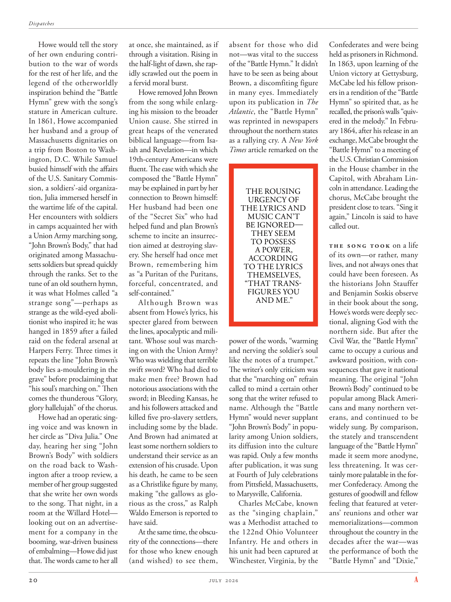

# The Atlantic — July 2026

## Page 22

---

Howe would tell the story at once, she maintained, as if of her own enduring contrithrough a visitation. Rising in bution to the war of words the half-light of dawn, she rapfor the rest of her life, and the idly scrawled out the poem in legend of the otherworldly a fervid moral burst. inspiration behind the “Battle Howe removed John Brown Hymn” grew with the song’s from the song while enlargstature in American culture. ing his mission to the broader In 1861, Howe accompanied Union cause. She stirred in her husband and a group of great heaps of the venerated

**【中文翻译】** 她坚称，豪会立即讲述这个故事，就好像她自己通过拜访而做出的持久贡献一样。在黎明的微光中，她在口水战中崛起，用饶舌的方式讲述了她的余生，悠闲地潦草地写下了这首超凡脱俗的传说中的诗，一种狂热的道德爆发。 “豪战移除约翰·布朗赞美诗”背后的灵感随着这首歌在美国文化中的地位的扩大而增长。 1861 年，豪陪伴联邦事业发展。她搅动了她的丈夫和一大堆受人尊敬的人

*— Massachusetts dignitaries on*

*【作者署名】马萨诸塞州政要*

biblical language—from Isaa trip from Boston to Washiah and Revelation—in which ington, D.C. While Samuel 19th-century Americans were busied himself with the affairs fluent. The ease with which she of the U.S. Sanitary Commiscomposed the “Battle Hymn” sion, a soldiers’-aid organizamay be explained in part by her tion, Julia immersed herself in connection to Brown himself: the wartime life of the capital.

**【中文翻译】** 圣经语言——从以撒从波士顿到瓦希亚的旅行和启示录——在华盛顿特区的灵顿，而塞缪尔 19 世纪的美国人正忙着流利的事务。美国卫生委员会的她轻松地创作了一个士兵援助组织“战歌”，这在一定程度上可以解释为她沉浸在与布朗本人的联系中：首都的战时生活。

Her husband had been one Her encounters with soldiers of the “Secret Six” who had in camps acquainted her with helped fund and plan Brown’s a Union Army marching song, scheme to incite an insurrec- “John Brown’s Body,” that had tion aimed at destroying slavoriginated among Massachuery. She herself had once met setts soldiers but spread quickly Brown, remembering him through the ranks. Set to the as “a Puritan of the Puritans, tune of an old southern hymn, forceful, concentrated, and it was what Holmes called “a self-contained.” strange song”—perhaps as Although Brown was strange as the wild-eyed aboliabsent from Howe’s lyrics, his tionist who inspired it; he was specter glared from between hanged in 1859 after a failed the lines, apocalyptic and miliraid on the federal arsenal at tant. Whose soul was marchHarpers Ferry. Three times it ing on with the Union Army? repeats the line “John Brown’s Who was wielding that terrible body lies a-mouldering in the swift sword? Who had died to grave” before proclaiming that make men free? Brown had “his soul’s marching on.” Then notorious associations with the comes the thunderous “Glory, sword; in Bleeding Kansas, he glory hallelujah” of the chorus. and his followers attacked and Howe had an operatic singkilled five proslavery settlers, ing voice and was known in including some by the blade. her circle as “Diva Julia.” One And Brown had animated at day, hearing her sing “John least some northern soldiers to Brown’s Body” with soldiers understand their service as an on the road back to Washextension of his crusade. Upon ington after a troop review, a his death, he came to be seen member of her group suggested as a Christlike figure by many, that she write her own words making “the gallows as gloto the song. That night, in a rious as the cross,” as Ralph room at the Willard Hotel— Waldo Emerson is reported to looking out on an advertisehave said. ment for a company in the At the same time, the obscubooming, war-driven business rity of the connections—there of embalming—Howe did just for those who knew enough that. The words came to her all (and wished) to see them, absent for those who did not—was vital to the success of the “Battle Hymn.” It didn’t have to be seen as being about Brown, a discomfiting figure in many eyes. Immediately upon its publication in The Atlantic , the “Battle Hymn” was reprinted in newspapers throughout the northern states as a rallying cry. A New York Times article remarked on the THE ROUSING URGENCY OF THE LYRICS AND MUSIC CAN’T BE IGNORED— THEY SEEM TO POSSESS A POWER, ACCORDING TO THE LYRICS THEMSELVES, “THAT TRANSFIGURES YOU AND ME.”

**【中文翻译】** 她的丈夫是她与“秘密六人组”士兵的接触者之一，他们在营地里认识了她，帮助资助和策划了布朗的一首联邦军进行曲，计划煽动叛乱——“约翰·布朗的身体”，其目的是摧毁马萨诸塞州的奴隶制。她本人曾经见过塞特士兵，但很快就传遍了布朗，在队伍中记住了他。设定为“清教徒中的清教徒，一首古老的南方赞美诗的曲调，有力，集中，这就是福尔摩斯所说的“自成一体”。奇怪的歌曲”——也许是因为豪的歌词中没有狂野的废人，但布朗是他的灵感来源； 1859年，他在联邦军火库的防线上失败后，被绞死。他的灵魂是马奇·哈珀斯·费里。与联邦军的三倍？在宣布使人自由之前，重复了这句台词“约翰·布朗的谁挥舞着那把腐烂在快剑中的可怕尸体？谁已经死去”？布朗“他的灵魂仍在前进”。然后，与合唱中雷鸣般的“荣耀，剑；在流血的堪萨斯，他荣耀哈利路亚”的臭名昭著的联想。他的追随者发起攻击，豪以歌剧般的方式杀死了五名支持奴隶制的定居者，并因其中一些人被刀刃而闻名。她的圈子里被称为“Diva Julia”。一和布朗白天很活跃，听到她唱着“约翰至少有一些北方士兵到布朗的身体”，士兵们明白他们的服务是在返回华盛顿的路上延伸他的十字军东征。部队检阅结束后，他去世了。据报道，威拉德酒店的拉尔夫房间里的沃尔多·爱默生在广告上看到她说，她自己写下歌词，“绞刑架就像歌曲的歌声。那天晚上，在十字架上，”。同时，豪为那些对此有足够了解的人所做的，是令人费解的、战争驱动的商业联系——即防腐——。她所有人都想到（并希望）看到他们，而那些没有看到的人则缺席——这对“战歌”的成功至关重要。它不必被视为与布朗有关，在许多人眼中，布朗是一个令人不安的人物。 《战歌》在《大西洋月刊》发表后，立即在北部各州的报纸上转载，作为战斗口号。 《纽约时报》的一篇文章评论了歌词和音乐令人振奋的紧迫感，不容忽视——根据歌词本身，它们似乎拥有一种力量，“这改变了你和我。”

power of the words, “warming and nerving the soldier’s soul like the notes of a trumpet.” The writer’s only criticism was that the “marching on” refrain called to mind a certain other song that the writer refused to name. Although the “Battle Hymn” would never supplant “John Brown’s Body” in popularity among Union soldiers, its diffusion into the culture was rapid. Only a few months after publication, it was sung at Fourth of July celebrations

**【中文翻译】** 这句话的力量，“像喇叭的音符一样温暖和鼓舞士兵的灵魂。”作者唯一的批评是，“继续前进”的副歌让人想起另一首作者拒绝透露名字的歌曲。尽管《战歌》永远不会取代《约翰·布朗的尸体》在联邦士兵中的受欢迎程度，但它很快就传播到了文化中。出版后仅几个月，它就在独立日庆祝活动中被演唱

*— from Pittsfield, Massachusetts,*

*【作者署名】来自马萨诸塞州皮茨菲尔德，*

to Marysville, California. Charles McCabe, known as the “singing chaplain,” was a Methodist attached to the 122nd Ohio Volunteer Infantry. He and others in his unit had been captured at Winchester, Virginia, by the Confederates and were being held as prisoners in Richmond.

**【中文翻译】** 前往加利福尼亚州马里斯维尔。查尔斯·麦凯布 (Charles McCabe)，被称为“歌唱牧师”，是一名隶属于俄亥俄州第 122 志愿步兵团的卫理公会教徒。他和他所在部队的其他人在弗吉尼亚州温彻斯特被南方联盟俘虏，并被关押在里士满。

In 1863, upon learning of the Union victory at Gettys burg, McCabe led his fellow prisoners in a rendition of the “Battle Hymn” so spirited that, as he recalled, the prison’s walls “quivered in the melody.” In February 1864, after his release in an exchange, McCabe brought the “Battle Hymn” to a meeting of the U.S. Christian Commission in the House chamber in the Capitol, with Abraham Lincoln in attendance. Leading the chorus, McCabe brought the president close to tears. “Sing it again,” Lincoln is said to have called out.

**【中文翻译】** 1863 年，得知联邦军在葛底斯堡取得胜利后，麦凯布带领狱友们演唱了“战歌”，据他回忆，监狱的墙壁“在旋律中颤抖”。 1864 年 2 月，在一次交换中获释后，麦凯布带着《战歌》参加了在国会大厦众议院会议厅举行的美国基督教委员会会议，亚伯拉罕·林肯出席了会议。麦凯布领唱的合唱让总统差点落泪。据说林肯喊道：“再唱一遍。”

The song took on a life of its own—or rather, many lives, and not always ones that could have been foreseen. As the historians John Stauffer and Benjamin Soskis observe in their book about the song, Howe’s words were deeply sectional, aligning God with the northern side. But after the Civil War, the “Battle Hymn” came to occupy a curious and awkward position, with consequences that gave it national meaning. The original “John Brown’s Body” continued to be popular among Black Americans and many northern veterans, and continued to be widely sung. By comparison, the stately and transcendent language of the “Battle Hymn” made it seem more anodyne, less threatening. It was certainly more palatable in the former Confederacy. Among the gestures of goodwill and fellow feeling that featured at veterans’ reunions and other war memorializations— common throughout the country in the decades after the war—was the performance of both the “Battle Hymn” and “Dixie,”

**【中文翻译】** 这首歌有了自己的生命——或者更确切地说，有很多生命，但并不总是可以预见的。正如历史学家约翰·斯托弗（John Stauffer）和本杰明·索斯基斯（Benjamin Soskis）在他们关于这首歌的书中所观察到的那样，豪的歌词具有深刻的分歧，将上帝与北方联系起来。但内战结束后，“战歌”占据了一个奇怪而尴尬的地位，其后果赋予了它全国性的意义。最初的《约翰·布朗的身体》继续在美国黑人和许多北方退伍军人中流行，并继续被广泛传唱。相比之下，《战歌》庄严超凡的语言让它显得更加平和，不那么具有威胁性。这在前联邦国家肯定更受欢迎。退伍军人聚会和其他战争纪念活动中表现出善意和同胞感情的表现——战后几十年在全国各地都很常见——是表演“战歌”和“迪克西”，
