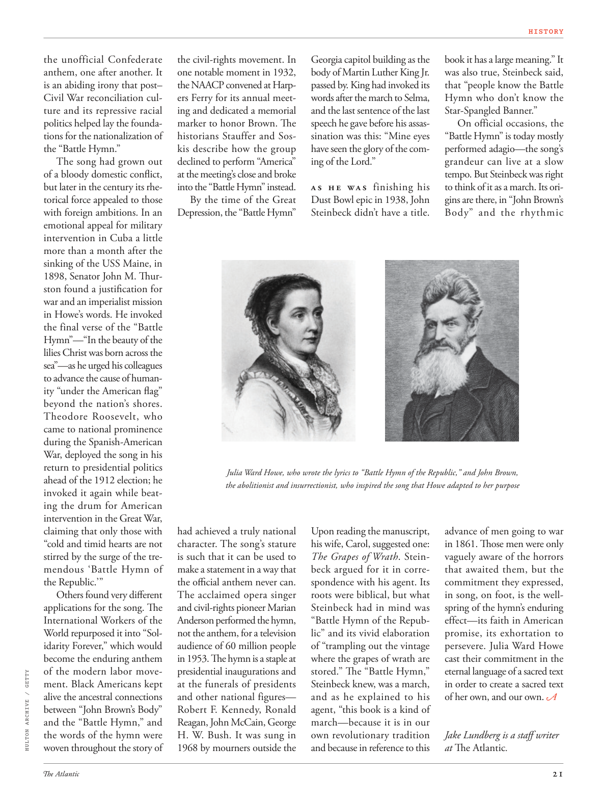

# The Atlantic — July 2026

## Page 23

---

the unofficial Confederate the civil-rights movement. In anthem, one after another. It one notable moment in 1932, is an abiding irony that post– the NAACP convened at HarpCivil War reconciliation culers Ferry for its annual meetture and its repressive racial ing and dedicated a memorial politics helped lay the foundamarker to honor Brown. The tions for the nationalization of historians Stauffer and Sosthe “Battle Hymn.” kis describe how the group The song had grown out declined to perform “America” of a bloody domestic confl ict, at the meeting’s close and broke but later in the century its rheinto the “Battle Hymn” instead. torical force appealed to those By the time of the Great with foreign ambitions. In an Depression, the “Battle Hymn” emotional appeal for military intervention in Cuba a little more than a month after the sinking of the USS Maine, in 1898, Senator John M. Th urston found a justifi cation for war and an imperialist mission in Howe’s words. He invoked the final verse of the “Battle Hymn”—“In the beauty of the lilies Christ was born across the sea”—as he urged his colleagues to advance the cause of humanity “under the American fl ag” beyond the nation’s shores.

**【中文翻译】** 非官方的邦联民权运动。在国歌声中，一首又一首。 1932 年的一个值得注意的时刻是一个持久的讽刺，即全国有色人种协进会在哈普内战和解委员会召开年度会议及其镇压种族问题并致力于纪念政治活动，为纪念布朗奠定了基础。历史学家斯托弗和索斯的《战歌》的国有化主张。这首歌描述了乐队如何在会议结束和破裂时拒绝演奏有关血腥国内冲突的“美国”，但在本世纪后期，它改为演奏“战歌”。到了伟大时代，历史力量对那些怀有对外野心的人具有吸引力。 1898 年，缅因号战列舰沉没一个多月后，在大萧条时期，“战歌”情感诉求对古巴进行军事干预，参议员约翰·M·瑟斯顿 (John M. Thurston) 用豪的话说，为战争和帝国主义使命找到了理由。他引用了《战歌》的最后一首诗——“在百合花的美丽中，基督在大海的彼岸诞生”——他敦促同事们“在美国国旗下”将人类事业推向海外。

Theodore Roosevelt, who came to national prominence during the Spanish-American War, deployed the song in his return to presidential politics ahead of the 1912 election; he invoked it again while beating the drum for American intervention in the Great War, claiming that only those with had achieved a truly national “cold and timid hearts are not character. The song’s stature stirred by the surge of the treis such that it can be used to mendous ‘Battle Hymn of make a statement in a way that the Republic.’ ” the offi cial anthem never can.

**【中文翻译】** 西奥多·罗斯福 (Theodore Roosevelt) 在美西战争期间声名鹊起，他在 1912 年大选前重返总统政坛时使用了这首歌；他在为美国干预一战鼓掌时再次引用了这首歌，声称只有那些拥有真正的民族精神的人，“冷漠和胆怯的心不是性格。这首歌的地位被特雷斯的浪潮所搅动，以至于它可以用来弥补‘以共和国的方式发表声明的战歌’”，这是官方国歌永远无法做到的。

Others found very diff erent The acclaimed opera singer applications for the song. The and civil-rights pioneer Marian International Workers of the Anderson performed the hymn, World repurposed it into “Solnot the anthem, for a television idarity Forever,” which would audience of 60 million people become the enduring anthem in 1953. The hymn is a staple at of the modern labor movepresidential inaugurations and

**【中文翻译】** 其他人发现这首歌的应用程序与广受好评的歌剧歌手非常不同。安德森民权先驱玛丽安国际工人组织 (Marian International Workers of the Anderson) 演唱了这首圣歌，世界将其重新调整为“索尔诺国歌，永远的电视偶像”，这首歌将成为 1953 年 6000 万观众的不朽圣歌。这首圣歌是现代劳工运动总统就职典礼和总统就职典礼上的主要内容。

*HULTON ARCHIVE / GETTY*

*【图注与署名】赫尔顿档案馆/盖蒂图片社*

ment. Black Americans kept at the funerals of presidents alive the ancestral connections and other national figures— between “John Brown’s Body” Robert F. Kennedy, Ronald and the “Battle Hymn,” and Reagan, John McCain, George the words of the hymn were H. W. Bush. It was sung in woven throughout the story of 1968 by mourners outside the Georgia capitol building as the body of Martin Luther King Jr. passed by. King had invoked its words after the march to Selma, and the last sentence of the last speech he gave before his assassination was this: “Mine eyes have seen the glory of the coming of the Lord.”

**【中文翻译】** ment。美国黑人在总统的葬礼上保留了祖先和其他国家人物的联系——在“约翰·布朗的遗体”罗伯特·F·肯尼迪、罗纳德和“战歌”与里根、约翰·麦凯恩、乔治之间，赞美诗的歌词是布什的。当马丁·路德·金的遗体经过佐治亚州国会大厦外时，哀悼者将这首歌贯穿了 1968 年的整个故事。金在向塞尔玛进军后引用了这句话，他在被刺杀前发表的最后一次演讲中的最后一句话是：“我的眼睛已经看到了主降临的荣耀。”

A s h e wa s finishing his Dust Bowl epic in 1938, John Steinbeck didn’t have a title. Julia Ward Howe, who wrote the lyrics to “Battle Hymn of the Republic,” and John Brown, the abolitionist and insurrectionist, who inspired the song that Howe adapted to her purpose Upon reading the manuscript, his wife, Carol, suggested one: The Grapes of Wrath . Steinbeck argued for it in correspondence with his agent. Its roots were biblical, but what Steinbeck had in mind was “Battle Hymn of the Republic” and its vivid elaboration of “trampling out the vintage where the grapes of wrath are stored.” The “Battle Hymn,” Steinbeck knew, was a march, and as he explained to his agent, “this book is a kind of march—because it is in our own revolutionary tradition and because in reference to this book it has a large meaning.” It was also true, Steinbeck said, that “people know the Battle Hymn who don’t know the Star-Spangled Banner.”

**【中文翻译】** 1938 年，当约翰·斯坦贝克 (John Steinbeck) 完成他的沙尘暴史诗时，他还没有获得头衔。 《共和国战歌》的歌词作者朱莉娅·沃德·豪 (Julia Ward Howe) 和废奴主义者兼叛乱分子约翰·布朗 (John Brown) 启发了豪根据自己的目的改编了这首歌。在阅读手稿后，他的妻子卡罗尔提出了一首歌曲：《愤怒的葡萄》。斯坦贝克在与他的经纪人的通信中对此进行了辩护。它的根源是圣经，但斯坦贝克想到的是《共和国战歌》，以及它对“践踏储存愤怒葡萄的年份”的生动阐述。斯坦贝克知道，《战歌》是一首进行曲，正如他向他的经纪人解释的那样，“这本书是一种进行曲——因为它符合我们自己的革命传统，而且因为它对这本书有很大的意义。”斯坦贝克说，“人们只知道战歌，却不知道星条旗”，这也是事实。

On official occasions, the “Battle Hymn” is today mostly performed adagio—the song’s grandeur can live at a slow tempo. But Steinbeck was right to think of it as a march. Its origins are there, in “John Brown’s Body” and the rhythmic advance of men going to war in 1861. Th ose men were only vaguely aware of the horrors that awaited them, but the commitment they expressed, in song, on foot, is the wellspring of the hymn’s enduring effect—its faith in American promise, its exhortation to persevere. Julia Ward Howe cast their commitment in the eternal language of a sacred text in order to create a sacred text of her own, and our own. Jake Lundberg is a staff writer at The Atlantic .

**【中文翻译】** 在官方场合，《战歌》现在大多以慢板演奏——这首歌的宏伟可以在缓慢的节奏中体现出来。但斯坦贝克将其视为一次游行是正确的。它的起源就在那里，在《约翰·布朗的身体》和 1861 年参战的人们有节奏的前进中。这些人只是模糊地意识到等待着他们的恐怖，但他们在歌曲中、步行中表达的承诺是这首赞美诗持久影响的源泉——它对美国承诺的信念，它对坚持不懈的劝告。朱莉娅·沃德·豪以神圣文本的永恒语言表达了他们的承诺，以便创造出她自己的、我们自己的神圣文本。杰克·伦德伯格是《大西洋月刊》的特约撰稿人。
