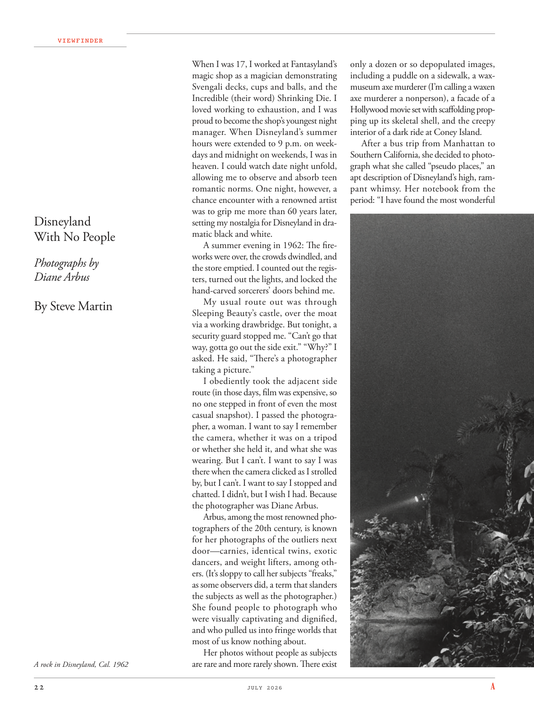

# The Atlantic — July 2026

## Page 24

---

VIEWFINDER

**【中文翻译】** 取景器

#### Disneyland

**【副标题翻译】** 迪士尼乐园

#### With No People

**【副标题翻译】** 无人陪伴

Photographs by Diane Arbus

**【中文翻译】** 黛安·阿布斯摄影

#### By Steve Martin

**【副标题翻译】** 史蒂夫·马丁

A rock in Disneyland, Cal. 1962 When I was 17, I worked at Fantasyland’s magic shop as a magician demonstrating Svengali decks, cups and balls, and the Incredible (their word) Shrinking Die. I loved working to exhaustion, and I was proud to become the shop’s youngest night manager. When Disneyland’s summer hours were extended to 9 p.m. on weekdays and midnight on weekends, I was in heaven. I could watch date night unfold, allowing me to observe and absorb teen romantic norms. One night, however, a chance encounter with a renowned artist was to grip me more than 60 years later, setting my nostalgia for Disneyland in dramatic black and white.

**【中文翻译】** 加州迪士尼乐园的一块岩石。 1962 年，我 17 岁时，在 Fantasyland 的魔术店担任魔术师，展示 Svengali 牌、杯子和球，以及不可思议的（他们的说法）收缩骰子。我喜欢工作到筋疲力尽，我很自豪能成为店里最年轻的夜班经理。当迪士尼乐园的夏季营业时间延长至晚上 9 点时工作日和周末午夜，我都在天堂。我可以观看约会之夜的展开，让我能够观察和吸收青少年的浪漫规范。然而，60 多年后的一天晚上，与一位著名艺术家的偶遇却深深吸引了我，让我对迪士尼乐园的怀念变成了戏剧性的黑白。

A summer evening in 1962: The fireworks were over, the crowds dwindled, and the store emptied. I counted out the registers, turned out the lights, and locked the hand-carved sorcerers’ doors behind me.

**【中文翻译】** 1962 年的一个夏日傍晚：烟花散去，人群逐渐减少，商店里空无一人。我清点了收银机，关掉了灯，锁上了身后手工雕刻的巫师门。

My usual route out was through Sleeping Beauty’s castle, over the moat via a working drawbridge. But tonight, a security guard stopped me. “Can’t go that way, gotta go out the side exit.” “Why?” I asked. He said, “There’s a photographer taking a picture.”

**【中文翻译】** 我通常出去的路线是穿过睡美人的城堡，通过一座可用的吊桥越过护城河。但今晚，一名保安拦住了我。 “那条路不能走，得从旁边的出口出去。” “为什么？”我问。他说：“有一个摄影师在拍照。”

I obediently took the adjacent side route (in those days, film was expensive, so no one stepped in front of even the most casual snapshot). I passed the photographer, a woman. I want to say I remember the camera, whether it was on a tripod or whether she held it, and what she was wearing. But I can’t. I want to say I was there when the camera clicked as I strolled by, but I can’t. I want to say I stopped and chatted. I didn’t, but I wish I had. Because the photographer was Diane Arbus.

**【中文翻译】** 我乖乖地走了旁边的那条路（那时候胶卷很贵，所以即使是最随意的快照也没有人走在前面）。我经过了摄影师，一位女士。我想说我记得相机，无论是在三脚架上还是她拿着它，以及她穿的衣服。但我不能。我想说当我走过时相机发出咔哒声时我就在那里，但我不能。我想说我停下来聊天了。我没有，但我希望我有。因为摄影师是黛安·阿勃丝。

Arbus, among the most renowned photographers of the 20th century, is known for her photographs of the outliers next door—carnies, identical twins, exotic dancers, and weight lifters, among others. (It’s sloppy to call her subjects “freaks,” as some observers did, a term that slanders the subjects as well as the photographer.) She found people to photograph who were visually captivating and dignified, and who pulled us into fringe worlds that most of us know nothing about.

**【中文翻译】** 阿布斯是 20 世纪最著名的摄影师之一，因其拍摄隔壁的异类照片而闻名——卡尼、同卵双胞胎、异国情调的舞者和举重运动员等。 （像一些观察者那样，称她的拍摄对象为“怪胎”是草率的，这个词既诽谤了拍摄对象，也诽谤了摄影师。）她发现拍摄的人在视觉上迷人且有尊严，他们把我们带入了我们大多数人一无所知的边缘世界。

Her photos without people as subjects are rare and more rarely shown. There exist only a dozen or so depopulated images, including a puddle on a sidewalk, a waxmuseum axe murderer (I’m calling a waxen axe murderer a nonperson), a facade of a Hollywood movie set with scaffolding propping up its skeletal shell, and the creepy interior of a dark ride at Coney Island.

**【中文翻译】** 她的没有人物作为主题的照片很少见，而且更罕见。只剩下十几个无人居住的图像，包括人行道上的水坑、蜡像馆斧头杀人犯（我把蜡斧杀人犯称为非人）、好莱坞电影布景的正面，脚手架支撑着它的骨架，以及科尼岛黑暗游乐设施的令人毛骨悚然的内部。

After a bus trip from Manhattan to Southern California, she decided to photograph what she called “pseudo places,” an apt description of Disneyland’s high, rampant whimsy. Her notebook from the period: “I have found the most wonderful

**【中文翻译】** 从曼哈顿乘巴士前往南加州后，她决定拍摄她所谓的“伪地点”，这是对迪士尼乐园高涨、猖獗的奇思妙想的恰当描述。她那个时期的笔记本：“我发现了最美妙的
