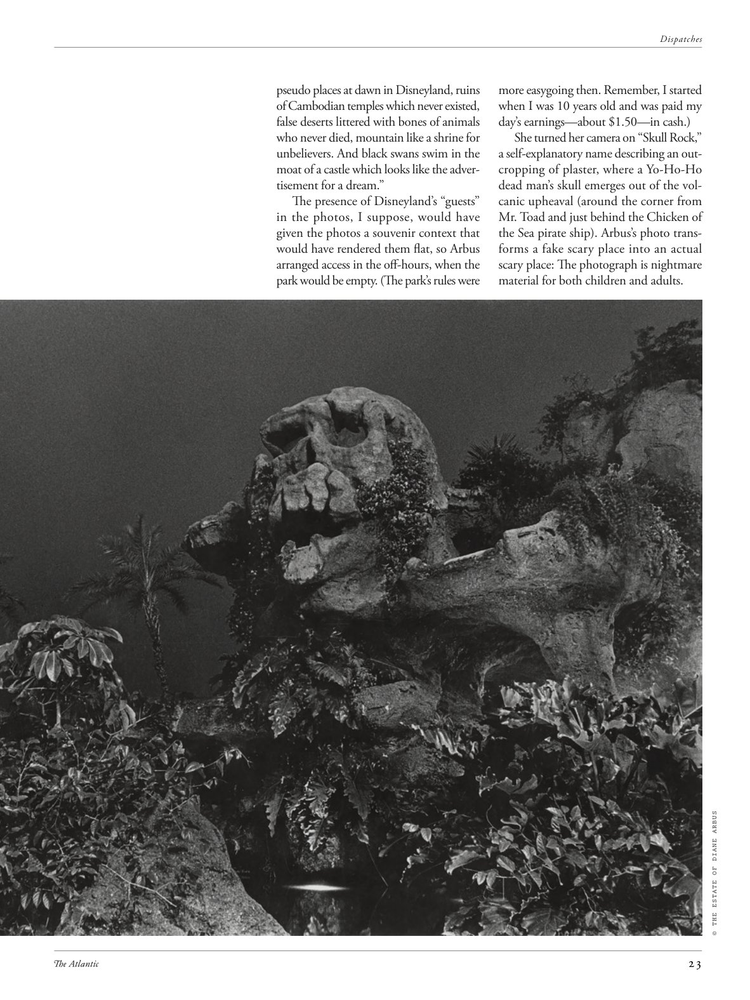

# The Atlantic — July 2026

## Page 25

---

pseudo places at dawn in Disneyland, ruins of Cambodian temples which never existed, false deserts littered with bones of animals who never died, mountain like a shrine for unbelievers. And black swans swim in the moat of a castle which looks like the advertisement for a dream.”

**【中文翻译】** 迪士尼乐园黎明时分的虚假地点，从未存在过的柬埔寨寺庙废墟，散布着从未死亡的动物骨头的虚假沙漠，像不信者的圣地一样的山脉。黑天鹅在城堡的护城河里游来游去，看起来就像是梦想的广告。”

The presence of Disneyland’s “guests” in the photos, I suppose, would have given the photos a souvenir context that would have rendered them flat, so Arbus arranged access in the off-hours, when the park would be empty. (The park’s rules were more easygoing then. Remember, I started when I was 10 years old and was paid my day’s earnings— about $1.50— in cash.) She turned her camera on “Skull Rock,” a selfexplanatory name describing an outcropping of plaster, where a Yo-Ho-Ho dead man’s skull emerges out of the volcanic upheaval (around the corner from Mr. Toad and just behind the Chicken of the Sea pirate ship). Arbus’s photo transforms a fake scary place into an actual scary place: The photograph is nightmare materi al for both children and adults. © THE ESTATE OF DIANE ARBUS

**【中文翻译】** 我想，照片中迪士尼乐园“客人”的存在会给这些照片带来纪念意义，从而使它们变得平坦，所以阿布斯安排在非工作时间进入，那时公园是空的。 （当时公园的规定比较宽松。记住，我从 10 岁开始就开始工作，一天的工资是现金——大约 1.5 美元。）她把相机转向“骷髅岩”，这是一个不言自明的名字，描述了一块露出地表的石膏，火山喷发中露出了一个哟嗬嗬的死人头骨（在蟾蜍先生的拐角处，就在“海之鸡”后面）海盗船）。阿布斯的照片将一个虚假的恐怖地方变成了一个真正的恐怖地方：这张照片对于儿童和成人来说都是噩梦。 © 黛安·阿勃丝庄园
