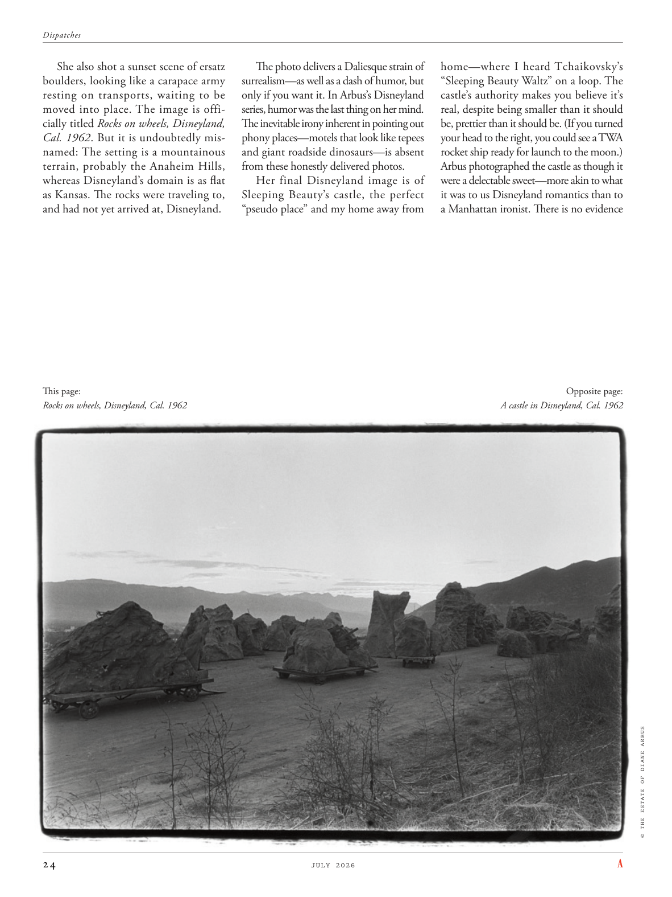

# The Atlantic — July 2026

## Page 26

---

She also shot a sunset scene of ersatz boulders, looking like a carapace army resting on transports, waiting to be moved into place. The image is officially titled Rocks on wheels, Disneyland, Cal. 1962 . But it is undoubtedly misnamed: The setting is a mountainous terrain, probably the Anaheim Hills, whereas Disneyland’s domain is as flat as Kansas. The rocks were traveling to, and had not yet arrived at, Disneyland.

**【中文翻译】** 她还拍摄了人造巨石的日落场景，看起来就像一支甲壳军队停在运输工具上，等待移动到位。该图片的正式标题为“车轮上的岩石，加州迪士尼乐园”。 1962年。但它的名字无疑是错误的：背景是山区，可能是阿纳海姆山，而迪士尼乐园的区域则像堪萨斯州一样平坦。岩石正前往迪士尼乐园，但尚未抵达。

This page: Rocks on wheels, Disneyland, Cal. 1962 The photo delivers a Daliesque strain of surrealism— as well as a dash of humor, but only if you want it. In Arbus’s Disneyland series, humor was the last thing on her mind.

**【中文翻译】** 本页：车轮上的岩石，加州迪士尼乐园。 1962 年这张照片呈现出达利埃式的超现实主义风格，同时还带有一丝幽默感，但前提是你愿意。在阿布斯的迪士尼乐园系列中，幽默是她最不关心的事情。

The inevitable irony inherent in pointing out phony places— motels that look like tepees and giant roadside dinosaurs— is absent from these honestly delivered photos.

**【中文翻译】** 这些诚实提供的照片中没有指出虚假地点（看起来像圆锥形帐篷和路边巨型恐龙的汽车旅馆）所固有的讽刺。

Her final Disneyland image is of Sleeping Beauty’s castle, the perfect “pseudo place” and my home away from home— where I heard Tchaikovsky’s “Sleeping Beauty Waltz” on a loop. The castle’s authority makes you believe it’s real, despite being smaller than it should be, prettier than it should be. (If you turned your head to the right, you could see a TWA rocket ship ready for launch to the moon.) Arbus photographed the castle as though it were a delectable sweet—more akin to what it was to us Disneyland romantics than to a Manhattan ironist. There is no evidence Opposite page: A castle in Disneyland, Cal. 1962 © THE ESTATE OF DIANE ARBUS

**【中文翻译】** 她最后的迪士尼乐园形象是睡美人的城堡，完美的“伪地方”，也是我的家外之家——在那里我循环播放着柴可夫斯基的《睡美人华尔兹》。这座城堡的权威让你相信它是真实的，尽管它比应有的小，但比应有的更漂亮。 （如果你把头转向右边，你可以看到一艘环球航空公司的火箭飞船准备发射到月球。）阿布斯拍摄的这座城堡就好像它是一块美味的糖果——更像是我们迪士尼乐园的浪漫主义者，而不是曼哈顿的讽刺作家。没有证据 对页：加州迪士尼乐园的一座城堡。 1962 © 黛安·阿勃丝庄园
