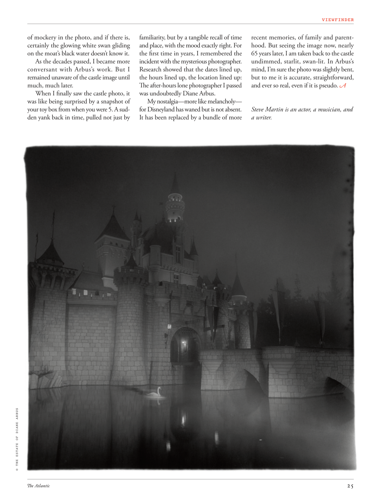

# The Atlantic — July 2026

## Page 27

---

of mockery in the photo, and if there is, certainly the glowing white swan gliding on the moat’s black water doesn’t know it. As the decades passed, I became more conversant with Arbus’s work. But I remained unaware of the castle image until much, much later.

**【中文翻译】** 照片中充满了嘲讽，如果有的话，那只在护城河黑​​色水面上滑行的发光白天鹅肯定不知道。几十年过去了，我对阿勃丝的作品越来越熟悉。但直到很久很久以后我才意识到城堡的形象。

When I finally saw the castle photo, it was like being surprised by a snapshot of your toy box from when you were 5. A sudden yank back in time, pulled not just by © THE ESTATE OF DIANE ARBUS familiarity, but by a tangible recall of time and place, with the mood exactly right. For the first time in years, I remembered the incident with the mysterious photographer.

**【中文翻译】** 当我终于看到那张城堡照片时，感觉就像是被一张 5 岁时玩具箱的快照所震惊。一种突然的时光倒流，不仅仅是因为熟悉，而是因为对时间和地点的切实回忆，而且心情也恰到好处。多年来，我第一次想起了那位神秘摄影师的事件。

Research showed that the dates lined up, the hours lined up, the location lined up: The after-hours lone photographer I passed was undoubtedly Diane Arbus.

**【中文翻译】** 研究表明，日期、时间、地点都在排列：我经过的下班后孤独的摄影师无疑是黛安·阿勃丝 (Diane Arbus)。

My nostalgia—more like melancholy— for Disneyland has waned but is not absent. It has been replaced by a bundle of more recent memories, of family and parenthood. But seeing the image now, nearly 65 years later, I am taken back to the castle undimmed, starlit, swan-lit. In Arbus’s mind, I’m sure the photo was slightly bent, but to me it is accurate, straightforward, and ever so real, even if it is pseudo. Steve Martin is an actor, a musician, and a writer.

**【中文翻译】** 我对迪士尼乐园的怀念——更像是忧郁——已经减弱，但并未消失。它已经被一堆最近的记忆所取代，关于家庭和为人父母的记忆。但现在，将近 65 年后，看到这张照片，我仿佛被带回到了城堡，那座城堡没有变暗，星光灿烂，天鹅般的灯光。在阿布斯看来，我确信这张照片有点弯曲，但对我来说，它是准确的、直接的，而且是如此真实，即使它是伪的。史蒂夫·马丁是一名演员、音乐家和作家。
