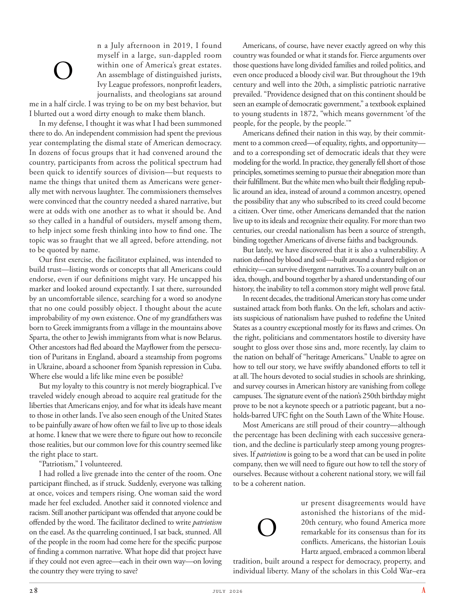

# The Atlantic — July 2026

## Page 30

---

n a July afternoon in 2019, I found myself in a large, sundappled room

**【中文翻译】** 2019 年 7 月的一个下午，我发现自己身处一间阳光斑驳的大房间里

### O

within one of America’s great estates. An assemblage of distinguished jurists, Ivy League professors, nonprofit leaders, journalists, and theologians sat around me in a half circle. I was trying to be on my best behavior, but I blurted out a word dirty enough to make them blanch.

**【中文翻译】** 在美国最伟大的庄园之一内。一群杰出的法学家、常春藤盟校教授、非营利组织领袖、记者和神学家围着我围成半圈。我试图表现得最好，但我脱口而出的脏话足以让他们脸色发白。

In my defense, I thought it was what I had been summoned there to do. An independent commission had spent the previous year contemplating the dismal state of American democracy.

**【中文翻译】** 在我的辩护中，我认为这就是我被召唤去那里做的事情。一个独立委员会在前一年一直在思考美国民主的惨淡状况。

In dozens of focus groups that it had convened around the country, participants from across the political spectrum had been quick to identify sources of division—but requests to name the things that united them as Americans were generally met with nervous laughter. The commissioners themselves were convinced that the country needed a shared narrative, but were at odds with one another as to what it should be. And so they called in a handful of outsiders, myself among them, to help inject some fresh thinking into how to find one. The topic was so fraught that we all agreed, before attending, not to be quoted by name.

**【中文翻译】** 在全国各地召开的数十个焦点小组中，来自不同政治派别的参与者很快就找出了分裂的根源，但要求说出将他们团结为美国人的事物的名称通常会引起紧张的笑声。委员们自己相信，国家需要一个共同的叙述，但对于它应该是什么却存​​在分歧。因此，他们召集了一些局外人，其中包括我自己，以帮助为如何找到一个人注入一些新的想法。这个话题是如此令人担忧，以至于我们都同意在参加之前不透露姓名。

Our first exercise, the facilitator explained, was intended to build trust—listing words or concepts that all Americans could endorse, even if our definitions might vary. He uncapped his marker and looked around expectantly. I sat there, surrounded by an uncomfortable silence, searching for a word so anodyne that no one could possibly object. I thought about the acute im probability of my own existence. One of my grandfathers was born to Greek immigrants from a village in the mountains above Sparta, the other to Jewish immigrants from what is now Belarus.

**【中文翻译】** 主持人解释说，我们的第一个练习是为了建立信任——列出所有美国人都可以认可的词语或概念，即使我们的定义可能有所不同。他打开记号笔的盖子，满怀期待地环顾四周。我坐在那里，周围是令人不安的沉默，寻找一个没有人能反对的止痛词。我想到了我自己存在的可能性极小。我的一位祖父是来自斯巴达上方山区村庄的希腊移民，另一位祖父是来自现在的白俄罗斯的犹太移民。

Other ancestors had fled aboard the Mayflower from the persecution of Puritans in England, aboard a steamship from pogroms in Ukraine, aboard a schooner from Spanish repression in Cuba.

**【中文翻译】** 其他祖先则乘坐五月花号逃离英国清教徒的迫害，乘坐轮船逃离乌克兰的大屠杀，乘坐纵帆船逃离西班牙在古巴的镇压。

Where else would a life like mine even be possible? But my loyalty to this country is not merely biographical. I’ve traveled widely enough abroad to acquire real gratitude for the liberties that Americans enjoy, and for what its ideals have meant to those in other lands. I’ve also seen enough of the United States to be painfully aware of how often we fail to live up to those ideals at home. I knew that we were there to figure out how to reconcile those realities, but our common love for this country seemed like the right place to start.

**【中文翻译】** 还有什么地方可以过上像我这样的生活呢？但我对这个国家的忠诚不仅仅是传记上的。我去过足够多的国外旅行，对美国人享有的自由以及其理想对其他国家的人民意味着什么表示真正的感激之情。我也见过足够多的美国，痛苦地意识到我们在国内经常无法实现这些理想。我知道我们来这里是为了弄清楚如何调和这些现实，但我们对这个国家的共同热爱似乎是正确的起点。

“Patriotism,” I volunteered. I had rolled a live grenade into the center of the room. One participant flinched, as if struck. Suddenly, everyone was talking at once, voices and tempers rising. One woman said the word made her feel excluded. Another said it connoted violence and racism. Still another participant was offended that anyone could be offended by the word. The facilitator declined to write patriotism on the easel. As the quarreling continued, I sat back, stunned. All of the people in the room had come here for the specific purpose of finding a common narrative. What hope did that project have if they could not even agree—each in their own way—on loving the country they were trying to save?

**【中文翻译】** “爱国主义，”我自告奋勇地说。我把一枚未爆炸的手榴弹扔到了房间中央。一名参与者退缩了，仿佛受到了打击。顿时，大家齐声议论起来，声音和脾气都高涨起来。一位女士说这个词让她感到被排除在外。另一个人说这意味着暴力和种族主义。还有一位参与者感到被冒犯，因为任何人都可能被这个词冒犯。主持人拒绝在画架上写下爱国主义。争吵仍在继续，我坐了回去，惊呆了。房间里的所有人来到这里都是为了寻找共同的叙述。如果他们甚至不能以自己的方式就热爱他们试图拯救的国家达成一致，那么这个项目还有什么希望呢？

Americans, of course, have never exactly agreed on why this country was founded or what it stands for. Fierce arguments over those questions have long divided families and roiled politics, and even once produced a bloody civil war. But throughout the 19th century and well into the 20th, a simplistic patriotic narrative prevailed. “Providence designed that on this continent should be seen an example of democratic government,” a textbook explained to young students in 1872, “which means government ‘of the people, for the people, by the people.’ ” Americans defined their nation in this way, by their commitment to a common creed—of equality, rights, and opportunity— and to a corresponding set of democratic ideals that they were modeling for the world. In practice, they generally fell short of those principles, sometimes seeming to pursue their abnegation more than their fulfillment. But the white men who built their fledgling republic around an idea, instead of around a common ancestry, opened the possibility that any who subscribed to its creed could become a citizen. Over time, other Americans demanded that the nation live up to its ideals and recognize their equality. For more than two centuries, our creedal nationalism has been a source of strength, binding together Americans of diverse faiths and backgrounds.

**【中文翻译】** 当然，美国人对于这个国家为何成立或它代表什么从来没有完全达成一致。长期以来，围绕这些问题的激烈争论导致家庭分裂、政治动荡，甚至一度引发了血腥内战。但从整个 19 世纪到 20 世纪，一种简单化的爱国主义叙事盛行。 1872 年，一本教科书向年轻学生解释说，“上帝的旨意是让这片大陆成为民主政府的典范，这意味着‘民有、民享、民治’的政府。”美国人以这种方式定义他们的国家，他们致力于共同的信条——平等、权利和机会——以及他们为世界树立的一套相应的民主理想。在实践中，他们普遍达不到这些原则，有时似乎更追求放弃而不是实现。但是，白人围绕一个理念而不是围绕共同的血统建立了刚刚起步的共和国，他们开启了任何遵守其信条的人都可以成为公民的可能性。随着时间的推移，其他美国人要求国家实现其理想并承认他们的平等。两个多世纪以来，我们的信仰民族主义一直是力量的源泉，将不同信仰和背景的美国人团结在一起。

But lately, we have discovered that it is also a vulnerability. A nation defined by blood and soil—built around a shared religion or ethnicity—can survive divergent narratives. To a country built on an idea, though, and bound together by a shared understanding of our history, the inability to tell a common story might well prove fatal.

**【中文翻译】** 但最近，我们发现这也是一个漏洞。一个由血统和土壤定义的国家——围绕共同的宗教或种族建立——可以在不同的叙述中生存下来。然而，对于一个建立在理念之上、通过对历史的共同理解而团结在一起的国家来说，无法讲述一个共同的故事很可能是致命的。

In recent decades, the traditional American story has come under sustained attack from both flanks. On the left, scholars and activists suspicious of nationalism have pushed to redefine the United States as a country exceptional mostly for its flaws and crimes. On the right, politicians and commentators hostile to diversity have sought to gloss over those sins and, more recently, lay claim to the nation on behalf of “heritage Americans.” Unable to agree on how to tell our story, we have swiftly abandoned efforts to tell it at all. The hours devoted to social studies in schools are shrinking, and survey courses in American history are vanishing from college campuses. The signature event of the nation’s 250th birthday might prove to be not a keynote speech or a patriotic pageant, but a noholds-barred UFC fight on the South Lawn of the White House.

**【中文翻译】** 近几十年来，传统的美国故事不断受到两面的攻击。在左翼方面，对民族主义持怀疑态度的学者和活动人士推动将美国重新定义为一个主要因其缺陷和罪行而与众不同的国家。在右翼方面，敌视多元化的政客和评论员试图掩盖这些罪恶，最近又代表“美国传统”声称对国家拥有主权。由于无法就如何讲述我们的故事达成一致，我们很快就放弃了讲述它的努力。学校用于社会研究的时间正在减少，美国历史调查课程正在从大学校园中消失。美国250岁生日的标志性活动可能不是主题演讲或爱国盛会，而是在白宫南草坪举行的一场毫无限制的 UFC 比赛。

Most Americans are still proud of their country—although the percentage has been declining with each successive generation, and the decline is particularly steep among young progressives. If patriotism is going to be a word that can be used in polite company, then we will need to figure out how to tell the story of ourselves. Because without a coherent national story, we will fail to be a coherent nation.

**【中文翻译】** 大多数美国人仍然为自己的国家感到自豪——尽管这个比例每一代人都在下降，而且在年轻的进步人士中下降尤其严重。如果爱国主义是一个可以在礼貌的场合使用的词，那么我们就需要弄清楚如何讲述我们自己的故事。因为如果没有一个连贯的国家故事，我们就无法成为一个连贯的国家。

### O

tradition, built around a respect for democracy, property, and individual liberty. Many of the scholars in this Cold War–era ur present disagreements would have astonished the historians of the mid20th century, who found America more remarkable for its consensus than for its conflicts. Americans, the historian Louis Hartz argued, embraced a common liberal

**【中文翻译】** 传统，建立在对民主、财产和个人自由的尊重之上。冷战时期的许多学者目前的分歧会让20世纪中叶的历史学家感到惊讶，他们发现美国的共识比冲突更引人注目。历史学家路易斯·哈茨认为，美国人拥护共同的自由主义思想
