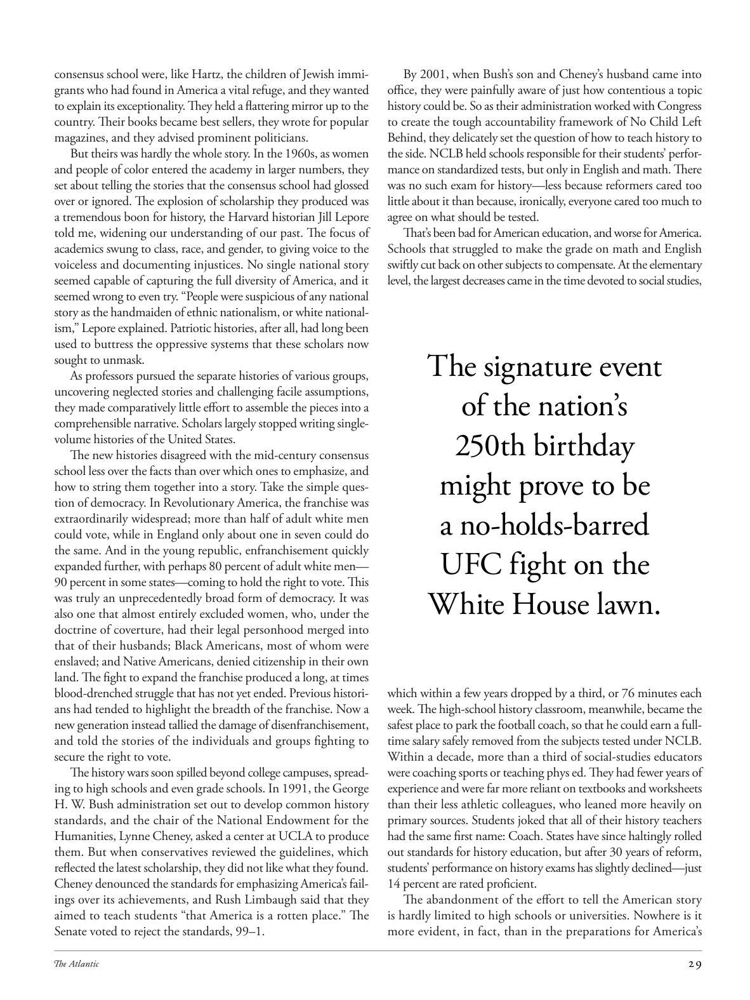

# The Atlantic — July 2026

## Page 31

---

consensus school were, like Hartz, the children of Jewish immigrants who had found in America a vital refuge, and they wanted to explain its exceptionality. They held a flattering mirror up to the country. Their books became best sellers, they wrote for popular magazines, and they advised prominent politicians.

**【中文翻译】** 共识学校和哈茨一样，都是犹太移民的孩子，他们在美国找到了重要的避难所，他们想解释它的特殊性。他们举起一面美丽的镜子照向乡村。他们的书成为畅销书，为流行杂志撰稿，并为著名政治家提供建议。

But theirs was hardly the whole story. In the 1960s, as women and people of color entered the academy in larger numbers, they set about telling the stories that the consensus school had glossed over or ignored. The explosion of scholarship they produced was a tremendous boon for history, the Harvard historian Jill Lepore told me, widening our understanding of our past. The focus of academics swung to class, race, and gender, to giving voice to the voiceless and documenting injustices. No single national story seemed capable of capturing the full diversity of America, and it seemed wrong to even try. “People were suspicious of any national story as the handmaiden of ethnic nationalism, or white nationalism,” Lepore explained. Patriotic histories, after all, had long been used to buttress the oppressive systems that these scholars now sought to unmask.

**【中文翻译】** 但他们的故事并不是故事的全部。 20 世纪 60 年代，随着大量女性和有色人种进入学院，她们开始讲述被主流学派掩盖或忽视的故事。哈佛大学历史学家吉尔·莱波雷 (Jill Lepore) 告诉我，他们产生的学术成果的激增对历史来说是一个巨大的福音，拓宽了我们对过去的理解。学术界的焦点转向阶级、种族和性别，转向为无声者发声并记录不公正现象。似乎没有任何一个国家的故事能够捕捉到美国的全部多样性，甚至尝试似乎都是错误的。 “人们怀疑任何民族故事都是种族民族主义或白人民族主义的婢女，”莱波雷解释道。毕竟，爱国历史长期以来一直被用来支持这些学者现在试图揭露的压迫制度。

As professors pursued the separate histories of various groups, uncovering neglected stories and challenging facile assumptions, they made comparatively little effort to assemble the pieces into a comprehensible narrative. Scholars largely stopped writing singlevolume histories of the United States.

**【中文翻译】** 当教授们追寻不同群体的不同历史、发现被忽视的故事并挑战肤浅的假设时，他们相对较少的努力将这些片段组装成一个可理解的叙述。学者们基本上不再撰写单卷本的美国历史。

The new histories disagreed with the mid-century consensus school less over the facts than over which ones to emphasize, and how to string them together into a story. Take the simple question of democracy. In Revolutionary America, the franchise was extraordinarily widespread; more than half of adult white men could vote, while in England only about one in seven could do the same. And in the young republic, enfranchisement quickly expanded further, with perhaps 80 percent of adult white men— 90 percent in some states— coming to hold the right to vote. This was truly an unprecedentedly broad form of democracy. It was also one that almost entirely excluded women, who, under the doctrine of coverture, had their legal personhood merged into that of their husbands; Black Americans, most of whom were enslaved; and Native Americans, denied citizenship in their own land. The fight to expand the franchise produced a long, at times blood-drenched struggle that has not yet ended. Previous historians had tended to highlight the breadth of the franchise. Now a new generation instead tallied the damage of dis enfranchisement, and told the stories of the individuals and groups fighting to secure the right to vote.

**【中文翻译】** 新历史学派与中世纪共识学派的分歧更多在于强调哪些事实，以及如何将它们串连成一个故事。以民主这个简单的问题为例。在革命美国，选举权非常普遍。超过一半的成年白人可以投票，而在英格兰，只有大约七分之一的人可以投票。在这个年轻的共和国，选举权迅速进一步扩大，大约 80% 的成年白人（在某些州为 90%）都拥有投票权。这确实是一种前所未有的广泛的民主形式。这也是一个几乎完全排除妇女的国家，根据秘密原则，妇女的法律人格并入其丈夫的法律人格；美国黑人，其中大多数是奴隶；和美洲原住民，被剥夺了自己土地上的公民身份。扩大特许经营权的斗争引发了一场漫长的、有时甚至是血腥的斗争，至今尚未结束。以前的历史学家倾向于强调特许经营的广度。现在，新一代人开始统计剥夺选举权所造成的损害，并讲述个人和团体为争取投票权而奋斗的故事。

The history wars soon spilled beyond college campuses, spreading to high schools and even grade schools. In 1991, the George H. W. Bush administration set out to develop common history standards, and the chair of the National Endowment for the Humanities, Lynne Cheney, asked a center at UCLA to produce them. But when conservatives reviewed the guidelines, which reflected the latest scholarship, they did not like what they found.

**【中文翻译】** 历史之战很快就蔓延到大学校园之外，蔓延到高中甚至小学。 1991 年，乔治·H·W·布什政府着手制定共同历史标准，美国国家人文基金会主席林恩·切尼 (Lynne Cheney) 要求加州大学洛杉矶分校的一个中心制定这些标准。但当保守派审查反映最新学术成果的指导方针时，他们并不喜欢他们的发现。

Cheney denounced the standards for emphasizing America’s failings over its achievements, and Rush Limbaugh said that they aimed to teach students “that America is a rotten place.” The Senate voted to reject the standards, 99–1.

**【中文翻译】** 切尼谴责了强调美国失败而不是成就的标准，拉什·林博表示，这些标准旨在教导学生“美国是一个腐烂的地方”。参议院以 99 比 1 的投票否决了该标准。

By 2001, when Bush’s son and Cheney’s husband came into office, they were painfully aware of just how contentious a topic history could be. So as their administration worked with Congress to create the tough accountability framework of No Child Left Behind, they delicately set the question of how to teach history to the side. NCLB held schools responsible for their students’ performance on standardized tests, but only in English and math. There was no such exam for history—less because reformers cared too little about it than because, ironically, everyone cared too much to agree on what should be tested.

**【中文翻译】** 2001 年，当布什的儿子和切尼的丈夫上任时，他们痛苦地意识到历史话题可能会引起多么大的争议。因此，当他们的政府与国会合作创建“不让一个孩子掉队”的严格问责框架时，他们巧妙地将如何教授历史的问题放在一边。 NCLB 要求学校对其学生在标准化考试中的表现负责，但仅限于英语和数学。历史上没有这样的检验——与其说是因为改革者对它太不关心，不如说是因为，讽刺的是，每个人都太在乎，以至于无法就应该检验什么达成一致。

That’s been bad for American education, and worse for America. Schools that struggled to make the grade on math and English swiftly cut back on other subjects to compensate. At the elementary level, the largest decreases came in the time devoted to social studies,

**【中文翻译】** 这对美国教育不利，对美国来说更糟。数学和英语成绩不佳的学校迅速削减了其他科目的课程以弥补损失。在小学阶段，减少最多的是用于社会研究的时间，

### The signature event

**【标题翻译】** 签名活动

### of the nation’s

**【标题翻译】** 国家的

### 250th birthday

**【标题翻译】** 250 岁生日

### might prove to be

**【标题翻译】** 可能被证明是

### a no-holds-barred

**【标题翻译】** 无拘无束的

### UFC fight on the

**【标题翻译】** UFC 战斗

### White House lawn.

**【标题翻译】** 白宫草坪。

which within a few years dropped by a third, or 76 minutes each week. The high-school history classroom, meanwhile, became the safest place to park the football coach, so that he could earn a fulltime salary safely removed from the subjects tested under NCLB.

**【中文翻译】** 几年之内，该时间减少了三分之一，即每周 76 分钟。与此同时，高中历史教室成为停放橄榄球教练最安全的地方，这样他就可以安全地从 NCLB 测试科目中移除，获得全职工资。

Within a decade, more than a third of social-studies educators were coaching sports or teaching phys ed. They had fewer years of experience and were far more reliant on textbooks and worksheets than their less athletic colleagues, who leaned more heavily on primary sources. Students joked that all of their history teachers had the same first name: Coach. States have since haltingly rolled out standards for history education, but after 30 years of reform, students’ performance on history exams has slightly declined—just 14 percent are rated proficient.

**【中文翻译】** 十年内，超过三分之一的社会研究教育工作者从事体育教练或体育教学。与那些运动能力较差的同事相比，他们的经验较少，而且对教科书和作业表的依赖程度更高，后者更依赖第一手资料。学生们开玩笑说他们所有的历史老师都有相同的名字：教练。此后，各州一直断断续续地推出了历史教育标准，但经过 30 年的改革，学生在历史考试中的成绩略有下降——只有 14% 的人被评为熟练。

The abandonment of the effort to tell the American story is hardly limited to high schools or universities. Nowhere is it more evident, in fact, than in the preparations for America’s

**【中文翻译】** 放弃讲述美国故事的努力不仅限于高中或大学。事实上，这一点在美国的准备工作中最为明显。
