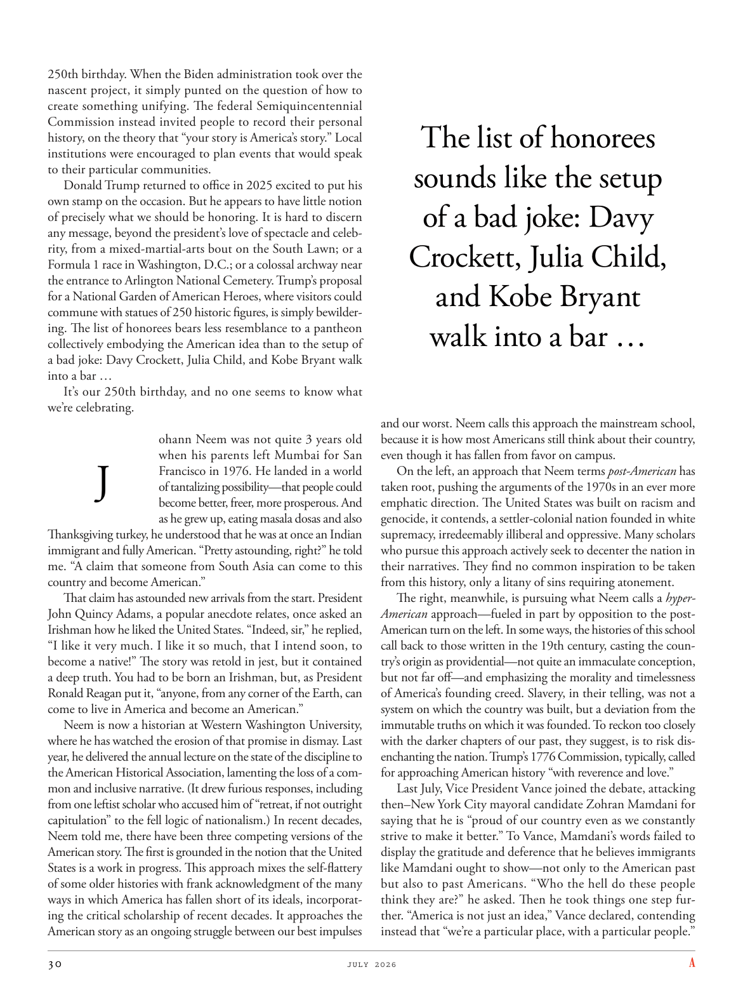

# The Atlantic — July 2026

## Page 32

---

250th birthday. When the Biden administration took over the nascent project, it simply punted on the question of how to create something unifying. The federal Semiquincentennial Commission instead invited people to record their personal history, on the theory that “your story is America’s story.” Local institutions were encouraged to plan events that would speak to their particular communities.

**【中文翻译】** 250 岁生日。当拜登政府接管这个新生项目时，它只是把赌注押在了如何创造统一的东西的问题上。相反，联邦五十周年纪念委员会邀请人们记录他们的个人历史，其理论是“你的故事就是美国的故事”。鼓励地方机构规划与其特定社区对话的活动。

Donald Trump returned to office in 2025 excited to put his own stamp on the occasion. But he appears to have little notion of precisely what we should be honoring. It is hard to discern any message, beyond the president’s love of spectacle and celebrity, from a mixed-martial-arts bout on the South Lawn; or a

**【中文翻译】** 唐纳德·特朗普 (Donald Trump) 将于 2025 年重返办公室，他很高兴能在这一时刻留下自己的印记。但他似乎不太清楚我们到底应该尊重什么。除了总统对奇观和名人的热爱之外，很难从南草坪的一场综合格斗比赛中看出任何信息；或一个

*— Formula 1 race in Washington, D.C.; or a colossal archway near*

*【作者署名】华盛顿特区的一级方程式比赛；或附近的巨大拱门*

the entrance to Arlington National Cemetery. Trump’s proposal for a National Garden of American Heroes, where visitors could commune with statues of 250 historic figures, is simply bewildering. The list of honorees bears less resemblance to a pantheon collectively embodying the American idea than to the setup of a bad joke: Davy Crockett, Julia Child, and Kobe Bryant walk into a bar … It’s our 250th birthday, and no one seems to know what we’re celebrating.

**【中文翻译】** 阿灵顿国家公墓的入口。特朗普提议建立美国英雄国家花园，游客可以在那里与 250 名历史人物的雕像交流，这简直令人困惑。获奖者名单与其说是代表美国理念的万神殿，不如说是一个糟糕的笑话的设定：戴维·克罗克特、朱莉娅·柴尔德和科比·布莱恩特走进一家酒吧……今天是我们的 250 岁生日，似乎没有人知道我们在庆祝什么。

ohann Neem was not quite 3 years old when his parents left Mumbai for San

**【中文翻译】** 当奥汉·尼姆 (ohans Neem) 的父母离开孟买前往圣地时，他还不到 3 岁

### J

Francisco in 1976. He landed in a world of tantalizing possibility— that people could become better, freer, more prosperous. And as he grew up, eating masala dosas and also Thanksgiving turkey, he understood that he was at once an Indian immigrant and fully American. “Pretty astounding, right?” he told me. “A claim that someone from South Asia can come to this country and become American.”

**【中文翻译】** 1976 年的弗朗西斯科。他来到了一个充满诱人可能性的世界——人们可以变得更好、更自由、更繁荣。随着他长大，吃马沙拉薄饼和感恩节火鸡，他明白自己既是印度移民，又是地道的美国人。 “相当令人震惊，对吧？”他告诉我。 “声称来自南亚的人可以来到这个国家并成为美国人。”

That claim has astounded new arrivals from the start. President John Quincy Adams, a popular anecdote relates, once asked an Irishman how he liked the United States. “Indeed, sir,” he replied, “I like it very much. I like it so much, that I intend soon, to become a native!” The story was retold in jest, but it contained a deep truth. You had to be born an Irishman, but, as President Ronald Reagan put it, “anyone, from any corner of the Earth, can come to live in America and become an American.”

**【中文翻译】** 这一说法从一开始就让新来者感到震惊。有一则广为流传的轶事称，约翰·昆西·亚当斯总统曾经问一位爱尔兰人他喜欢美国吗。 “确实，先生，”他回答道，“我非常喜欢它。我非常喜欢它，我打算很快就成为当地人！”这个故事以玩笑的方式讲述，但其中蕴含着深刻的真理。你出生时必须是爱尔兰人，但是，正如罗纳德·里根总统所说，“任何人，无论来自地球的任何角落，都可以来到美国生活并成为美国人。”

Neem is now a historian at Western Washington University, where he has watched the erosion of that promise in dismay. Last year, he delivered the annual lecture on the state of the discipline to the American Historical Association, lamenting the loss of a common and inclusive narrative. (It drew furious responses, including from one leftist scholar who accused him of “retreat, if not outright capitulation” to the fell logic of nationalism.) In recent decades, Neem told me, there have been three competing versions of the American story. The first is grounded in the notion that the United States is a work in progress. This approach mixes the self-flattery of some older histories with frank acknowledgment of the many ways in which America has fallen short of its ideals, incorporating the critical scholarship of recent decades. It approaches the American story as an ongoing struggle between our best impulses

**【中文翻译】** 尼姆现在是西华盛顿大学的历史学家，在那里他沮丧地目睹了这一承诺的侵蚀。去年，他向美国历史协会发表了关于该学科现状的年度演讲，对共同和包容性叙事的丧失表示遗憾。 （它引起了激烈的反应，其中包括一位左翼学者，他指责他向民族主义的邪恶逻辑“退缩，甚至是彻底投降”。） 尼姆告诉我，近几十年来，美国故事出现了三个相互竞争的版本。第一个基于这样的观念：美国是一项正在进行中的工作。这种方法将一些古老历史的自吹自擂与对美国在许多方面未能实现其理想的坦率承认结合起来，并结合了近几十年来的批判性学术成果。它将美国故事视为我们最好的冲动之间持续的斗争

### The list of honorees

**【标题翻译】** 获奖者名单

### sounds like the setup

**【标题翻译】** 听起来像设置

### of a bad joke: Davy

**【标题翻译】** 一个糟糕的笑话：戴维

### Crockett, Julia Child,

**【标题翻译】** 克罗克特，朱莉娅·柴尔德，

### and Kobe Bryant

**【标题翻译】** 和科比·布莱恩特

### walk into a bar …

**【标题翻译】** 走进一家酒吧……

and our worst. Neem calls this approach the mainstream school, because it is how most Americans still think about their country, even though it has fallen from favor on campus.

**【中文翻译】** 和我们最糟糕的。尼姆将这种方法称为主流学校，因为这仍然是大多数美国人对自己国家的看法，尽管它在校园里已经不再受青睐。

On the left, an approach that Neem terms post-American has taken root, pushing the arguments of the 1970s in an ever more emphatic direction. The United States was built on racism and genocide, it contends, a settler-colonial nation founded in white supremacy, irredeemably illiberal and oppressive. Many scholars who pursue this approach actively seek to decenter the nation in their narratives. They find no common inspiration to be taken from this history, only a litany of sins requiring atonement.

**【中文翻译】** 在左翼方面，一种被尼姆称为“后美国”的方法已经扎根，将 20 世纪 70 年代的争论推向了一个更加有力的方向。它声称，美国是建立在种族主义和种族灭绝的基础上的，是一个以白人至上为基础的定居者殖民国家，无可救药地不自由和压迫。许多采用这种方法的学者积极寻求在他们的叙述中使国家去中心化。他们从这段历史中找不到共同的灵感，只有一长串需要赎罪的罪恶。

The right, meanwhile, is pursuing what Neem calls a hyperAmerican approach— fueled in part by opposition to the postAmerican turn on the left. In some ways, the histories of this school call back to those written in the 19th century, casting the country’s origin as providential—not quite an immaculate conception, but not far off—and emphasizing the morality and timelessness of America’s founding creed. Slavery, in their telling, was not a system on which the country was built, but a deviation from the im mutable truths on which it was founded. To reckon too closely with the darker chapters of our past, they suggest, is to risk disenchanting the nation. Trump’s 1776 Commission, typically, called for approaching American history “with reverence and love.”

**【中文翻译】** 与此同时，右翼正在追求尼姆所说的超美国方式——部分原因是左翼反对后美国转向。在某些方面，这所学校的历史让人回想起19世纪的历史，将这个国家的起源视为天意——虽然不是一个完美的概念，但也相差不远——并强调美国建国信条的道德性和永恒性。在他们看来，奴隶制不是一个国家赖以建立的制度，而是对国家赖以建立的不变真理的偏离。他们认为，过于密切地审视我们过去的黑暗篇章，就有可能让这个国家不再抱有幻想。特朗普 1776 年的委员会通常呼吁“怀着崇敬和爱”对待美国历史。

Last July, Vice President Vance joined the debate, attacking then–New York City mayoral candidate Zohran Mamdani for saying that he is “proud of our country even as we constantly strive to make it better.” To Vance, Mamdani’s words failed to display the gratitude and deference that he believes immigrants like Mamdani ought to show— not only to the American past but also to past Americans. “Who the hell do these people think they are?” he asked. Then he took things one step further. “America is not just an idea,” Vance declared, contending instead that “we’re a particular place, with a particular people.”

**【中文翻译】** 去年七月，副总统万斯加入了辩论，攻击当时的纽约市市长候选人佐兰·马姆达尼(Zohran Mamdani)，称他“为我们的国家感到自豪，尽管我们不断努力让这个国家变得更好”。对于万斯来说，马姆达尼的话未能表达出他认为像马姆达尼这样的移民应该表现出的感激和尊重——不仅是对美国的过去，而且是对过去的美国人。 “这些人到底以为自己是谁？”他问道。然后他更进一步。 “美国不仅仅是一个想法，”万斯宣称，相反，“我们是一个特定的地方，有特定的人民。”
