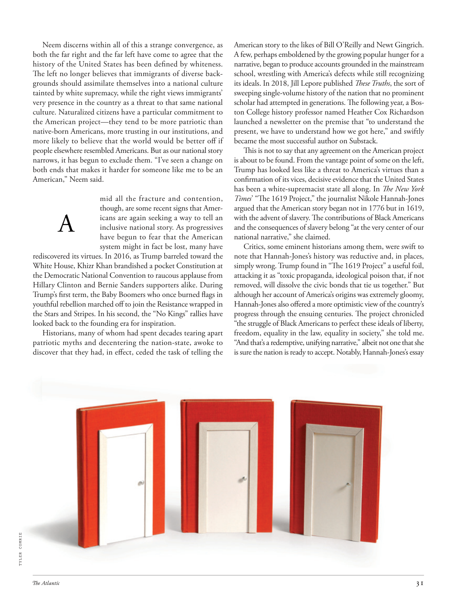

# The Atlantic — July 2026

## Page 33

---

Neem discerns within all of this a strange convergence, as both the far right and the far left have come to agree that the history of the United States has been defined by whiteness.

**【中文翻译】** 尼姆在这一切中发现了一种奇怪的趋同，因为极右翼和极左翼都同意美国的历史是由白人定义的。

The left no longer believes that immigrants of diverse backgrounds should assimilate themselves into a national culture tainted by white supremacy, while the right views immigrants’ very presence in the country as a threat to that same national culture. Naturalized citizens have a particular commitment to the American project—they tend to be more patriotic than native-born Americans, more trusting in our institutions, and more likely to believe that the world would be better off if people elsewhere resembled Americans. But as our national story narrows, it has begun to exclude them. “I’ve seen a change on both ends that makes it harder for someone like me to be an American,” Neem said.

**【中文翻译】** 左派不再认为不同背景的移民应该将自己融入受白人至上主义污染的民族文化中，而右派则认为移民在该国的存在是对同一民族文化的威胁。入籍公民对美国项目有着特殊的承诺——他们往往比土生土长的美国人更爱国，更信任我们的机构，并且更有可能相信，如果其他地方的人像美国人一样，世界会变得更好。但随着我们国家故事的缩小，它已经开始将他们排除在外。 “我看到了两端的变化，这使得像我这样的人更难成为美国人，”尼姆说。

mid all the fracture and contention, though, are some recent signs that Amer-

**【中文翻译】** 然而，在所有的分裂和争论中，最近的一些迹象表明，美国

### A

icans are again seeking a way to tell an inclusive national story. As progressives have begun to fear that the American system might in fact be lost, many have rediscovered its virtues. In 2016, as Trump barreled toward the White House, Khizr Khan brandished a pocket Constitution at the Democratic National Convention to raucous applause from Hillary Clinton and Bernie Sanders supporters alike. During Trump’s first term, the Baby Boomers who once burned flags in youthful rebellion marched off to join the Resistance wrapped in the Stars and Stripes. In his second, the “No Kings” rallies have looked back to the founding era for inspiration.

**【中文翻译】** icans再次寻求一种方式来讲述一个包容性的国家故事。随着进步人士开始担心美国体系实际上可能会消失，许多人重新发现了它的优点。 2016年，当特朗普冲向白宫时，希兹尔·汗在民主党全国代表大会上挥舞着袖珍宪法，赢得了希拉里·克林顿和伯尼·桑德斯支持者的热烈掌声。在特朗普的第一个任期内，曾经在青年叛乱中焚烧旗帜的婴儿潮一代，披着星条旗游行加入抵抗运动。在他的第二次“无王”集会中，人们回顾了建国时代，寻找灵感。

Historians, many of whom had spent decades tearing apart patriotic myths and decentering the nation-state, awoke to discover that they had, in effect, ceded the task of telling the TYLER COMRIE American story to the likes of Bill O’Reilly and Newt Gingrich.

**【中文翻译】** 历史学家中的许多人花了几十年的时间来撕毁爱国神话，并使民族国家去中心化，但他们醒来后发现，他们实际上已经把讲述泰勒·科里的美国故事的任务交给了比尔·奥莱利和纽特·金里奇等人。

A few, perhaps emboldened by the growing popular hunger for a narrative, began to produce accounts grounded in the mainstream school, wrestling with America’s defects while still recognizing its ideals. In 2018, Jill Lepore published These Truths , the sort of sweeping single-volume history of the nation that no prominent scholar had attempted in generations. The following year, a Boston College history professor named Heather Cox Richardson launched a newsletter on the premise that “to understand the present, we have to understand how we got here,” and swiftly became the most successful author on Substack.

**【中文翻译】** 一些人也许是受到了人们对叙事日益增长的渴望的鼓舞，开始创作基于主流学派的叙述，在与美国的缺陷作斗争的同时仍然承认其理想。 2018 年，吉尔·莱波雷 (Jill Lepore) 出版了《这些真理》(These Truths)，这是几代杰出学者从未尝试过的全面的单卷本国家历史著作。第二年，波士顿学院历史学教授希瑟·考克斯·理查森 (Heather Cox Richardson) 推出了一份时事通讯，其前提是“要了解现在，我们必须了解我们是如何走到这一步的”，并迅速成为 Substack 上最成功的作者。

This is not to say that any agreement on the American project is about to be found. From the vantage point of some on the left, Trump has looked less like a threat to America’s virtues than a confirmation of its vices, decisive evidence that the United States has been a white-supremacist state all along. In The New York Times ’ “The 1619 Project,” the journalist Nikole Hannah-Jones argued that the American story began not in 1776 but in 1619, with the advent of slavery. The contributions of Black Americans and the consequences of slavery belong “at the very center of our national narrative,” she claimed.

**【中文翻译】** 这并不是说即将就美国项目达成任何协议。从一些左翼人士的角度来看，特朗普与其说是对美国美德的威胁，倒不如说是对美国罪恶的确认，这是美国一直以来都是白人至上主义国家的决定性证据。在《纽约时报》的“1619计划”中，记者 Nikole Hannah-Jones 认为，美国的故事不是始于 1776 年，而是始于 1619 年奴隶制的出现。她声称，美国黑人的贡献和奴隶制的后果属于“我们国家叙事的核心”。

Critics, some eminent historians among them, were swift to note that Hannah-Jones’s history was reductive and, in places, simply wrong. Trump found in “The 1619 Project” a useful foil, attacking it as “toxic propaganda, ideological poison that, if not removed, will dissolve the civic bonds that tie us together.” But although her account of America’s origins was extremely gloomy, Hannah-Jones also offered a more optimistic view of the country’s progress through the ensuing centuries. The project chronicled “the struggle of Black Americans to perfect these ideals of liberty, freedom, equality in the law, equality in society,” she told me.

**【中文翻译】** 批评者，其中包括一些著名的历史学家，很快指出汉娜·琼斯的历史是还原性的，而且在某些地方根本是错误的。特朗普在“1619计划”中找到了有用的陪衬，攻击其为“有毒宣传、意识形态毒药，如果不消除，将瓦解将我们联系在一起的公民纽带”。尽管汉娜-琼斯对美国起源的描述极其悲观，但她对美国在接下来几个世纪的进步也提出了更为乐观的看法。她告诉我，该项目记录了“美国黑人为完善自由、自由、法律平等、社会平等理想而进行的斗争”。

“And that’s a redemptive, unifying narrative,” albeit not one that she is sure the nation is ready to accept. Notably, Hannah-Jones’s essay

**【中文翻译】** “这是一种救赎性的、统一的叙事，”尽管她确信这个国家还没有准备好接受这种叙事。值得注意的是，汉娜·琼斯的文章
