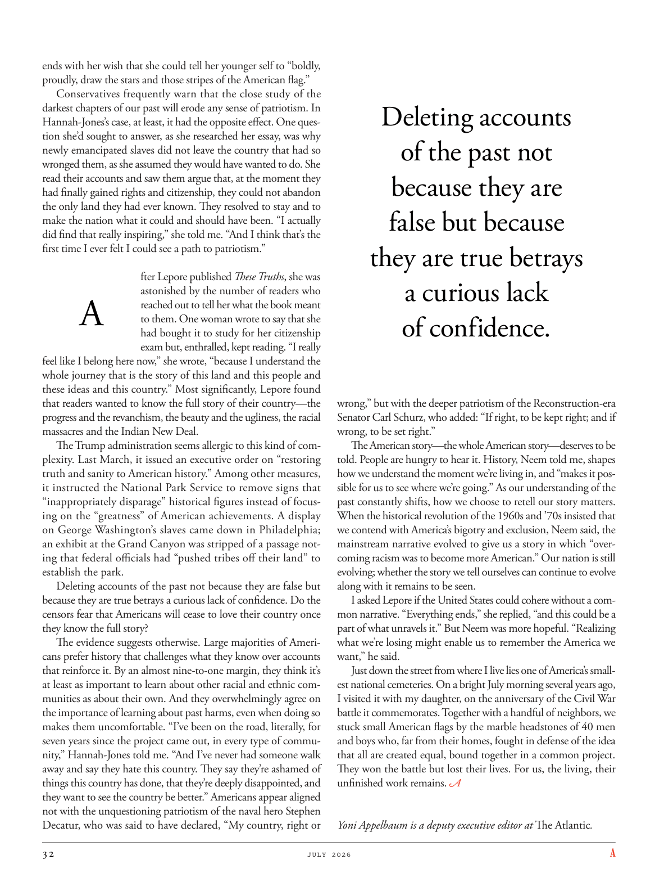

# The Atlantic — July 2026

## Page 34

---

ends with her wish that she could tell her younger self to “boldly, proudly, draw the stars and those stripes of the American flag.” Conservatives frequently warn that the close study of the darkest chapters of our past will erode any sense of patriotism. In HannahJones’s case, at least, it had the opposite effect. One question she’d sought to answer, as she researched her essay, was why newly emancipated slaves did not leave the country that had so wronged them, as she assumed they would have wanted to do. She read their accounts and saw them argue that, at the moment they had finally gained rights and citizenship, they could not abandon the only land they had ever known. They resolved to stay and to make the nation what it could and should have been. “I actually did find that really inspiring,” she told me. “And I think that’s the first time I ever felt I could see a path to patriotism.”

**【中文翻译】** 最后她希望她能告诉年轻的自己“大胆、自豪地画出美国国旗上的星星和条纹”。保守派经常警告说，仔细研究我们过去最黑暗的章节将削弱爱国主义意识。至少在汉娜·琼斯的例子中，它产生了相反的效果。在研究论文时，她试图回答的一个问题是，为什么新解放的奴隶没有离开这个曾经如此冤枉他们的国家，正如她认为的那样，他们会想要这样做。她读了他们的叙述，看到他们辩称，在他们终于获得权利和公民身份的那一刻，他们不能放弃他们所知道的唯一土地。他们决心留下来，让这个国家成为它本来可以和应该成为的样子。 “我确实发现这真的很鼓舞人心，”她告诉我。 “我认为这是我第一次感觉到我能看到一条爱国主义之路。”

fter Lepore published These Truths , she was astonished by the number of readers who

**【中文翻译】** 莱波雷出版《这些真理》后，令她惊讶的是有如此多的读者

### A

reached out to tell her what the book meant to them. One woman wrote to say that she had bought it to study for her citizenship exam but, enthralled, kept reading. “I really feel like I belong here now,” she wrote, “because I understand the whole journey that is the story of this land and this people and these ideas and this country.” Most significantly, Lepore found that readers wanted to know the full story of their country— the progress and the revanchism, the beauty and the ugliness, the racial massacres and the Indian New Deal.

**【中文翻译】** 伸出手告诉她这本书对他们意味着什么。一位女士写信说，她买这本书是为了准备公民考试，但她被迷住了，继续阅读。 “我现在真的觉得我属于这里，”她写道，“因为我了解这片土地、这片人民、这些想法和这个国家的故事的整个旅程。”最重要的是，莱波雷发现读者想了解他们国家的完整故事——进步和复仇主义、美丽和丑陋、种族屠杀和印度新政。

The Trump administration seems allergic to this kind of complexity. Last March, it issued an executive order on “restoring truth and sanity to American history.” Among other measures, it instructed the National Park Service to remove signs that “in appropriately disparage” historical figures instead of focusing on the “greatness” of American achievements. A display on George Washington’s slaves came down in Philadelphia; an exhibit at the Grand Canyon was stripped of a passage noting that federal officials had “pushed tribes off their land” to establish the park.

**【中文翻译】** 特朗普政府似乎对这种复杂性过敏。去年三月，它发布了一项关于“恢复美国历史的真相和理智”的行政命令。除其他措施外，它还指示国家公园管理局删除“适当贬低”历史人物的标志，而不是关注美国成就的“伟大”。一场关于乔治·华盛顿奴隶的展览在费城落下。大峡谷的一个展览被剥夺了一段文字，指出联邦官员“将部落赶出了他们的土地”以建立公园。

Deleting accounts of the past not because they are false but because they are true betrays a curious lack of confidence. Do the censors fear that Americans will cease to love their country once they know the full story?

**【中文翻译】** 删除过去的记录并不是因为它们是虚假的，而是因为它们是真实的，这暴露了一种奇怪的缺乏信心。审查机构是否担心美国人一旦了解了整个故事就会不再热爱自己的国家？

The evidence suggests otherwise. Large majorities of Americans prefer history that challenges what they know over accounts that reinforce it. By an almost nine-to-one margin, they think it’s at least as important to learn about other racial and ethnic communities as about their own. And they overwhelmingly agree on the importance of learning about past harms, even when doing so makes them un comfortable. “I’ve been on the road, literally, for seven years since the project came out, in every type of community,” Hannah-Jones told me. “And I’ve never had someone walk away and say they hate this country. They say they’re ashamed of things this country has done, that they’re deeply disappointed, and they want to see the country be better.” Americans appear aligned not with the unquestioning patriotism of the naval hero Stephen Decatur, who was said to have declared, “My country, right or

**【中文翻译】** 证据表明事实并非如此。大多数美国人更喜欢挑战他们已知知识的历史，而不是强化已知知识的记载。他们以几乎九比一的比例认为了解其他种族和民族社区至少与了解自己的种族和民族社区同样重要。他们绝大多数都同意了解过去的伤害的重要性，即使这样做会让他们感到不舒服。 “自从该项目推出以来，我实际上已经在路上七年了，在各种类型的社区中，”汉娜·琼斯告诉我。 “我从来没有见过有人走开后说他们讨厌这个国家。他们说他们对这个国家所做的事情感到羞耻，他们深感失望，他们希望看到这个国家变得更好。”美国人似乎并不认同海军英雄斯蒂芬·迪凯特毫无疑问的爱国主义，据说他曾宣称：“我的国家，无论是对是错，

### Deleting accounts

**【标题翻译】** 删除账户

### of the past not

**【标题翻译】** 过去的不

### because they are

**【标题翻译】** 因为他们是

### false but because

**【标题翻译】** 假的，但因为

### they are true betrays

**【标题翻译】** 他们是真正的背叛者

### a curious lack

**【标题翻译】** 奇怪的缺乏

### of confidence.

**【标题翻译】** 的信心。

wrong,” but with the deeper patriotism of the Reconstructionera Senator Carl Schurz, who added: “If right, to be kept right; and if wrong, to be set right.”

**【中文翻译】** 错误，”但重建时期参议员卡尔·舒尔茨有着更深层次的爱国主义，他补充道：“如果正确，就保持正确；如果正确，就保持正确；如果正确，就保持正确；如果正确，就保持正确。如果错了，就改正。”

The American story—the whole American story—deserves to be told. People are hungry to hear it. History, Neem told me, shapes how we understand the moment we’re living in, and “makes it possible for us to see where we’re going.” As our understanding of the past constantly shifts, how we choose to retell our story matters.

**【中文翻译】** 美国的故事——整个美国的故事——值得讲述。人们渴望听到它。尼姆告诉我，历史塑造了我们如何理解我们所生活的时刻，并且“让我们能够看到我们要去哪里”。随着我们对过去的理解不断变化，我们选择如何重述我们的故事很重要。

When the historical revolution of the 1960s and ’70s insisted that we contend with America’s bigotry and exclusion, Neem said, the mainstream narrative evolved to give us a story in which “overcoming racism was to become more American.” Our nation is still evolving; whether the story we tell ourselves can continue to evolve along with it remains to be seen.

**【中文翻译】** 尼姆说，当 20 世纪 60 年代和 70 年代的历史革命坚持要求我们与美国的偏执和排斥作斗争时，主流叙事演变为我们提供了一个“克服种族主义就是变得更加美国化”的故事。我们的国家仍在不断发展；我们告诉自己的故事是否能够随之继续发展还有待观察。

I asked Lepore if the United States could cohere without a common narrative. “Everything ends,” she replied, “and this could be a part of what unravels it.” But Neem was more hopeful. “Realizing what we’re losing might enable us to remember the America we want,” he said.

**【中文翻译】** 我问莱波雷，如果没有共同的叙述，美国是否可以团结一致。 “一切都会结束，”她回答道，“这可能是解开一切的一部分。”但尼姆更有希望。 “意识到我们正在失去什么可能会让我们记住我们想要的美国，”他说。

Just down the street from where I live lies one of America’s smallest national cemeteries. On a bright July morning several years ago, I visited it with my daughter, on the anniversary of the Civil War battle it commemorates. Together with a handful of neighbors, we stuck small American flags by the marble headstones of 40 men and boys who, far from their homes, fought in defense of the idea that all are created equal, bound together in a common project.

**【中文翻译】** 就在我住的地方的街道上，坐落着美国最小的国家公墓之一。几年前，在一个阳光明媚的七月早晨，我和女儿参观了它，当时正值它纪念内战的周年纪念日。我们和几位邻居一起，在 40 名男人和男孩的大理石墓碑旁插上了小美国国旗，他们远离家乡，为捍卫人人生而平等、团结在一个共同事业中的理念而奋斗。

They won the battle but lost their lives. For us, the living, their unfinished work remains. Yoni Appelbaum is a deputy executive editor at The Atlantic .

**【中文翻译】** 他们赢得了战斗，但却失去了生命。对于我们这些活着的人来说，他们未完成的工作仍然存在。约尼·阿佩尔鲍姆 (Yoni Appelbaum) 是《大西洋月刊》的副执行主编。
