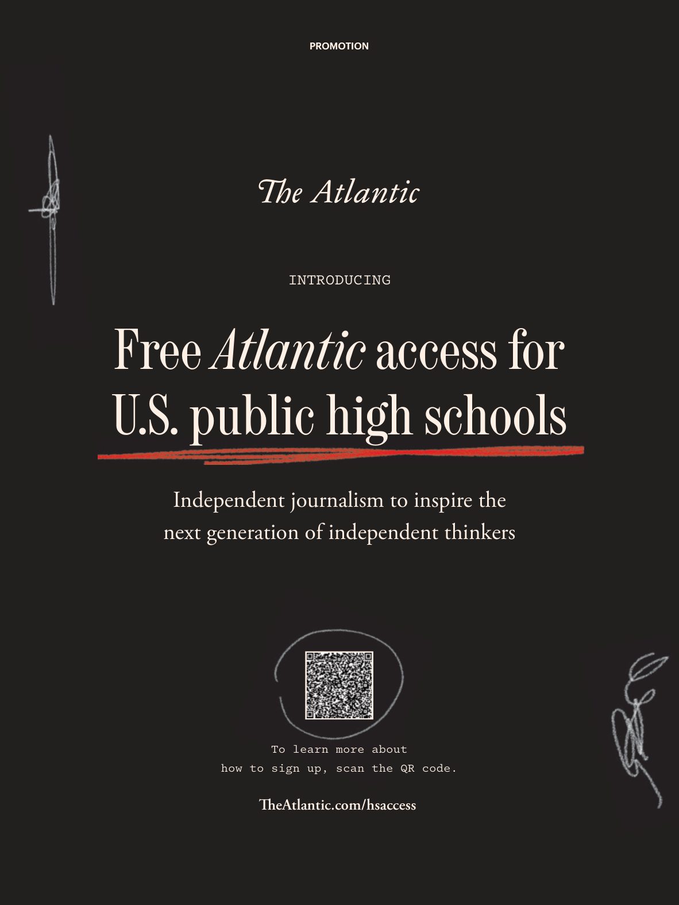

# The Atlantic — July 2026

## Page 35

---

INTRODUCING

**【中文翻译】** 介绍

### Free Atlantic access for

**【标题翻译】** 免费大西洋访问

### U.S. public high schools

**【标题翻译】** 美国公立高中

### Independent journalism to inspire the

**【标题翻译】** 独立新闻业激励

### next generation of independent thinkers

**【标题翻译】** 下一代独立思考者

To learn more about how to sign up, scan the QR code. TheAtlantic.com/hsaccess

**【中文翻译】** 如需了解更多注册方式，请扫描二维码。 TheAtlantic.com/hsaccess
