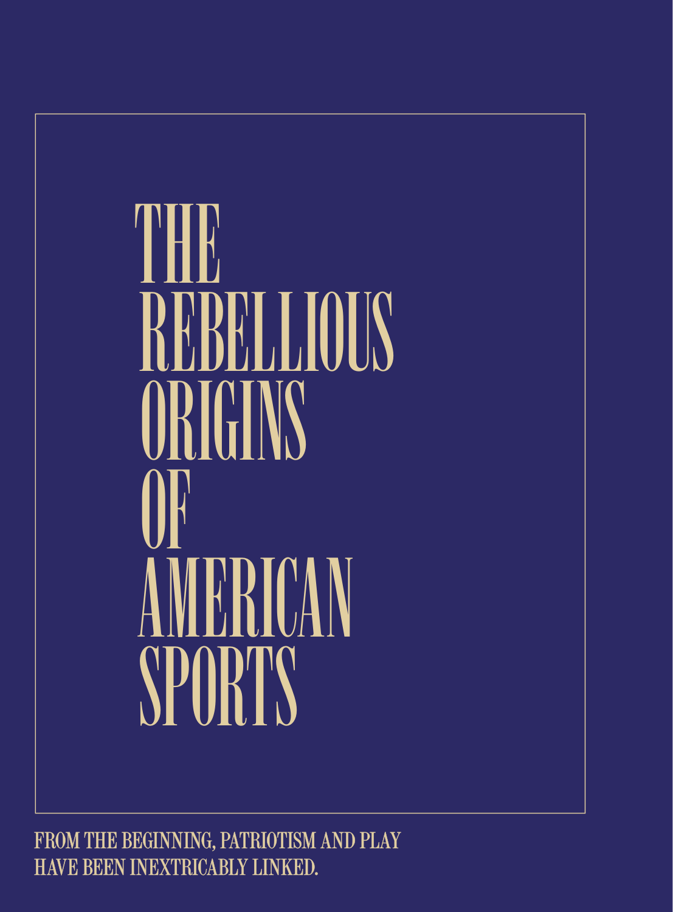

# The Atlantic — July 2026

## Page 36

---

### THE

**【标题翻译】** 这

### THE

**【标题翻译】** 这

### REBELLIOUS

**【标题翻译】** 叛逆

### REBELLIOUS

**【标题翻译】** 叛逆

### ORIGINS

**【标题翻译】** 起源

### ORIGINS

**【标题翻译】** 起源

### OF OF AMERICAN

**【标题翻译】** 美国的

### AMERICAN

**【标题翻译】** 美国人

### SPORTS

**【标题翻译】** 运动的

### SPORTS

**【标题翻译】** 运动的

### FROM THE BEGINNING, PATRIOTISM AND PLAY

**【标题翻译】** 从一开始，爱国主义和游戏

### FROM THE BEGINNING, PATRIOTISM AND PLAY

**【标题翻译】** 从一开始，爱国主义和游戏

### HAVE BEEN INEXTRICABLY LINKED.

**【标题翻译】** 有着千丝万缕的联系。

### HAVE BEEN INEXTRICABLY LINKED.

**【标题翻译】** 有着千丝万缕的联系。
