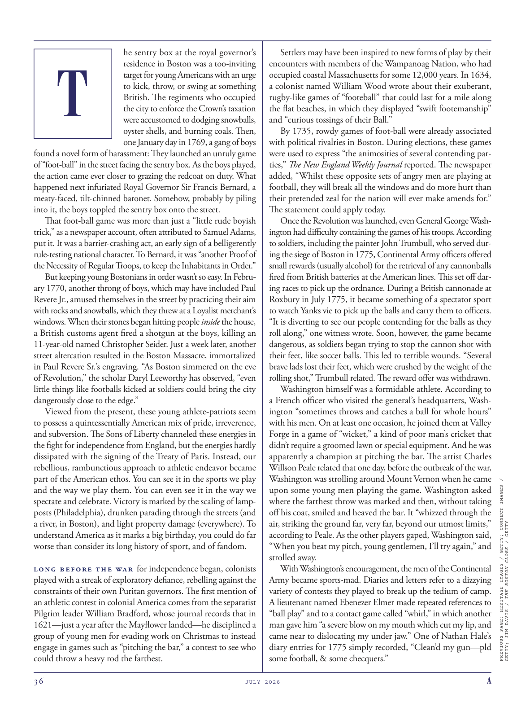

# The Atlantic — July 2026

## Page 38

---

he sentry box at the royal governor’s residence in Boston was a too-inviting

**【中文翻译】** 波士顿皇家总督官邸的岗哨太吸引人了

### T

target for young Americans with an urge to kick, throw, or swing at something British. The regiments who occupied the city to enforce the Crown’s taxation were accustomed to dodging snowballs, oyster shells, and burning coals. Then, one January day in 1769, a gang of boys found a novel form of harassment: They launched an unruly game of “foot-ball” in the street facing the sentry box. As the boys played, the action came ever closer to grazing the redcoat on duty. What happened next infuriated Royal Governor Sir Francis Bernard, a meaty-faced, tilt-chinned baronet. Somehow, probably by piling into it, the boys toppled the sentry box onto the street.

**【中文翻译】** 那些渴望踢、扔或挥动英国东西的美国年轻人的目标。占领这座城市执行政府征税的军团习惯于躲避雪球、牡蛎壳和燃烧的煤炭。然后，1769 年 1 月的一天，一群男孩发现了一种新颖的骚扰形式：他们在哨所对面的街道上发起了一场不守规矩的“足球”游戏。当孩子们玩耍时，动作越来越接近擦伤值班的红衣人。接下来发生的事情激怒了皇家总督弗朗西斯·伯纳德爵士，他是一位肉脸、下巴倾斜的男爵。不知何故，可能是通过挤进去，男孩们把岗哨推倒在街上。

That foot-ball game was more than just a “little rude boyish trick,” as a newspaper account, often attributed to Samuel Adams, put it. It was a barrier-crashing act, an early sign of a belligerently rule-testing national character. To Bernard, it was “another Proof of the Necessity of Regular Troops, to keep the Inhabitants in Order.”

**【中文翻译】** 正如一篇通常被认为是塞缪尔·亚当斯所为的报纸报道所言，那场足球比赛不仅仅是一场“粗鲁的孩子气的小把戏”。这是一次冲破障碍的行为，是好战、挑战规则的民族性格的早期迹象。对伯纳德来说，这是“正规部队必要性的又一证明，以维持居民的秩序”。

But keeping young Bostonians in order wasn’t so easy. In February 1770, another throng of boys, which may have included Paul Revere Jr., amused themselves in the street by practicing their aim with rocks and snowballs, which they threw at a Loyalist merchant’s windows. When their stones began hitting people inside the house, a British customs agent fired a shotgun at the boys, killing an 11-year-old named Christopher Seider. Just a week later, another street altercation resulted in the Boston Massacre, immortalized in Paul Revere Sr.’s engraving. “As Boston simmered on the eve of Revolution,” the scholar Daryl Leeworthy has observed, “even little things like footballs kicked at soldiers could bring the city dangerously close to the edge.”

**【中文翻译】** 但让年轻的波士顿人保持秩序并不那么容易。 1770 年 2 月，另一群男孩，其中可能包括小保罗·里维尔 (Paul Revere Jr.)，在街上用石头和雪球练习瞄准取乐，他们将这些石头和雪球扔向保皇派商人的窗户。当他们的石块开始击中屋内的人时，一名英国海关人员向男孩们开枪，杀死了一名名叫克里斯托弗·塞德 (Christopher Seider) 的 11 岁男孩。仅仅一周后，另一场街头争吵导致了波士顿大屠杀，这在老保罗·里维尔的版画中永垂不朽。学者达里尔·李沃西（Daryl Leeworthy）观察到：“波士顿在革命前夕沸腾，即使是像向士兵踢足球这样的小事，也可能使这座城市濒临危险的边缘。”

Viewed from the present, these young athlete-patriots seem to possess a quintessentially American mix of pride, irreverence, and subversion. The Sons of Liberty channeled these energies in the fight for independence from England, but the energies hardly dissipated with the signing of the Treaty of Paris. Instead, our rebellious, rambunctious approach to athletic endeavor became part of the American ethos. You can see it in the sports we play and the way we play them. You can even see it in the way we spectate and celebrate. Victory is marked by the scaling of lampposts (Philadelphia), drunken parading through the streets (and a river, in Boston), and light property damage (everywhere). To understand America as it marks a big birthday, you could do far worse than consider its long history of sport, and of fandom.

**【中文翻译】** 从现在来看，这些年轻的运动员爱国者似乎拥有典型的美国骄傲、不敬和颠覆的混合体。自由之子将这些精力投入到争取脱离英国独立的斗争中，但这些精力并没有随着《巴黎条约》的签署而消散。相反，我们叛逆、粗暴的运动方式成为了美国精神的一部分。你可以从我们参加的运动以及我们进行运动的方式中看到这一点。你甚至可以从我们观看和庆祝的方式中看到这一点。胜利的标志是路灯柱被剥落（费城）、醉酒者在街道上游行（以及波士顿的一条河）以及轻微的财产损失（到处）。要了解美国的一个重要生日，你可能比考虑它悠久的体育和球迷历史更糟糕。

Long before the war for independence began, colonists played with a streak of exploratory defiance, rebelling against the constraints of their own Puritan governors. The first mention of an athletic contest in colonial America comes from the separatist Pilgrim leader William Bradford, whose journal records that in 1621—just a year after the Mayflower landed—he disciplined a group of young men for evading work on Christmas to instead engage in games such as “pitching the bar,” a contest to see who could throw a heavy rod the farthest.

**【中文翻译】** 早在独立战争开始之前，殖民者就进行了一系列探索性的反抗，反抗他们自己的清教徒总督的限制。第一次提到美国殖民地时期的体育竞赛来自分离主义朝圣者领袖威廉·布拉德福德 (William Bradford)，他的日记记载，1621 年，也就是五月花号登陆一年后，他对一群年轻人进行了纪律处分，因为他们在圣诞节期间逃避工作，转而参加诸如“投杠”之类的游戏，这是一项看谁能将重棒扔得最远的比赛。

Settlers may have been inspired to new forms of play by their encounters with members of the Wampanoag Nation, who had

**【中文翻译】** 定居者可能因与万帕诺亚格族成员的遭遇而受到启发，开始尝试新的游戏形式。

*— occupied coastal Massachusetts for some 12,000 years. In 1634,*

*【作者署名】占领马萨诸塞州沿海地区约 12,000 年。 1634年，*

a colonist named William Wood wrote about their exuberant, rugby-like games of “footeball” that could last for a mile along the flat beaches, in which they displayed “swift footemanship” and “curious tossings of their Ball.”

**【中文翻译】** 一位名叫威廉·伍德（William Wood）的殖民者描述了他们充满活力的、类似橄榄球的“足球”游戏，这种游戏可以沿着平坦的海滩持续一英里，在游戏中他们展示了“敏捷的脚法”和“奇怪的投球”。

By 1735, rowdy games of foot-ball were already associated with political rivalries in Boston. During elections, these games were used to express “the animosities of several contending parties,” The New England Weekly Journal reported. The news paper added, “Whilst these opposite sets of angry men are playing at football, they will break all the windows and do more hurt than their pretended zeal for the nation will ever make amends for.”

**【中文翻译】** 到 1735 年，喧闹的橄榄球比赛已经与波士顿的政治竞争联系在一起。据《新英格兰周刊》报道，在选举期间，这些游戏被用来表达“几个竞争政党的敌意”。该报纸补充道，“当这些相反的愤怒的人在踢足球时，他们会打破所有的窗户，造成的伤害比他们假装的对国家的热情所能弥补的要多。”

The statement could apply today. Once the Revolution was launched, even General George Washington had difficulty containing the games of his troops. According to soldiers, including the painter John Trumbull, who served during the siege of Boston in 1775, Continental Army officers offered small rewards (usually alcohol) for the retrieval of any cannonballs fired from British batteries at the American lines. This set off daring races to pick up the ordnance. During a British cannonade at Roxbury in July 1775, it became something of a spectator sport to watch Yanks vie to pick up the balls and carry them to officers.

**【中文翻译】** 该声明今天可能适用。革命爆发后，即使是乔治华盛顿将军也难以控制他的军队的游戏。据包括 1775 年波士顿围攻期间服役的画家约翰·特朗布尔 (John Trumbull) 在内的士兵们称，大陆军军官会提供小额奖励（通常是酒精），以奖励收回任何从英国炮台向美国防线发射的炮弹。这引发了抢夺军械的大胆竞赛。 1775 年 7 月，英国人在罗克斯伯里举行炮击，观看美国佬争先恐后地捡起球并将其交给军官，这在某种程度上已成为一项观赏性运动。

“It is diverting to see our people contending for the balls as they roll along,” one witness wrote. Soon, however, the game became dangerous, as soldiers began trying to stop the cannon shot with their feet, like soccer balls. This led to terrible wounds. “Several brave lads lost their feet, which were crushed by the weight of the rolling shot,” Trumbull related. The reward offer was withdrawn.

**【中文翻译】** 一位目击者写道：“看到我们的人们在滚动时争夺球，真是有趣。”然而很快，比赛就变得危险了，士兵们开始像足球一样用脚来阻止炮弹的射击。这导致了严重的伤口。 “几个勇敢的小伙子失去了双脚，因为滚滚射击的重量压碎了双脚，”特朗布尔说道。奖励提议被撤回。

Washington himself was a formidable athlete. According to a French officer who visited the general’s headquarters, Washington “sometimes throws and catches a ball for whole hours” with his men. On at least one occasion, he joined them at Valley Forge in a game of “wicket,” a kind of poor man’s cricket that didn’t require a groomed lawn or special equipment. And he was apparently a champion at pitching the bar. The artist Charles Willson Peale related that one day, before the outbreak of the war, Washington was strolling around Mount Vernon when he came upon some young men playing the game. Washington asked where the farthest throw was marked and then, without taking off his coat, smiled and heaved the bar. It “whizzed through the air, striking the ground far, very far, beyond our utmost limits,” according to Peale. As the other players gaped, Washington said, “When you beat my pitch, young gentlemen, I’ll try again,” and strolled away.

**【中文翻译】** 华盛顿本人是一位令人敬畏的运动员。据一位参观将军总部的法国军官说，华盛顿“有时会和他的部下一起投球、接球，一待就是几个小时”。至少有一次，他在福吉谷和他们一起参加了一场“wicket”比赛，这是一种不需要修剪草坪或特殊设备的穷人板球比赛。他显然是推销酒吧的冠军。艺术家查尔斯·威尔森·皮尔 (Charles Willson Peale) 说，战争爆发前的一天，华盛顿在弗农山周围散步时，遇到了一些正在玩游戏的年轻人。华盛顿问最远的投掷标记在哪里，然后，没有脱掉外套，微笑着举起了杠子。皮尔说，它“在空中呼啸而过，撞击地面很远很远，超出了我们的极限”。当其他球员目瞪口呆时，华盛顿说：“年轻的先生们，当你们击败了我的球时，我会再试一次，”然后就漫步离开了。

With Washington’s encouragement, the men of the Continental Army became sports-mad. Diaries and letters refer to a dizzying variety of contests they played to break up the tedium of camp.

**【中文翻译】** 在华盛顿的鼓励下，大陆军的士兵们变得狂热于体育运动。日记和信件提到了他们为了打破营地的单调而进行的各种令人眼花缭乱的比赛。

A lieutenant named Ebenezer Elmer made repeated references to “ball play” and to a contact game called “whirl,” in which another man gave him “a severe blow on my mouth which cut my lip, and came near to dislocating my under jaw.” One of Nathan Hale’s diary entries for 1775 simply recorded, “Clean’d my gun—pld some football, & some checquers.”

**【中文翻译】** 一位名叫埃比尼泽·埃尔默（Ebenezer Elmer）的中尉多次提到“球类运动”和一种名为“旋转”的接触游戏，其中另一个人对他“狠狠地打了我的嘴，割破了我的嘴唇，差点让我的下颌脱臼”。内森·黑尔 (Nathan Hale) 1775 年的一篇日记简单地写道：“清理了我的枪——请拿一些足球和一些支票。”

*PREVIOUS PAGE: HERITAGE IMAGES / GETTY; CONNECT IMAGES /*

*【图注与署名】上一页：遗产图像/盖蒂图片社；连接图像/*

*GETTY; JIM DAVIS / THE BOSTON GLOBE / GETTY*

*【图注与署名】盖蒂图片社；吉姆·戴维斯/波士顿环球报/盖蒂图片社*
