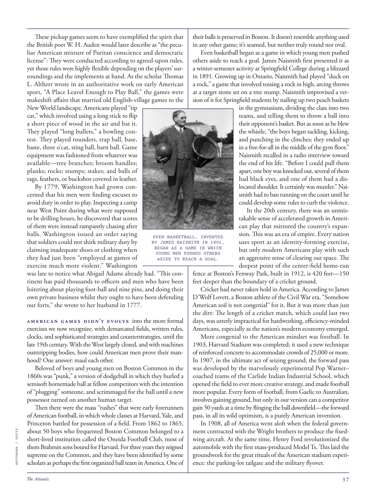

# The Atlantic — July 2026

## Page 39

---

These pickup games seem to have exemplified the spirit that the British poet W. H. Auden would later describe as “the peculiar American mixture of Puritan conscience and democratic license”: They were conducted according to agreed-upon rules, yet those rules were highly flexible depending on the players’ surroundings and the implements at hand. As the scholar Thomas L. Altherr wrote in an authoritative work on early American sport, “A Place Leavel Enough to Play Ball,” the games were makeshift affairs that married old English-village games to the New World landscape. Americans played “tip cat,” which involved using a long stick to flip a short piece of wood in the air and bat it.

**【中文翻译】** 这些皮卡游戏似乎体现了英国诗人 W. H. 奥登后来描述的“清教徒良心与民主许可的独特美国混合体”的精神：它们是根据商定的规则进行的，但这些规则根据玩家所处的环境和手头的工具而具有高度的灵活性。正如学者托马斯·L·阿尔瑟尔（Thomas L. Altherr）在一本关于早期美国体育的权威著作《一个足以打球的地方》中所写的那样，这些比赛是将古老的英国乡村比赛与新世界景观结合起来的权宜之计。美国人玩“tip cat”，即用一根长棍在空中翻转一小块木头并击打它。

They played “long bullets,” a bowling contest. They played rounders, trap ball, base, baste, three o’cat, sting ball, barn ball. Game equipment was fashioned from whatever was available—tree branches; broom handles; planks; rocks; stumps; stakes; and balls of rags, feathers, or buckshot covered in leather.

**【中文翻译】** 他们进行了“长子弹”保龄球比赛。他们玩圆球、陷阱球、垒球、垒球、三点球、刺球、谷仓球。游戏设备是用任何可用的东西制作的——树枝；扫帚柄；木板；岩石；树桩；赌注；以及由破布、羽毛或铅弹制成的球，上面覆盖着皮革。

By 1779, Washington had grown concerned that his men were finding excuses to avoid duty in order to play. Inspecting a camp near West Point during what were supposed to be drilling hours, he discovered that scores of them were instead rampantly chasing after balls. Washington issued an order saying that soldiers could not shirk military duty by claiming inadequate shoes or clothing when they had just been “employed at games of exercise much more violent.” Washington was late to notice what Abigail Adams already had. “This continent has paid thousands to officers and men who have been loitering about playing foot-ball and nine pins, and doing their own private business whilst they ought to have been defending our forts,” she wrote to her husband in 1777.

**【中文翻译】** 到了 1779 年，华盛顿开始担心他的手下为了比赛而寻找借口逃避职责。在本应进行训练的时间里，他检查了西点军校附近的一个营地，发现其中有数十人在疯狂地追球。华盛顿发布命令称，士兵在“参加更加暴力的运动会”时，不得以鞋子或衣服不足为由而逃避军事义务。华盛顿很晚才注意到阿比盖尔·亚当斯已经拥有的东西。 1777 年，她在给丈夫的信中写道：“这个大陆已经向军官和士兵支付了数千美元，他们本应保卫我们的堡垒，但他们却闲逛着踢足球、打九瓶球、做自己的私人生意。”

American games didn’t evolve into the more formal exercises we now recognize, with demarcated fields, written rules, clocks, and sophisticated strategies and counter strategies, until the late 19th century. With the West largely closed, and with machines out stripping bodies, how could American men prove their manhood? One answer: maul each other.

**【中文翻译】** 直到 19 世纪末，美国游戏才发展成为我们现在所认识的更正式的练习，包括划定的场地、书面规则、时钟以及复杂的策略和对抗策略。在西方基本封闭的情况下，随着机器的剥离，美国男人如何证明自己的男子气概？答案之一：互相殴打。

Beloved of boys and young men on Boston Common in the 1860s was “punk,” a version of dodgeball in which they hurled a semisoft homemade ball at fellow competitors with the intention of “plugging” someone, and scrimmaged for the ball until a new possessor turned on another human target.

**【中文翻译】** 1860 年代波士顿公园深受男孩和年轻人喜爱的是“朋克”，这是躲避球的一种版本，他们向其他参赛者投掷自制的半软球，意图“堵塞”某人，并为球争夺，直到新的拥有者转向另一个人类目标。

Then there were the mass “rushes” that were early forerunners of American football, in which whole classes at Harvard, Yale, and Princeton battled for possession of a field. From 1862 to 1865,

**【中文翻译】** 然后是大规模的“冲刺”，这是美式橄榄球的早期先驱，哈佛、耶鲁和普林斯顿的整个班级都在争夺一块场地。从 1862 年到 1865 年，

*BETTMANN / GETTY*

*【图注与署名】贝特曼/盖蒂图片社*

about 50 boys who frequented Boston Common belonged to a short-lived institution called the Oneida Football Club, most of them Brahmin sons bound for Harvard. For three years they reigned supreme on the Common, and they have been identified by some scholars as perhaps the first organized ball team in America. One of their balls is preserved in Boston. It doesn’t resemble anything used in any other game; it’s seamed, but neither truly round nor oval.

**【中文翻译】** 大约 50 名经常光顾波士顿公园的男孩属于一个名为奥奈达足球俱乐部的短命机构，其中大多数是前往哈佛大学的婆罗门儿子。三年来，他们在公共球场上占据着统治地位，一些学者认为他们可能是美国第一支有组织的球队。他们的一个球被保存在波士顿。它与任何其他游戏中使用的任何东西都不相似；它有接缝，但既不是真正的圆形也不是椭圆形。

Even basketball began as a game in which young men pushed others aside to reach a goal. James Naismith first presented it as a winter-semester activity at Springfield College during a blizzard in 1891. Growing up in Ontario, Naismith had played “duck on a rock,” a game that involved tossing a rock in high, arcing throws at a target stone set on a tree stump. Naismith improvised a version of it for Springfield students by nailing up two peach baskets in the gymnasium, dividing the class into two teams, and telling them to throw a ball into their opponent’s basket. But as soon as he blew the whistle, “the boys began tackling, kicking, and punching in the clinches; they ended up in a free-for-all in the middle of the gym floor,” Naismith recalled in a radio interview toward the end of his life. “Before I could pull them apart, one boy was knocked out, several of them had black eyes, and one of them had a dislocated shoulder. It certainly was murder.” Naismith had to ban running on the court until he could develop some rules to curb the violence.

**【中文翻译】** 甚至篮球也开始是一项年轻人将其他人推到一边以达到目标的游戏。 1891 年，詹姆斯·奈史密斯 (James Naismith) 在斯普林菲尔德学院 (Springfield College) 的一场暴风雪期间首次将其作为一项冬季学期活动。奈史密斯在安大略省长大，曾玩过“石头上的鸭子”游戏，这项游戏涉及将石头高高抛向设置在树桩上的目标石块。奈史密斯为斯普林菲尔德的学生临时制作了一个版本，他在体育馆里钉了两个桃篮，将全班分成两队，并告诉他们将球扔进对手的篮子里。但他一吹响哨子，“孩子们就开始扭打、踢打、拳打脚踢；最终他们在体育馆地板上进行了一场混战，”奈史密斯在晚年接受电台采访时回忆道。 “还没等我把他们拉开，一个男孩就被打晕了，几个人眼睛都黑了，其中一个肩膀脱臼了。这肯定是谋杀。”奈史密斯不得不禁止在球场上跑步，直到他制定出一些规则来遏制暴力。

takable sense of accelerated growth in American play that mirrored the country’s expansion. This was an era of empire. Every nation EVEN BASKETBALL, INVENTED uses sport as an identity-forming exercise, BY JAMES NAISMITH IN 1891, BEGAN AS A GAME IN WHICH but only modern Americans play with such YOUNG MEN PUSHED OTHERS an aggressive sense of clearing out space. The ASIDE TO REACH A GOAL. deepest point of the center-field home-run fence at Boston’s Fenway Park, built in 1912, is 420 feet—150 feet deeper than the boundary of a cricket ground.

**【中文翻译】** 美国游戏加速增长的明显感觉反映了该国的扩张。这是一个帝国时代。每个国家，甚至发明篮球，都将运动作为一种身份形成活动，由詹姆斯·奈史密斯于 1891 年开始，作为一种游戏，但只有现代美国人才玩这种年轻人推动其他人腾出空间的侵略性感觉。实现目标的旁白。波士顿芬威公园建于 1912 年，中场本垒打围栏的最深点深 420 英尺，比板球场的边界深 150 英尺。

Cricket had never taken hold in America. According to James D’Wolf Lovett, a Boston athlete of the Civil War era, “Somehow American soil is not congenial” for it. But it was more than just the dirt: The length of a cricket match, which could last two days, was utterly impractical for hardworking, efficiencyminded Americans, especially as the nation’s modern economy emerged.

**【中文翻译】** 板球运动从未在美国流行过。内战时期的波士顿运动员詹姆斯·德沃尔夫·洛维特 (James D’Wolf Lovett) 表示，“不知何故，美国的土壤并不适合”。但这不仅仅是泥土：一场可能持续两天的板球比赛对于勤奋、注重效率的美国人来说是完全不切实际的，尤其是在国家现代经济兴起之际。

More congenial to the American mindset was football. In 1903, Harvard Stadium was completed; it used a new technique of re inforced concrete to accommodate crowds of 25,000 or more.

**【中文翻译】** 更符合美国人心态的是足球。 1903年，哈佛体育场竣工；它采用了一种新的钢筋混凝土技术，可容纳 25,000 人或更多的人群。

In 1907, in the ultimate act of seizing ground, the forward pass was developed by the marvelously experimental Pop Warner– coached teams of the Carlisle Indian Industrial School, which opened the field to ever more creative strategy, and made football more popular. Every form of football, from Gaelic to Australian, involves gaining ground, but only in our version can a competitor gain 50 yards at a time by flinging the ball downfield— the forward pass, in all its wild optimism, is a purely American invention.

**【中文翻译】** 1907 年，在夺取阵地的最终行动中，前传是由卡莱尔印度工业学校波普·华纳 (Pop Warner) 执教的团队进行的奇妙实验开发出来的，这为更具创造性的策略开辟了领域，并使足球变得更加流行。每种形式的足球，从盖尔式足球到澳大利亚式足球，都涉及取得进展，但只有在我们的版本中，参赛者才能通过将球抛到前场一次取得 50 码——向前传球，在其所有的疯狂乐观中，纯粹是美国的发明。

In 1908, all of America went aloft when the federal government contracted with the Wright brothers to produce the fixedwing aircraft. At the same time, Henry Ford revolutionized the automobile with the first mass-produced Model Ts. This laid the groundwork for the great rituals of the American stadium experience: the parking-lot tailgate and the military flyover. In the 20th century, there was an unmis-

**【中文翻译】** 1908 年，当联邦政府与莱特兄弟签订生产固定翼飞机的合同时，整个美国都飞上了天空。与此同时，亨利·福特推出了第一批量产的 T 型汽车，彻底改变了汽车业。这为美国体育场体验的伟大仪式奠定了基础：停车场尾门和军事立交桥。在20世纪，有一个无误的
