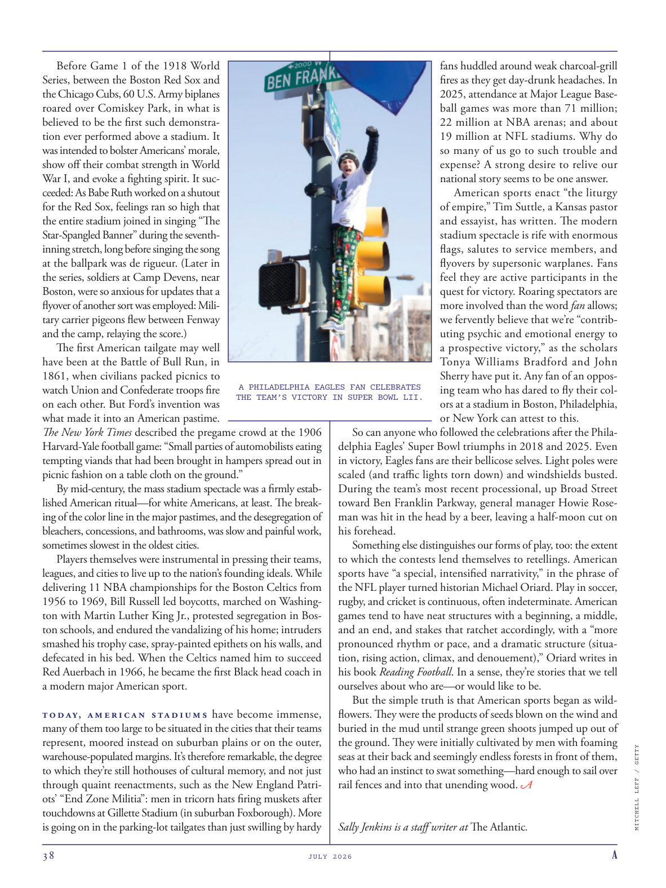

# The Atlantic — July 2026

## Page 40

---

Before Game 1 of the 1918 World Series, between the Boston Red Sox and the Chicago Cubs, 60 U.S. Army biplanes roared over Comiskey Park, in what is believed to be the first such demonstration ever performed above a stadium. It was intended to bolster Americans’ morale, show off their combat strength in World War I, and evoke a fighting spirit. It succeeded: As Babe Ruth worked on a shutout for the Red Sox, feelings ran so high that the entire stadium joined in singing “The Star-Spangled Banner” during the seventhinning stretch, long before singing the song at the ballpark was de rigueur. (Later in the series, soldiers at Camp Devens, near Boston, were so anxious for updates that a flyover of another sort was employed: Military carrier pigeons flew between Fenway and the camp, relaying the score.) The first American tailgate may well have been at the Battle of Bull Run, in 1861, when civilians packed picnics to watch Union and Confederate troops fire on each other. But Ford’s invention was what made it into an American pastime.

**【中文翻译】** 1918 年世界职业棒球大赛第一场比赛之前，波士顿红袜队与芝加哥小熊队之间，60 架美国陆军双翼飞机在科米斯基公园上空呼啸而过，这被认为是有史以来首次在体育场上空进行此类演示。其目的是鼓舞美国人的士气，展示他们在一战中的战斗力，唤起战斗精神。它成功了：当贝比·鲁斯 (Babe Ruth) 为红袜队 (Red Sox) 进行绝杀时，情绪高涨，以至于整个体育场在第七局比赛中都开始齐唱《星条旗永不落》(The Star-Spangled Banner)，而这早在球场上唱这首歌成为仪式之前就已经开始了。 （在该系列的后期，波士顿附近的德文斯营的士兵们非常渴望获得最新消息，因此采用了另一种飞越方式：军用信鸽在芬威和营地之间飞行，传递比分。）美国的第一个尾门很可能是在 1861 年的布尔朗战役中，当时平民们聚集在一起野餐，观看联邦和南方军队互相开火。但福特的发明使其成为美国人的消遣。

The New York Times described the pregame crowd at the 1906 HarvardYale football game: “Small parties of automobilists eating tempting viands that had been brought in hampers spread out in picnic fashion on a table cloth on the ground.”

**【中文翻译】** 《纽约时报》这样描述 1906 年哈佛耶鲁橄榄球赛赛前的人群：“一小群汽车司机吃着诱人的食物，这些食物是用野餐式的篮子运来的，摊在地上的桌布上。”

By mid-century, the mass stadium spectacle was a firmly established American ritual—for white Americans, at least. The breaking of the color line in the major pastimes, and the desegregation of bleachers, concessions, and bathrooms, was slow and painful work, sometimes slowest in the oldest cities.

**【中文翻译】** 到了本世纪中叶，大型体育场的奇观已经成为美国一种根深蒂固的仪式——至少对美国白人来说是这样。主要消遣活动中种族界限的打破，以及露天看台、特许经营场所和浴室的种族隔离，是一项缓慢而痛苦的工作，有时在最古老的城市是最慢的。

Players themselves were instrumental in pressing their teams, leagues, and cities to live up to the nation’s founding ideals. While delivering 11 NBA championships for the Boston Celtics from 1956 to 1969, Bill Russell led boycotts, marched on Washington with Martin Luther King Jr., protested segregation in Boston schools, and endured the vandalizing of his home; intruders smashed his trophy case, spray-painted epithets on his walls, and defecated in his bed. When the Celtics named him to succeed Red Auerbach in 1966, he became the first Black head coach in a modern major American sport.

**【中文翻译】** 球员们自己在敦促他们的球队、联赛和城市实现建国理想方面发挥了重要作用。 1956 年至 1969 年间，比尔·拉塞尔 (Bill Russell) 为波士顿凯尔特人队 (Boston Celtics) 夺得 11 座 NBA 冠军，期间他领导了抵制活动，与小马丁·路德·金 (Martin Luther King Jr.) 一起在华盛顿游行，抗议波士顿学校的种族隔离，并忍受了对自己家的破坏；入侵者打碎了他的奖杯柜，在他的墙上喷上了绰号，并在他的床上大便。 1966 年，当凯尔特人队任命他接替红衣主教奥尔巴赫时，他成为美国现代主要体育运动中第一位黑人主教练。

T o d ay, A m e ri c a t s ta d i u m s have become immense, many of them too large to be situated in the cities that their teams represent, moored instead on suburban plains or on the outer, warehousepopulated margins. It’s therefore remarkable, the degree to which they’re still hothouses of cultural memory, and not just through quaint reenactments, such as the New England Patriots’ “End Zone Militia”: men in tricorn hats firing muskets after touchdowns at Gillette Stadium (in suburban Fox borough). More is going on in the parking-lot tailgates than just swilling by hardy A PHILADELPHIA EAGLES FAN CELEBRATES THE TEAM’S VICTORY IN SUPER BOWL LII.

**【中文翻译】** 如今，美国的体育场已经变得巨大，其中许多体育场太大，无法坐落在其球队所代表的城市中，而是停泊在郊区平原或仓库密集的外围边缘。因此，值得注意的是，它们仍然是文化记忆的温室，而不仅仅是通过古雅的重演，例如新英格兰爱国者队的“端区民兵”：戴着三角帽的男子在吉列体育场（位于福克斯郊区）触地得分后开火。费城老鹰队的球迷庆祝球队在第五届超级碗中的胜利，而停车场后挡板上发生的事情不仅仅如此。

So can anyone who followed the celebrations after the Philadelphia Eagles’ Super Bowl triumphs in 2018 and 2025. Even in victory, Eagles fans are their bellicose selves. Light poles were scaled (and traffic lights torn down) and windshields busted.

**【中文翻译】** 任何关注费城老鹰队 2018 年和 2025 年超级碗夺冠后庆祝活动的人都可以。即使在胜利中，老鹰队的球迷也是好战的。灯杆被剥落（交通灯被拆除），挡风玻璃被打破。

During the team’s most recent processional, up Broad Street toward Ben Franklin Parkway, general manager Howie Roseman was hit in the head by a beer, leaving a half-moon cut on his forehead.

**【中文翻译】** 在球队最近一次沿着布罗德街向本·富兰克林公园大道游行时，总经理豪伊·罗斯曼被啤酒击中头部，额头上留下了半月形的伤口。

Something else distinguishes our forms of play, too: the extent to which the contests lend themselves to retellings. American sports have “a special, intensified narrativity,” in the phrase of the NFL player turned historian Michael Oriard. Play in soccer, rugby, and cricket is continuous, often indeterminate. American games tend to have neat structures with a beginning, a middle, and an end, and stakes that ratchet accordingly, with a “more pronounced rhythm or pace, and a dramatic structure (situation, rising action, climax, and denouement),” Oriard writes in his book Reading Football . In a sense, they’re stories that we tell ourselves about who are—or would like to be.

**【中文翻译】** 我们的游戏形式还有其他一些区别：比赛在多大程度上适合重述。用美国国家橄榄球联盟 (NFL) 球员出身的历史学家迈克尔·奥里亚德 (Michael Oriard) 的话来说，美国体育有“一种特殊的、强化的叙事性”。足球、橄榄球和板球比赛是连续的，通常是不确定的。奥里亚德在他的《阅读足球》一书中写道，美国的比赛往往有简洁的结构，包括开头、中间和结尾，并相应地增加赌注，具有“更明显的节奏或节奏，以及戏剧性的结构（情境、上升动作、高潮和结局）”。从某种意义上说，它们是我们告诉自己是谁或想成为什么样的人的故事。

But the simple truth is that American sports began as wildflowers. They were the products of seeds blown on the wind and buried in the mud until strange green shoots jumped up out of the ground. They were initially cultivated by men with foaming seas at their back and seemingly endless forests in front of them, who had an instinct to swat something—hard enough to sail over rail fences and into that unending wood.

**【中文翻译】** 但简单的事实是，美国体育运动始于野花。它们是种子随风飘扬并埋在泥土中的产物，直到奇怪的绿芽从地里跳出来。它们最初是由那些背后有泡沫的海洋、前面似乎无尽的森林的人培育的，他们有一种本能，可以拍打某些东西——足够坚硬，可以越过铁栅栏，进入那片无边无际的树林。

*— Sally Jenkins is a staff writer at The Atlantic .*

*【作者署名】莎莉·詹金斯是《大西洋月刊》的特约撰稿人。*

fans huddled around weak charcoal-grill fires as they get day-drunk headaches. In 2025, attendance at Major League Baseball games was more than 71 million; 22 million at NBA arenas; and about 19 million at NFL stadiums. Why do so many of us go to such trouble and expense? A strong desire to relive our national story seems to be one answer.

**【中文翻译】** 球迷们因白天醉酒而头痛，挤在微弱的木炭烧烤炉火旁。 2025 年，美国职业棒球大联盟比赛的观众人数超过 7100 万人； NBA 赛场观众人数达 2200 万人； NFL 体育场内约有 1900 万人。为什么我们这么多人要经历这样的麻烦和花费？答案之一似乎是重温我们国家故事的强烈愿望。

American sports enact “the liturgy of empire,” Tim Suttle, a Kansas pastor and essayist, has written. The modern stadium spectacle is rife with enormous flags, salutes to service members, and flyovers by supersonic warplanes. Fans feel they are active participants in the quest for victory. Roaring spectators are more involved than the word fan allows; we fervently believe that we’re “contributing psychic and emotional energy to a prospective victory,” as the scholars Tonya Williams Bradford and John Sherry have put it. Any fan of an opposing team who has dared to fly their colors at a stadium in Boston, Philadelphia, or New York can attest to this.

**【中文翻译】** 堪萨斯州牧师兼散文家蒂姆·萨特尔（Tim Suttle）写道，美国体育界上演了“帝国的礼仪”。现代体育场的景观充满了巨大的旗帜、向军人致敬以及超音速战机的飞翔。球迷们觉得他们是追求胜利的积极参与者。咆哮的观众比“粉丝”这个词所允许的更多的参与；正如学者托尼亚·威廉姆斯·布拉德福德和约翰·雪莉所说，我们坚信我们正在“为未来的胜利贡献精神和情感能量”。任何敢于在波士顿、费城或纽约的体育场大显身手的对方球队球迷都可以证明这一点。

*MITCHELL LEFF / GETTY*

*【图注与署名】米切尔·莱夫/盖蒂图片社*
