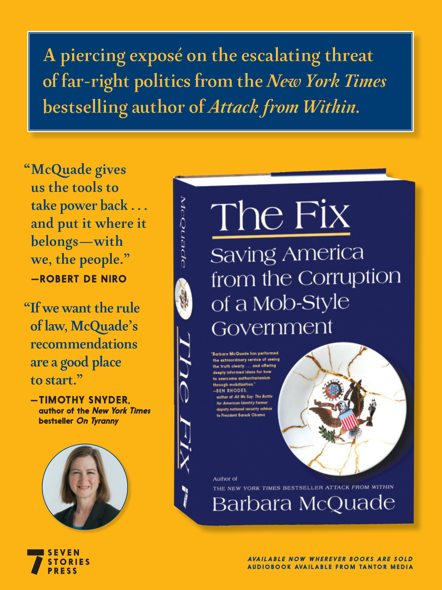

# The Atlantic — July 2026

## Page 41

---

### A piercing exposé on the escalating threat

**【标题翻译】** 对不断升级的威胁的尖锐揭露

### of far-right politics from the New York Times

**【标题翻译】** 来自《纽约时报》的极右政治

### bestselling author of Attack from Within.

**【标题翻译】** 畅销书《来自内部的攻击》的作者。

### “ McQuade gives

**【标题翻译】** “ 麦奎德给出

### us the tools to

**【标题翻译】** 我们的工具

### take power back . . .

**【标题翻译】** 夺回权力。 。 。

### and put it where it

**【标题翻译】** 并把它放在它该放的地方

### belongs—with

**【标题翻译】** 属于——与

### we, the people.”

**【标题翻译】** 我们，人民。”

#### — ROBERT DE NIRO

**【副标题翻译】** — 罗伯特·德尼罗

### “ If we want the rule

**【标题翻译】** “如果我们想要规则

### of law, McQuade’s

**【标题翻译】** 麦克奎德法学

### recommendations

**【标题翻译】** 建议

### are a good place

**【标题翻译】** 是个好地方

### to start.”

**【标题翻译】** 开始吧。”

— TIMOTHY SNYDER, author of the New York Times bestseller On Tyranny S E V E N S T O R I E S P R E S S AVA I L A B L E N OW W H E R E V E R BOO K S A R E S O L D AU D I O BOO K AVA I L A B L E F RO M TA N TO R M E D I A

**【中文翻译】** ——蒂莫西·斯奈德，《纽约时报》畅销书《论暴政》的作者
