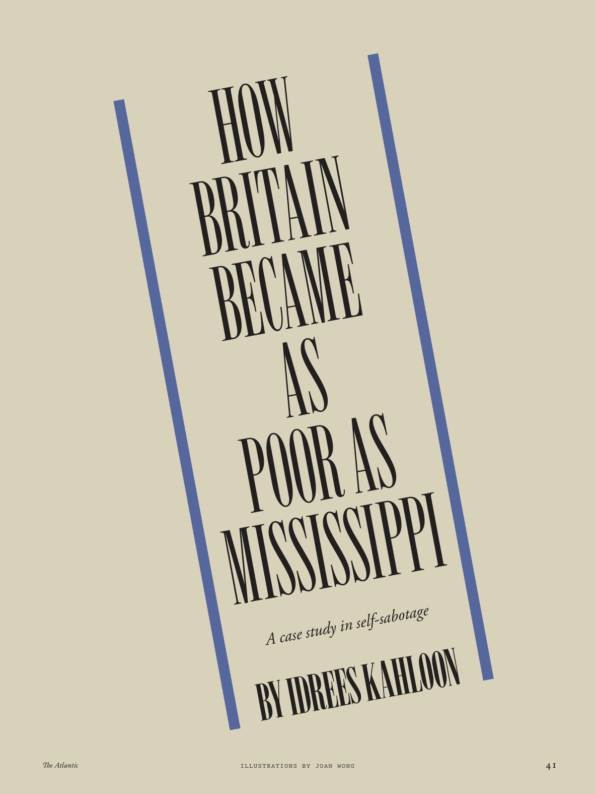

# The Atlantic — July 2026

## Page 43

---

### HOW

**【标题翻译】** 如何

### BRITAIN

**【标题翻译】** 英国

### BECAME

**【标题翻译】** 成为

### AS

**【标题翻译】** 作为

### POOR AS

**【标题翻译】** 可怜的AS

### MISSISSIPPI

**【标题翻译】** 密西西比州

#### A case study in self-sabotage

**【副标题翻译】** 自我破坏的案例研究

### BY IDREES KAHLOON

**【标题翻译】** 作者：IDREES KAHLON

*ILLUSTRATIONS BY JOAN WONG*

*【图注与署名】黄琼插图*
