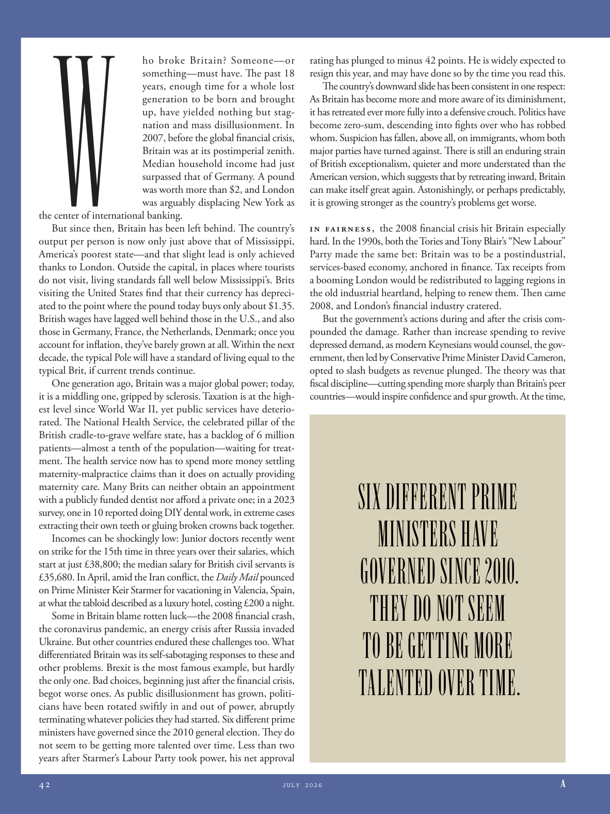

# The Atlantic — July 2026

## Page 44

---

ho broke Britain? Someone—or something— must have. The past 18 years, enough time for a whole lost generation to be born and brought up, have yielded nothing but stagnation and mass disillusionment. In 2007, before the global financial crisis, Britain was at its post imperial zenith.

**【中文翻译】** 何打破了英国？某人——或某物——一定有。过去的18年，足以让整个失落的一代出生和成长，但带来的却是停滞和大众的幻灭。 2007年，全球金融危机爆发之前，英国正处于后帝国的鼎盛时期。

Median household income had just surpassed that of Germany. A pound was worth more than $2, and London was arguably displacing New York as the center of international banking.

**【中文翻译】** 家庭收入中位数刚刚超过德国。一英镑价值超过 2 美元，伦敦可以说正在取代纽约成为国际银行业中心。

But since then, Britain has been left behind. The country’s output per person is now only just above that of Mississippi, America’s poorest state—and that slight lead is only achieved thanks to London. Outside the capital, in places where tourists do not visit, living standards fall well below Mississippi’s. Brits visiting the United States find that their currency has depreciated to the point where the pound today buys only about $1.35.

**【中文翻译】** 但从那时起，英国就被抛在了后面。该国的人均产出目前仅略高于美国最贫穷的州密西西比州，而这种微弱的领先优势只能归功于伦敦。在首都以外，在游客不去的地方，生活水平远低于密西西比州。到美国旅游的英国人发现他们的货币已经贬值到今天英镑只能兑换 1.35 美元左右。

British wages have lagged well behind those in the U.S., and also those in Germany, France, the Netherlands, Denmark; once you account for inflation, they’ve barely grown at all. Within the next decade, the typical Pole will have a standard of living equal to the typical Brit, if current trends continue.

**【中文翻译】** 英国的工资远远落后于美国，也落后于德国、法国、荷兰、丹麦；一旦考虑到通货膨胀，它们几乎没有增长。如果目前的趋势继续下去，在未来十年内，典型的波兰人将拥有与典型英国人相同的生活水平。

One generation ago, Britain was a major global power; today, it is a middling one, gripped by sclerosis. Taxation is at the highest level since World War II, yet public services have deteriorated. The National Health Service, the celebrated pillar of the British cradle-to-grave welfare state, has a backlog of 6 million patients—almost a tenth of the population—waiting for treatment. The health service now has to spend more money settling maternitymalpractice claims than it does on actually providing maternity care. Many Brits can neither obtain an appointment with a publicly funded dentist nor afford a private one; in a 2023 survey, one in 10 reported doing DIY dental work, in extreme cases extracting their own teeth or gluing broken crowns back together.

**【中文翻译】** 一代人之前，英国是一个全球主要强国；如今，它已处于中等水平，受到硬化症的困扰。税收处于二战以来的最高水平，但公共服务却在恶化。国家医疗服务体系是英国从摇篮到坟墓的福利国家的著名支柱，积压了 600 万患者（几乎占总人口的十分之一）等待治疗。卫生服务机构现在必须花费更多的钱来解决产妇医疗事故索赔，而不是实际提供产妇护理。许多英国人既无法预约公共资助的牙医，也无法负担私人牙医的费用。在 2023 年的一项调查中，十分之一的人表示自己做过牙科工作，在极端情况下会拔掉自己的牙齿或将破损的牙冠粘在一起。

Incomes can be shockingly low: Junior doctors recently went on strike for the 15th time in three years over their salaries, which start at just £38,800; the median salary for British civil servants is £35,680. In April, amid the Iran conflict, the Daily Mail pounced on Prime Minister Keir Starmer for vacationing in Valencia, Spain, at what the tabloid described as a luxury hotel, costing £200 a night.

**【中文翻译】** 收入可能低得惊人：初级医生最近三年内第 15 次因起薪仅为 38,800 英镑的工资而举行罢工；英国公务员的平均工资为 35,680 英镑。 4月份，在伊朗冲突期间，《每日邮报》猛烈抨击总理基尔·斯塔默前往西班牙巴伦西亚度假，该小报称该酒店是一家豪华酒店，每晚费用为200英镑。

Some in Britain blame rotten luck—the 2008 financial crash, the coronavirus pandemic, an energy crisis after Russia invaded Ukraine. But other countries endured these challenges too. What differentiated Britain was its self-sabotaging responses to these and other problems. Brexit is the most famous example, but hardly the only one. Bad choices, beginning just after the financial crisis, begot worse ones. As public disillusionment has grown, politicians have been rotated swiftly in and out of power, abruptly terminating whatever policies they had started. Six different prime ministers have governed since the 2010 general election. They do not seem to be getting more talented over time. Less than two years after Starmer’s Labour Party took power, his net approval rating has plunged to minus 42 points. He is widely expected to resign this year, and may have done so by the time you read this.

**【中文翻译】** 英国的一些人将其归咎于运气不好——2008年的金融危机、冠状病毒大流行、俄罗斯入侵乌克兰后的能源危机。但其他国家也面临着这些挑战。英国的与众不同之处在于它对这些问题和其他问题的自我破坏性反应。英国脱欧是最著名的例子，但并不是唯一的例子。金融危机刚结束时，错误的选择就会导致更糟糕的选择。随着公众幻灭感的加剧，政客们迅速轮换权力，突然终止了他们已经开始的任何政策。自2010年大选以来，已有六位不同的总理执政。随着时间的推移，他们似乎并没有变得更有才华。斯塔默领导的工党上台不到两年，他的净支持率已跌至-42点。人们普遍预计他将在今年辞职，并且在您阅读本文时可能已经辞职。

The country’s downward slide has been consistent in one respect: As Britain has become more and more aware of its diminishment, it has retreated ever more fully into a defensive crouch. Politics have become zero-sum, descending into fights over who has robbed whom. Suspicion has fallen, above all, on immigrants, whom both major parties have turned against. There is still an enduring strain of British exceptionalism, quieter and more understated than the American version, which suggests that by retreating inward, Britain can make itself great again. Astonishingly, or perhaps predictably, it is growing stronger as the country’s problems get worse.

**【中文翻译】** 该国的下滑在一个方面是一致的：随着英国越来越意识到自己的衰落，它已经更加全面地退回到防御性的蹲下状态。政治已经变成了零和博弈，陷入了谁抢了谁的斗争。首先，人们对移民产生了怀疑，而两大政党都反对移民。英国例外论依然存在，比美国例外论更安静、更低调，这表明，通过向内撤退，英国可以再次伟大。令人惊讶的是，或者也许可以预见的是，随着国家问题的恶化，它变得越来越强大。

In fairness, the 2008 financial crisis hit Britain especially hard. In the 1990s, both the Tories and Tony Blair’s “New Labour” Party made the same bet: Britain was to be a post industrial, servicesbased economy, anchored in finance. Tax receipts from a booming London would be redistributed to lagging regions in the old industrial heartland, helping to renew them. Then came 2008, and London’s financial industry cratered.

**【中文翻译】** 公平地说，2008年的金融危机对英国的打击尤其严重。 20世纪90年代，保守党和托尼·布莱尔的“新工党”都下了同样的赌注：英国将成为一个以金融为基础的后工业、服务型经济体。来自繁荣伦敦的税收收入将被重新分配给老工业中心地带的落后地区，帮助它们振兴。然后到了 2008 年，伦敦的金融业陷入困境。

But the government’s actions during and after the crisis compounded the damage. Rather than increase spending to revive depressed demand, as modern Keynesians would counsel, the government, then led by Conservative Prime Minister David Cameron, opted to slash budgets as revenue plunged. The theory was that fiscal discipline—cutting spending more sharply than Britain’s peer countries—would inspire confidence and spur growth. At the time,

**【中文翻译】** 但政府在危机期间和危机后的行动加剧了损失。当时由保守党首相戴维·卡梅伦领导的政府并没有像现代凯恩斯主义者所建议的那样通过增加支出来重振低迷的需求，而是选择在收入锐减时削减预算。该理论认为，财政纪律——比英国其他国家更大幅度地削减支出——将激发信心并刺激经济增长。当时，

### SIX DIFFERENT PRIME

**【标题翻译】** 六个不同的素数

### MINISTERS HAVE

**【标题翻译】** 部长们有

### GOVERNED SINCE 2010.

**【标题翻译】** 自 2010 年起进行管理。

### THEY DO NOT SEEM

**【标题翻译】** 他们看起来并不

### TO BE GETTING MORE

**【标题翻译】** 获得更多

### TALENTED OVER TIME.

**【标题翻译】** 随着时间的推移，才华横溢。
