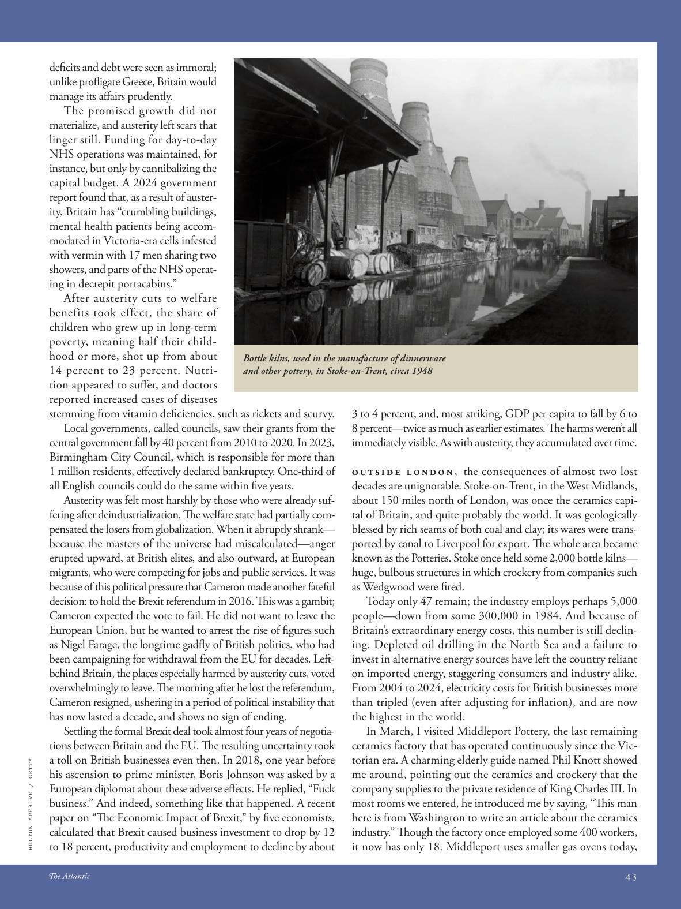

# The Atlantic — July 2026

## Page 45

---

defi cits and debt were seen as immoral; unlike profl igate Greece, Britain would manage its aff airs prudently. The promised growth did not materialize, and austerity left scars that linger still. Funding for day-to-day NHS operations was maintained, for instance, but only by cannibalizing the capital budget. A 2024 government report found that, as a result of austerity, Britain has “crumbling buildings, mental health patients being accommodated in Victoria-era cells infested with vermin with 17 men sharing two showers, and parts of the NHS operating in decrepit portacabins.”

**【中文翻译】** 赤字和债务被视为不道德；与挥霍无度的希腊不同，英国会谨慎处理事务。承诺的增长并未实现，紧缩政策留下的伤痕至今仍挥之不去。例如，NHS 日常运营的资金得以维持，但只能通过削减资本预算来维持。 2024 年的一份政府报告发现，由于紧缩政策，英国“建筑物摇摇欲坠，精神疾病患者被安置在维多利亚时代的牢房里，里面充满了害虫，17 名男子共用两个淋浴间，NHS 的部分部门在破旧的门舱中运作。”

After austerity cuts to welfare benefits took effect, the share of children who grew up in long-term poverty, meaning half their childhood or more, shot up from about 14 percent to 23 percent. Nutrition appeared to suff er, and doctors reported increased cases of diseases stemming from vitamin defi ciencies, such as rickets and scurvy.

**【中文翻译】** 福利紧缩削减生效后，在长期贫困中长大的儿童（即童年时期的一半或更多）比例从约 14% 飙升至 23%。营养似乎受到了影响，医生报告说，由维生素缺乏引起的疾病（例如佝偻病和坏血病）的病例有所增加。

Local governments, called councils, saw their grants from the central government fall by 40 percent from 2010 to 2020. In 2023, Birmingham City Council, which is responsible for more than 1 million residents, eff ectively declared bankruptcy. One-third of all English councils could do the same within five years.

**【中文翻译】** 从 2010 年到 2020 年，地方政府（称为议会）从中央政府获得的拨款减少了 40%。2023 年，负责超过 100 万居民的伯明翰市议会实际上宣布破产。三分之一的英国议会可以在五年内做到同样的事情。

Austerity was felt most harshly by those who were already suffering after deindustrialization. The welfare state had partially compensated the losers from globalization. When it abruptly shrank— because the masters of the universe had miscalculated—anger erupted upward, at British elites, and also outward, at European migrants, who were competing for jobs and public services. It was because of this political pressure that Cameron made another fateful decision: to hold the Brexit referendum in 2016. This was a gambit; Cameron expected the vote to fail. He did not want to leave the European Union, but he wanted to arrest the rise of figures such as Nigel Farage, the longtime gadfly of British politics, who had been campaigning for withdrawal from the EU for decades. Leftbehind Britain, the places especially harmed by austerity cuts, voted overwhelmingly to leave. The morning after he lost the referendum, Cameron resigned, ushering in a period of political instability that has now lasted a decade, and shows no sign of ending.

**【中文翻译】** 那些在去工业化之后已经遭受苦难的人对紧缩政策的感受最为强烈。福利国家部分补偿了全球化的输家。当它突然缩小时——因为宇宙的主人误判了——愤怒向上爆发，针对英国精英，也向外爆发，针对争夺就业和公共服务的欧洲移民。正是在这种政治压力下，卡梅伦做出了另一个重大决定：2016年举行脱欧公投。卡梅伦预计投票会失败。他不想离开欧盟，但他想阻止奈杰尔·法拉奇等人物的崛起，奈杰尔·法拉奇是英国政坛的老牛虻，几十年来一直在争取脱欧。落后的英国，尤其是受到紧缩削减伤害的国家，以压倒性多数投票决定脱欧。公投失败后的第二天早上，卡梅伦辞职，开启了一段政治不稳定时期，该时期已持续十年，且没有结束的迹象。

Settling the formal Brexit deal took almost four years of negotiations between Britain and the EU. The resulting un certainty took a toll on British businesses even then. In 2018, one year before

**【中文翻译】** 英国和欧盟花了近四年的时间才达成正式脱欧协议。即使在当时，由此产生的不确定性也对英国企业造成了影响。 2018年，也就是一年前

*HULTON ARCHIVE / GETTY*

*【图注与署名】赫尔顿档案馆/盖蒂图片社*

his ascension to prime minister, Boris Johnson was asked by a European diplomat about these adverse eff ects. He replied, “Fuck business.” And indeed, something like that happened. A recent paper on “The Economic Impact of Brexit,” by five economists, calculated that Brexit caused business investment to drop by 12 to 18 percent, productivity and employment to decline by about Bottle kilns, used in the manufacture of dinnerware and other pottery, in Stoke-on-Trent, circa 1948 3 to 4 percent, and, most striking, GDP per capita to fall by 6 to 8 percent—twice as much as earlier estimates. The harms weren’t all immediately visible. As with austerity, they accumulated over time.

**【中文翻译】** 鲍里斯·约翰逊就任英国首相后，一位欧洲外交官向他询问这些不利影响。他回答说：“去他妈的生意。”确实，类似的事情发生了。五位经济学家最近发表的一篇题​​为“英国脱欧的经济影响”的论文计算出，英国脱欧导致商业投资下降 12% 至 18%，生产力和就业率下降约 1948 年特伦特河畔斯托克用于制造餐具和其他陶器的瓶窑的 3% 至 4%，最引人注目的是，人均 GDP 下降 6% 至 8%，是之前估计的两倍。危害并不是立即可见的。与紧缩政策一样，它们是随着时间的推移而积累的。

Outside London, the consequences of almost two lost decades are unignorable. Stoke-on-Trent, in the West Midlands, about 150 miles north of London, was once the ceramics capital of Britain, and quite probably the world. It was geologically blessed by rich seams of both coal and clay; its wares were transported by canal to Liverpool for export. The whole area became known as the Potteries. Stoke once held some 2,000 bottle kilns— huge, bulbous structures in which crockery from companies such as Wedgwood were fi red.

**【中文翻译】** 在伦敦之外，近两个失去的十年的后果是不可忽视的。特伦特河畔斯托克位于西米德兰兹郡，距伦敦以北约 150 英里，曾经是英国乃至世界的陶瓷之都。这里的地质条件得天独厚，拥有丰富的煤层和粘土层。它的商品通过运河运到利物浦出口。整个地区被称为陶器厂。斯托克城曾经拥有大约 2,000 个瓶窑，这些巨大的球状结构在其中烧制来自韦奇伍德 (Wedgwood) 等公司的陶器。

Today only 47 remain; the industry employs perhaps 5,000 people— down from some 300,000 in 1984. And because of Britain’s extraordinary energy costs, this number is still declining. Depleted oil drilling in the North Sea and a failure to invest in alternative energy sources have left the country reliant on imported energy, staggering consumers and industry alike.

**【中文翻译】** 如今只剩下 47 人；该行业大约雇佣了 5,000 名员工——低于 1984 年的约 300,000 人。而且由于英国极高的能源成本，这一数字仍在下降。北海石油钻探的枯竭以及对替代能源投资的失败导致该国依赖进口能源，这让消费者和行业都感到震惊。

From 2004 to 2024, electricity costs for British businesses more than tripled (even after adjusting for infl ation), and are now the highest in the world.

**【中文翻译】** 从 2004 年到 2024 年，英国企业的电力成本增加了两倍多（即使在通货膨胀调整后），目前是世界上最高的。

In March, I visited Middleport Pottery, the last remaining ceramics factory that has operated continuously since the Victorian era. A charming elderly guide named Phil Knott showed me around, pointing out the ceramics and crockery that the company supplies to the private residence of King Charles III. In most rooms we entered, he introduced me by saying, “This man here is from Washington to write an article about the ceramics industry.” Th ough the factory once employed some 400 workers, it now has only 18. Middleport uses smaller gas ovens today,

**【中文翻译】** 三月，我参观了米德尔波特陶器厂，这是自维多利亚时代以来仅存的最后一座持续运营的陶瓷工厂。一位名叫菲尔·诺特 (Phil Knott) 的迷人老年导游带我四处参观，指出该公司向查理三世国王的私人住宅供应的陶瓷和陶器。在我们进入的大多数房间里，他介绍我时都会说：“这个人来自华盛顿，要写一篇关于陶瓷行业的文章。”虽然工厂曾经雇用了大约 400 名工人，但现在只有 18 名。米德尔波特现在使用较小的燃气烤箱，
