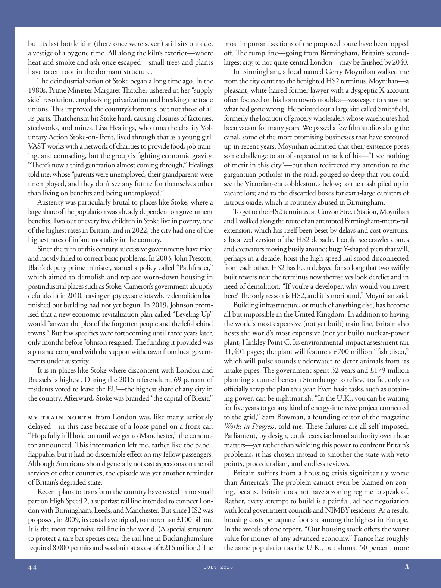

# The Atlantic — July 2026

## Page 46

---

but its last bottle kiln (there once were seven) still sits outside, a vestige of a bygone time. All along the kiln’s exterior—where heat and smoke and ash once escaped—small trees and plants have taken root in the dormant structure.

**【中文翻译】** 但它的最后一个瓶窑（曾经有七个）仍然坐落在外面，是过去时代的遗迹。沿着窑炉的外部——热量、烟雾和灰烬曾经逸出的地方——小树和植物已经在休眠的结构中扎根。

The deindustrialization of Stoke began a long time ago. In the 1980s, Prime Minister Margaret Thatcher ushered in her “supply side” revolution, emphasizing privatization and breaking the trade unions. This improved the country’s fortunes, but not those of all its parts. Thatcherism hit Stoke hard, causing closures of factories, steelworks, and mines. Lisa Healings, who runs the charity Voluntary Action Stoke-on-Trent, lived through that as a young girl.

**【中文翻译】** 斯托克的去工业化很早以前就开始了。 20世纪80年代，英国首相玛格丽特·撒切尔开启了“供给侧”革命，强调私有化和打破工会。这改善了国家的命运，但并没有改善其所有地区的命运。撒切尔主义对斯托克造成了沉重打击，导致工厂、钢铁厂和矿山关闭。丽莎·海林斯 (Lisa Healings) 经营着特伦特河畔斯托克慈善机构，她年轻时就经历过这样的经历。

VAST works with a network of charities to provide food, job training, and counseling, but the group is fighting economic gravity. “There’s now a third generation almost coming through,” Healings told me, whose “parents were unemployed, their grandparents were unemployed, and they don’t see any future for themselves other than living on benefits and being unemployed.”

**【中文翻译】** VAST 与慈善机构网络合作，提供食品、职业培训和咨询，但该组织正在对抗经济压力。 “现在第三代人快要过去了，”希林斯告诉我，他们的“父母失业了，祖父母失业了，除了靠救济金生活和失业之外，他们看不到自己的任何未来。”

Austerity was particularly brutal to places like Stoke, where a large share of the population was already dependent on government benefits. Two out of every five children in Stoke live in poverty, one of the highest rates in Britain, and in 2022, the city had one of the highest rates of infant mortality in the country.

**【中文翻译】** 紧缩政策对斯托克这样的地方尤其残酷，那里很大一部分人口已经依赖政府福利。斯托克市五分之二的儿童生活在贫困之中，是英国贫困率最高的城市之一，到 2022 年，该市将成为英国婴儿死亡率最高的城市之一。

Since the turn of this century, successive governments have tried and mostly failed to correct basic problems. In 2003, John Prescott, Blair’s deputy prime minister, started a policy called “Pathfinder,” which aimed to demolish and replace worn-down housing in postindustrial places such as Stoke. Cameron’s government abruptly defunded it in 2010, leaving empty eyesore lots where demolition had finished but building had not yet begun. In 2019, Johnson promised that a new economic-revitalization plan called “Leveling Up” would “answer the plea of the forgotten people and the left-behind towns.” But few specifics were forthcoming until three years later, only months before Johnson resigned. The funding it provided was a pittance compared with the support withdrawn from local governments under austerity.

**【中文翻译】** 自本世纪之交以来，历届政府都曾尝试纠正基本问题，但大多以失败告终。 2003年，布莱尔的副首相约翰·普雷斯科特启动了一项名为“探路者”的政策，旨在拆除和更换斯托克等后工业地区的破旧房屋。 2010年，卡梅伦政府突然取消了对该项目的资助，留下了一片空荡荡的、碍眼的地段，那里的拆除工作已经完成，但建设工作尚未开始。 2019年，约翰逊承诺，一项名为“Leveling Up”的新经济振兴计划将“回应被遗忘者和留守城镇的诉求”。但直到三年后，也就是约翰逊辞职前几个月，才公布了具体细节。与紧缩政策下地方政府撤回的支持相比，它提供的资金微不足道。

It is in places like Stoke where discontent with London and Brussels is highest. During the 2016 referendum, 69 percent of residents voted to leave the EU—the highest share of any city in the country. Afterward, Stoke was branded “the capital of Brexit.”

**【中文翻译】** 在斯托克这样的地方，人们对伦敦和布鲁塞尔的不满情绪最高。在 2016 年公投期间，69% 的居民投票决定离开欧盟——这一比例是该国所有城市中最高的。此后，斯托克被称为“英国脱欧之都”。

Mo train north from London was, like many, seriously delayed—in this case because of a loose panel on a front car. “Hopefully it’ll hold on until we get to Manchester,” the conductor announced. This information left me, rather like the panel, flappable, but it had no discernible effect on my fellow passengers.

**【中文翻译】** 与许多其他列车一样，从伦敦向北行驶的 Mo 列车也出现了严重延误，此次延误的原因是前车厢面板松动。 “希望它能一直持续到我们到达曼彻斯特，”指挥宣布。这些信息让我像面板一样感到不安，但它对我的其他乘客没有明显的影响。

Although Americans should generally not cast aspersions on the rail services of other countries, the episode was yet another reminder of Britain’s degraded state.

**【中文翻译】** 尽管美国人一般不应该诽谤其他国家的铁路服务，但这一事件再次提醒人们英国的堕落状态。

Recent plans to transform the country have rested in no small part on High Speed 2, a superfast rail line intended to connect London with Birming ham, Leeds, and Manchester. But since HS2 was proposed, in 2009, its costs have tripled, to more than £100 billion.

**【中文翻译】** 最近的国家转型计划在很大程度上依赖于高速2号线，这是一条旨在连接伦敦与伯明翰、利兹和曼彻斯特的超高速铁路线。但自从 2009 年提出 HS2 以来，其成本增加了两倍，达到 1000 亿英镑以上。

It is the most expensive rail line in the world. (A special structure to protect a rare bat species near the rail line in Buckingham shire required 8,000 permits and was built at a cost of £216 million.) The most important sections of the proposed route have been lopped off. The rump line—going from Birmingham, Britain’s secondlargest city, to not-quite-central London—may be finished by 2040.

**【中文翻译】** 它是世界上最昂贵的铁路线。 （白金汉郡铁路线附近为保护稀有蝙蝠物种而建造的特殊建筑需要 8,000 份许可证，耗资 2.16 亿英镑建造。）拟议路线最重要的路段已被砍掉。臀部线——从英国第二大城市伯明翰到不太市中心的伦敦——可能会在 2040 年完工。

In Birmingham, a local named Gerry Moynihan walked me from the city center to the benighted HS2 terminus. Moynihan— a pleasant, white-haired former lawyer with a dyspeptic X account often focused on his hometown’s troubles— was eager to show me what had gone wrong. He pointed out a large site called Smithfield, formerly the location of grocery wholesalers whose warehouses had been vacant for many years. We passed a few film studios along the canal, some of the more promising businesses that have sprouted up in recent years. Moynihan admitted that their existence poses some challenge to an oft-repeated remark of his—“I see nothing of merit in this city”—but then redirected my attention to the gargantuan potholes in the road, gouged so deep that you could see the Victorianera cobblestones below; to the trash piled up in vacant lots; and to the discarded boxes for extra-large canisters of nitrous oxide, which is routinely abused in Birmingham.

**【中文翻译】** 在伯明翰，一位名叫格里·莫伊尼汉 (Gerry Moynihan) 的当地人陪我从市中心走到昏暗的 HS2 终点站。莫伊尼汉是一位和蔼可亲、白发苍苍的前律师，他的 X 帐户经常关注家乡的麻烦，他急于向我展示出了什么问题。他指出了一个名为史密斯菲尔德的大型地点，这里以前是杂货批发商的所在地，其仓库已空置多年。我们沿着运河经过了几家电影制片厂，其中一些是近年来兴起的更有前途的企业。莫伊尼汉承认，它们的存在对他经常重复的一句话提出了一些挑战——“我在这座城市里看不到任何优点”——但随后我将注意力转移到道路上巨大的坑洼上，这些坑洼挖得很深，你可以看到下面维多利亚时期的鹅卵石；空地上堆放的垃圾；以及用于存放超大一氧化二氮罐的废弃盒子，这种气体在伯明翰经常被滥用。

To get to the HS2 terminus, at Curzon Street Station, Moynihan and I walked along the route of an attempted Birmingham-metro-rail extension, which has itself been beset by delays and cost overruns: a localized version of the HS2 debacle. I could see crawler cranes and excavators moving busily around; huge Y-shaped piers that will, perhaps in a decade, hoist the high-speed rail stood dis connected from each other. HS2 has been delayed for so long that two swiftly built towers near the terminus now themselves look derelict and in need of demolition. “If you’re a developer, why would you invest here? The only reason is HS2, and it is moribund,” Moynihan said.

**【中文翻译】** 为了到达柯松街车站的 HS2 总站，莫伊尼汉和我沿着伯明翰地铁延伸线的路线步行，该延伸线本身就受到延误和成本超支的困扰：这是 HS2 崩溃的本地化版本。我看到履带式起重机和挖掘机在忙碌地移动；巨大的 Y 形桥墩可能会在十年内将高铁吊起，这些桥墩彼此分离。 HS2 已经延误了很长时间，以至于终点站附近两座迅速建成的塔楼现在看起来已经被遗弃，需要拆除。 “如果你是开发商，你为什么要在这里投资？唯一的原因是 HS2，而且它已经濒临崩溃，”莫伊尼汉说。

Building infrastructure, or much of anything else, has become all but impossible in the United Kingdom. In addition to having the world’s most expensive (not yet built) train line, Britain also hosts the world’s most expensive (not yet built) nuclear-power plant, Hinkley Point C. Its environmental-impact assessment ran 31,401 pages; the plant will feature a £700 million “fish disco,” which will pulse sounds underwater to deter animals from its intake pipes. The government spent 32 years and £179 million planning a tunnel beneath Stonehenge to relieve traffic, only to officially scrap the plan this year. Even basic tasks, such as obtaining power, can be nightmarish. “In the U.K., you can be waiting for five years to get any kind of energy-intensive project connected to the grid,” Sam Bowman, a founding editor of the magazine Works in Progress , told me. These failures are all self-imposed.

**【中文翻译】** 在英国，建设基础设施或其他许多事情几乎是不可能的。除了拥有世界上最昂贵（尚未建成）的火车线外，英国还拥有世界上最昂贵（尚未建成）的欣克利角 C 核电站。其环境影响评估长达 31,401 页；该工厂将配备价值 7 亿英镑的“鱼迪斯科”，它会在水下发出脉冲声音，以阻止动物进入其进水管。政府花了 32 年时间和 1.79 亿英镑计划在巨石阵下方修建一条隧道以缓解交通，但今年却正式取消了该计划。即使是基本的任务，例如获取电力，也可能是噩梦般的。 “在英国，你可能需要等待五年才能将任何类型的能源密集型项目连接到电网，”《Works in Progress》杂志的创始编辑萨姆·鲍曼告诉我。这些失败都是自己造成的。

Parliament, by design, could exercise broad authority over these matters—yet rather than wielding this power to confront Britain’s problems, it has chosen instead to smother the state with veto points, proceduralism, and endless reviews.

**【中文翻译】** 按照设计，议会可以对这些事务行使广泛的权力，但它并没有运用这一权力来解决英国的问题，而是选择用否决权、程序主义和无休止的审查来压制国家。

Britain suffers from a housing crisis significantly worse than America’s. The problem cannot even be blamed on zoning, because Britain does not have a zoning regime to speak of.

**【中文翻译】** 英国遭受的住房危机比美国严重得多。这个问题甚至不能归咎于分区，因为英国没有分区制度可言。

Rather, every attempt to build is a painful, ad hoc negotiation with local government councils and NIMBY residents. As a result, housing costs per square foot are among the highest in Europe.

**【中文翻译】** 相反，每一次建设尝试都是与当地政府议会和邻避居民进行痛苦的临时谈判。因此，每平方英尺的住房成本是欧洲最高的。

In the words of one report, “Our housing stock offers the worst value for money of any advanced economy.” France has roughly the same population as the U.K., but almost 50 percent more

**【中文翻译】** 用一份报告的话来说，“我们的住房存量是所有发达经济体中性价比最差的。”法国的人口与英国大致相同，但多出近 50%
