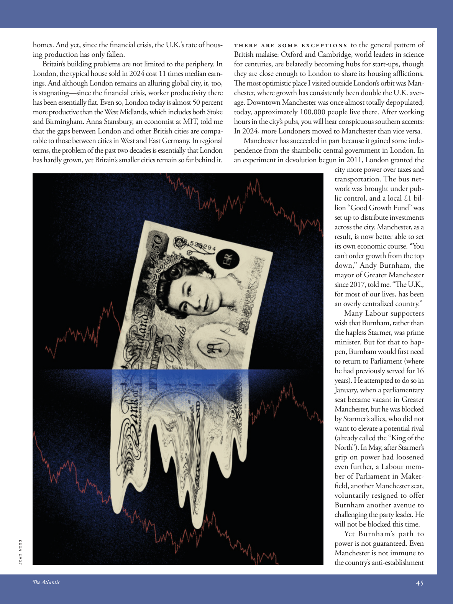

# The Atlantic — July 2026

## Page 47

---

homes. And yet, since the financial crisis, the U.K.’s rate of housing production has only fallen. Britain’s building problems are not limited to the periphery. In London, the typical house sold in 2024 cost 11 times median earnings. And although London remains an alluring global city, it, too, is stagnating—since the financial crisis, worker productivity there has been essentially flat. Even so, London today is almost 50 percent more productive than the West Midlands, which includes both Stoke and Birmingham. Anna Stansbury, an economist at MIT, told me that the gaps between London and other British cities are comparable to those between cities in West and East Germany. In regional terms, the problem of the past two decades is essentially that London has hardly grown, yet Britain’s smaller cities remain so far behind it.

**【中文翻译】** 家园。然而，自金融危机以来，英国的住房生产率只出现下降。英国的建筑问题不仅限于外围地区。在伦敦，2024 年出售的典型房屋价格是收入中位数的 11 倍。尽管伦敦仍然是一座有吸引力的全球城市，但它也陷入了停滞——自金融危机以来，那里的工人生产率基本持平。即便如此，今天的伦敦的生产力比西米德兰兹（包括斯托克和伯明翰）高出近 50%。麻省理工学院经济学家安娜·斯坦斯伯里告诉我，伦敦和其他英国城市之间的差距与西德和东德城市之间的差距相当。从地区角度来看，过去二十年的问题本质上是伦敦几乎没有发展，但英国的小城市却远远落后。

JOAN WONG There are some exceptions to the general pattern of British malaise: Oxford and Cambridge, world leaders in science for centuries, are belatedly becoming hubs for start-ups, though they are close enough to London to share its housing afflictions.

**【中文翻译】** 英国的普遍萎靡模式也有一些例外：几个世纪以来一直处于世界科学领先地位的牛津大学和剑桥大学，虽然距离伦敦足够近，可以分担伦敦的住房问题，但迟迟才成为初创企业的中心。

The most optimistic place I visited outside London’s orbit was Manchester, where growth has consistently been double the U.K. average. Downtown Manchester was once almost totally depopulated; today, approximately 100,000 people live there. After working hours in the city’s pubs, you will hear conspicuous southern accents: In 2024, more Londoners moved to Manchester than vice versa.

**【中文翻译】** 我访问过的伦敦以外最乐观的地方是曼彻斯特，那里的增长一直是英国平均水平的两倍。曼彻斯特市中心曾经几乎完全无人居住。如今，大约有 100,000 人居住在那里。在城市的酒吧工作后，您会听到明显的南方口音：2024 年，搬到曼彻斯特的伦敦人多于曼彻斯特搬到伦敦的人。

Manchester has succeeded in part because it gained some independence from the shambolic central government in London. In an experiment in devolution begun in 2011, London granted the city more power over taxes and transportation. The bus network was brought under public control, and a local £1 billion “Good Growth Fund” was set up to distribute investments across the city. Manchester, as a result, is now better able to set its own economic course. “You can’t order growth from the top down,” Andy Burnham, the mayor of Greater Manchester since 2017, told me. “The U.K., for most of our lives, has been an overly centralized country.”

**【中文翻译】** 曼彻斯特的成功部分是因为它从伦敦混乱的中央政府中获得了一定的独立性。在 2011 年开始的一项权力下放实验中，伦敦授予该市更多的税收和交通权力。公交网络受到公共控制，当地设立了 10 亿英镑的“良好增长基金”，以在全市范围内分配投资。因此，曼彻斯特现在能够更好地制定自己的经济方针。 “你不能自上而下地命令增长，”自 2017 年起担任大曼彻斯特市长的安迪·伯纳姆 (Andy Burnham) 告诉我。 “在我们一生的大部分时间里，英国一直是一个过度集权的国家。”

Many Labour supporters wish that Burnham, rather than the hapless Starmer, was prime minister. But for that to happen, Burnham would first need to return to Parliament (where he had previously served for 16 years). He attempted to do so in January, when a parliamentary seat became vacant in Greater Manchester, but he was blocked by Starmer’s allies, who did not want to elevate a potential rival (already called the “King of the North”). In May, after Starmer’s grip on power had loosened even further, a Labour member of Parliament in Makerfield, another Manchester seat, voluntarily resigned to offer Burnham another avenue to challenging the party leader. He will not be blocked this time. Yet Burnham’s path to power is not guaranteed. Even Manchester is not immune to the country’s anti-establishment

**【中文翻译】** 许多工党支持者希望伯纳姆而不是倒霉的斯塔默担任首相。但要做到这一点，伯纳姆首先需要重返议会（他此前曾在议会任职 16 年）。一月份，当大曼彻斯特的一个议会席位空缺时，他试图这样做，但他被斯塔默的盟友阻止，他们不想提升潜在的竞争对手（已被称为“北方之王”）。今年五月，斯塔默对权力的控制进一步放松后，曼彻斯特另一个席位梅克菲尔德的一名工党议员自愿辞职，为伯纳姆提供了另一条挑战该党领袖的途径。这次他不会再被封杀了。然而伯纳姆的权力之路并没有得到保证。即使曼彻斯特也未能幸免于该国的反建制
