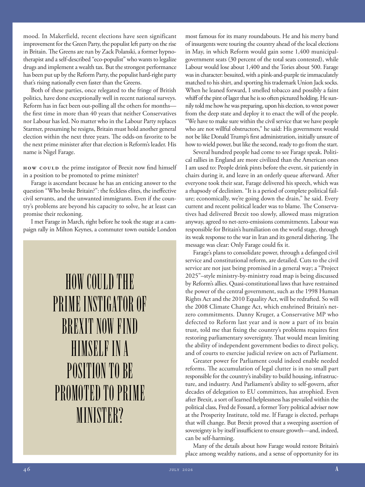

# The Atlantic — July 2026

## Page 48

---

mood. In Makerfield, recent elections have seen significant improvement for the Green Party, the populist left party on the rise in Britain. The Greens are run by Zack Polanski, a former hypnotherapist and a self-described “eco-populist” who wants to legalize drugs and implement a wealth tax. But the strongest performance has been put up by the Reform Party, the populist hard-right party that’s rising nationally even faster than the Greens.

**【中文翻译】** 情绪。在梅克菲尔德，最近的选举显示绿党（英国正在崛起的民粹主义左翼政党）取得了显着进步。绿党由扎克·波兰斯基领导，他曾是一名催眠治疗师，自称是“生态民粹主义者”，希望毒品合法化并实施财富税。但表现最强劲的是改革党，这个民粹主义的极右翼政党在全国范围内的崛起速度甚至比绿党还要快。

Both of these parties, once relegated to the fringe of British politics, have done exceptionally well in recent national surveys. Reform has in fact been out-polling all the others for months— the first time in more than 40 years that neither Conservatives nor Labour has led. No matter who in the Labour Party replaces Starmer, presuming he resigns, Britain must hold another general election within the next three years. The odds-on favorite to be the next prime minister after that election is Reform’s leader. His name is Nigel Farage.

**【中文翻译】** 这两个曾经一度被置于英国政治边缘的政党在最近的全国调查中都表现得异常出色。事实上，几个月来改革派的民意调查一直领先于其他所有派——这是 40 多年来第一次保守党和工党都没有领先。无论工党中谁取代斯塔默，假设他辞职，英国必须在未来三年内再次举行大选。此次选举后最有可能成为下一任总理的是改革党领袖。他的名字叫奈杰尔·法拉奇。

How could the prime instigator of Brexit now find himself in a position to be promoted to prime minister? Farage is ascendant because he has an enticing answer to the question “Who broke Britain?”: the feckless elites, the in effective civil servants, and the unwanted immigrants. Even if the country’s problems are beyond his capacity to solve, he at least can promise their reckoning.

**【中文翻译】** 英国脱欧的主要煽动者现在怎么可能晋升为首相呢？法拉奇的地位之所以上升，是因为他对“谁破坏了英国？”这个问题给出了一个诱人的答案：不负责任的精英、效率低下的公务员和不受欢迎的移民。即使国家的问题超出了他的解决能力，他至少可以答应他们的清算。

I met Farage in March, right before he took the stage at a campaign rally in Milton Keynes, a commuter town outside London

**【中文翻译】** 我三月份遇见了法拉奇，就在他在伦敦郊外的通勤小镇米尔顿凯恩斯的竞选集会上登台之前

### HOW COULD THE

**【标题翻译】** 怎么可能

### PRIME INSTIGATOR OF

**【标题翻译】** 主要煽动者

### BREXIT NOW FIND

**【标题翻译】** 立即脱欧 查找

### HIMSELF IN A

**【标题翻译】** 自己在A

### POSITION TO BE

**【标题翻译】** 未来的位置

### PROMOTED TO PRIME

**【标题翻译】** 晋升至 Prime

### MINISTER?

**【标题翻译】** 部长？

most famous for its many roundabouts. He and his merry band of insurgents were touring the country ahead of the local elections in May, in which Reform would gain some 1,400 municipalgovernment seats (30 percent of the total seats contested), while Labour would lose about 1,400 and the Tories about 500. Farage was in character: besuited, with a pink-and-purple tie immaculately matched to his shirt, and sporting his trademark Union Jack socks.

**【中文翻译】** 以其众多的环形交叉路口而闻名。在 5 月份的地方选举之前，他和他的一群快乐的叛乱分子正在全国巡回演出，改革党将获得约 1,400 个市政府席位（占所有竞选席位的 30%），而工党将失去约 1,400 个席位，保守党将失去约 500 个席位。法拉奇的性格很鲜明：西装革履，粉紫色领带与衬衫完美搭配，脚上穿着他标志性的英国国旗袜子。

When he leaned forward, I smelled tobacco and possibly a faint whiff of the pint of lager that he is so often pictured holding. He sunnily told me how he was preparing, upon his election, to wrest power from the deep state and deploy it to enact the will of the people.

**【中文翻译】** 当他向前倾身时，我闻到了烟草味，可能还闻到了他经常拿着的一品脱啤酒的淡淡气味。他阳光地告诉我，他如何准备在当选后从深层政府手中夺取权力，并利用它来实现人民的意愿。

“We have to make sure within the civil service that we have people who are not willful obstructors,” he said: His government would not be like Donald Trump’s first administration, initially unsure of how to wield power, but like the second, ready to go from the start.

**【中文翻译】** 他说：“我们必须确保公务员队伍中的人不会故意阻挠。”他的政府不会像唐纳德·特朗普的第一届政府那样，一开始不确定如何运用权力，而是像第二届政府一样，从一开始就做好了准备。

Several hundred people had come to see Farage speak. Political rallies in England are more civilized than the American ones I am used to: People drink pints before the event, sit patiently in chairs during it, and leave in an orderly queue afterward. After everyone took their seat, Farage delivered his speech, which was a rhapsody of declinism. “It is a period of complete political failure; economically, we’re going down the drain,” he said. Every current and recent political leader was to blame. The Conservatives had delivered Brexit too slowly, allowed mass migration anyway, agreed to net-zero-emissions commitments. Labour was responsible for Britain’s humiliation on the world stage, through its weak response to the war in Iran and its general dithering. The message was clear: Only Farage could fix it.

**【中文翻译】** 数百人前来观看法拉奇的演讲。英国的政治集会比我习惯的美国政治集会更加文明：人们在活动前喝一品脱啤酒，在活动期间耐心地坐在椅子上，然后有序地离开。所有人就座后，法拉奇发表了他的演讲，这是一首衰落主义的狂想曲。 “这是一个政治上彻底失败的时期；经济上，我们正在走入下水道，”他说。每一位现任和最近的政治领导人都难辞其咎。保守党脱欧进程太慢，无论如何都允许大规模移民，并同意净零排放承诺。工党对伊朗战争的软弱反应和普遍的犹豫不决，导致英国在世界舞台上蒙受羞辱。传达的信息很明确：只有法拉奇才能解决这个问题。

Farage’s plans to consolidate power, through a defanged civil service and constitutional reform, are detailed. Cuts to the civil service are not just being promised in a general way; a “Project 2025”–style ministry-by-ministry road map is being discussed by Reform’s allies. Quasi-constitutional laws that have restrained the power of the central government, such as the 1998 Human Rights Act and the 2010 Equality Act, will be redrafted. So will the 2008 Climate Change Act, which enshrined Britain’s netzero commitments. Danny Kruger, a Conservative MP who defected to Reform last year and is now a part of its brain trust, told me that fixing the country’s problems requires first restoring parliamentary sovereignty. That would mean limiting the ability of independent government bodies to direct policy, and of courts to exercise judicial review on acts of Parliament.

**【中文翻译】** 法拉奇通过削弱公务员制度和宪法改革来巩固权力的计划是详细的。削减公务员队伍不仅仅是一般性的承诺，而是一种普遍的承诺。改革的盟友正在讨论“2025计划”式的逐部委路线图。 1998年的《人权法》和2010年的《平等法》等限制中央政府权力的准宪法法律将重新起草。 2008 年《气候变化法案》也将如此，该法案体现了英国的净零排放承诺。保守党议员丹尼·克鲁格(Danny Kruger)去年叛逃到改革派，现在是改革派智囊团的一员，他告诉我，解决国家的问题首先需要恢复议会主权。这将意味着限制独立政府机构指导政策的能力以及法院对议会行为进行司法审查的能力。

Greater power for Parliament could indeed enable needed reforms. The accumulation of legal clutter is in no small part responsible for the country’s inability to build housing, infrastructure, and industry. And Parliament’s ability to self-govern, after decades of delegation to EU committees, has atrophied. Even after Brexit, a sort of learned helplessness has prevailed within the political class, Fred de Fossard, a former Tory political adviser now at the Prosperity Institute, told me. If Farage is elected, perhaps that will change. But Brexit proved that a sweeping assertion of sovereignty is by itself insufficient to ensure growth—and, indeed, can be self-harming.

**【中文翻译】** 赋予议会更大的权力确实可以促成必要的改革。法律混乱的积累在很大程度上导致了该国无法建设住房、基础设施和工业。经过几十年向欧盟委员会的授权后，议会的自治能力已经萎缩。现任繁荣研究所前保守党政治顾问弗雷德·德·福萨德告诉我，即使在英国脱欧之后，政治阶层中仍普遍存在一种习得性无助。如果法拉奇当选，也许情况会改变。但英国脱欧证明，全面主张主权本身不足以确保经济增长，而且实际上可能会造成自我伤害。

Many of the details about how Farage would restore Britain’s place among wealthy nations, and a sense of opportunity for its

**【中文翻译】** 关于法拉奇如何恢复英国在富裕国家中的地位的许多细节，以及英国的机会感
