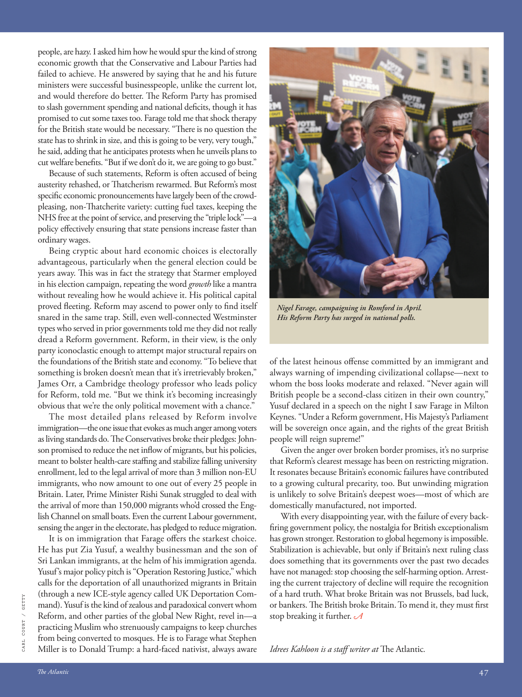

# The Atlantic — July 2026

## Page 49

---

people, are hazy. I asked him how he would spur the kind of strong economic growth that the Conservative and Labour Parties had failed to achieve. He answered by saying that he and his future ministers were successful businesspeople, unlike the current lot, and would therefore do better. The Reform Party has promised to slash government spending and national defi cits, though it has promised to cut some taxes too. Farage told me that shock therapy for the British state would be necessary. “There is no question the state has to shrink in size, and this is going to be very, very tough,” he said, adding that he anticipates protests when he unveils plans to cut welfare benefi ts. “But if we don’t do it, we are going to go bust.”

**【中文翻译】** 人，都是朦胧的。我问他将如何刺激保守党和工党未能实现的强劲经济增长。他回答说，他和他未来的部长们都是成功的商人，与现在的人不同，因此会做得更好。改革党承诺削减政府支出和国家赤字，但也承诺削减一些税收。法拉奇告诉我，英国政府有必要进行休克疗法。 “毫无疑问，国家必须缩小规模，这将非常非常艰难，”他说，并补充说，当他公布削减福利金的计划时，预计会引发抗议。 “但如果我们不这样做，我们就会破产。”

Because of such statements, Reform is often accused of being austerity rehashed, or Th atcherism rewarmed. But Reform’s most specifi c economic pronouncements have largely been of the crowdpleasing, non-Th atcherite variety: cutting fuel taxes, keeping the NHS free at the point of service, and preserving the “triple lock”— a policy eff ectively ensuring that state pensions increase faster than ordinary wages.

**【中文翻译】** 由于这样的言论，改革经常被指责为紧缩政策的重演，或者撒切尔主义的重新升温。但改革最具体的经济声明在很大程度上是取悦大众、非同寻常的：削减燃油税、保持国民医疗服务体系免费，以及保留“三重锁定”——一项有效确保国家养老金增长速度快于普通工资的政策。

Being cryptic about hard economic choices is electorally advantageous, particularly when the general election could be years away. This was in fact the strategy that Starmer employed in his election campaign, repeating the word growth like a mantra without revealing how he would achieve it. His political capital proved fl eeting. Reform may ascend to power only to find itself snared in the same trap. Still, even well-connected Westminster types who served in prior governments told me they did not really dread a Reform government. Reform, in their view, is the only party iconoclastic enough to attempt major structural repairs on the foundations of the British state and economy. “To believe that something is broken doesn’t mean that it’s irretrievably broken,” James Orr, a Cambridge theology professor who leads policy for Reform, told me. “But we think it’s becoming increasingly obvious that we’re the only political movement with a chance.”

**【中文翻译】** 对艰难的经济选择保持神秘对选举有利，尤其是在距离大选可能还有数年之遥的情况下。这实际上是斯塔默在竞选活动中采用的策略，他像咒语一样重复“增长”一词，但没有透露他将如何实现这一目标。事实证明，他的政治资本转瞬即逝。改革可能掌权后却发现自己陷入了同样的陷阱。尽管如此，即使是在前任政府任职、人脉广泛的威斯敏斯特人士也告诉我，他们并不真正害怕改革政府。在他们看来，改革党是唯一一个敢于对英国国家和经济基础进行重大结构性修复的反传统政党。 “相信某件事物被破坏了，并不意味着它已经无法挽回地破坏了，”领导改革政策的剑桥神学教授詹姆斯·奥尔告诉我。 “但我们认为，越来越明显的是，我们是唯一有机会的政治运动。”

The most detailed plans released by Reform involve immigration— the one issue that evokes as much anger among voters as living standards do. The Conservatives broke their pledges: Johnson promised to reduce the net inflow of migrants, but his policies, meant to bolster health-care staffi ng and stabilize falling university enrollment, led to the legal arrival of more than 3 million non-EU immigrants, who now amount to one out of every 25 people in Britain. Later, Prime Minister Rishi Sunak struggled to deal with the arrival of more than 150,000 migrants who’d crossed the English Channel on small boats. Even the current Labour government, sensing the anger in the electorate, has pledged to reduce migration.

**【中文翻译】** 改革派发布的最详细的计划涉及移民——这一问题与生活水平一样引起选民的愤怒。保守党违背了他们的承诺：约翰逊承诺减少移民净流入，但他的旨在加强医疗保健人员配置和稳定不断下降的大学入学率的政策导致了超过 300 万非欧盟移民合法抵达英国，目前这些移民占英国每 25 人中就有 1 人。后来，总理里希·苏纳克 (Rishi Sunak) 艰难地应对了超过 15 万乘坐小船穿越英吉利海峡的移民的到来。即使现任工党政府也感受到了选民的愤怒，也承诺减少移民。

It is on immigration that Farage offers the starkest choice. He has put Zia Yusuf, a wealthy businessman and the son of Sri Lankan immigrants, at the helm of his immigration agenda.

**【中文翻译】** 在移民问题上，法拉奇提供了最严峻的选择。他让斯里兰卡移民之子、富商齐亚·优素福 (Zia Yusuf) 掌管他的移民议程。

Yusuf’s major policy pitch is “Operation Restoring Justice,” which calls for the deportation of all unauthorized migrants in Britain (through a new ICE-style agency called UK Deportation Com-

**【中文翻译】** 优素福的主要政策主张是“恢复正义行动”，呼吁驱逐所有在英国未经授权的移民（通过一个名为英国驱逐委员会的新的 ICE 风格机构）。

*CARL COURT / GETTY*

*【图注与署名】卡尔·考特/盖蒂图片社*

mand). Yusuf is the kind of zealous and paradoxical convert whom Reform, and other parties of the global New Right, revel in—a practicing Muslim who strenuously campaigns to keep churches from being converted to mosques. He is to Farage what Stephen Miller is to Donald Trump: a hard-faced nativist, always aware Nigel Farage, campaigning in Romford in April.

**【中文翻译】** 要求）。优素福是一位热心而矛盾的皈依者，改革派和全球新右派的其他政党都对他很感兴趣——他是一位虔诚的穆斯林，竭尽全力阻止教堂转变为清真寺。他之于法拉奇就像斯蒂芬·米勒之于唐纳德·特朗普：一位冷酷的本土主义者，始终了解奈杰尔·法拉奇，四月份在罗姆福德竞选。

His Reform Party has surged in national polls. of the latest heinous off ense committed by an immigrant and always warning of impending civilizational collapse—next to whom the boss looks moderate and relaxed. “Never again will British people be a second-class citizen in their own country,” Yusuf declared in a speech on the night I saw Farage in Milton Keynes. “Under a Reform government, His Majesty’s Parliament will be sovereign once again, and the rights of the great British people will reign supreme!”

**【中文翻译】** 他领导的改革党在全国民意调查中的支持率飙升。讲述了移民最近犯下的令人发指的罪行，并总是警告文明即将崩溃——在他旁边的老板看起来温和而轻松。 “英国人民再也不会成为自己国家的二等公民，”我在米尔顿凯恩斯见到法拉奇的那天晚上，优素福在一次演讲中宣称。 “在改革政府的领导下，国王陛下的议会将再次拥有主权，伟大的英国人民的权利将至高无上！”

Given the anger over broken border promises, it’s no surprise that Reform’s clearest message has been on restricting migration. It resonates because Britain’s economic failures have contributed to a growing cultural precarity, too. But unwinding migration is unlikely to solve Britain’s deepest woes—most of which are domestically manufactured, not imported.

**【中文翻译】** 鉴于人们对违反边境承诺的愤怒，改革最明确的信息是限制移民也就不足为奇了。它引起共鸣是因为英国的经济失败也加剧了文化上的不稳定。但放松移民不太可能解决英国最深的问题——其中大部分是国内制造的，而不是进口的。

With every disappointing year, with the failure of every backfi ring government policy, the nostalgia for British exceptionalism has grown stronger. Restoration to global hegemony is impossible.

**【中文翻译】** 每过一年都是令人失望的一年，随着每一项适得其反的政府政策的失败，人们对英国例外论的怀念变得越来越强烈。恢复全球霸权是不可能的。

Stabilization is achievable, but only if Britain’s next ruling class does something that its governments over the past two decades have not managed: stop choosing the self-harming option. Arresting the current trajectory of decline will require the recognition of a hard truth. What broke Britain was not Brussels, bad luck, or bankers. The British broke Britain. To mend it, they must first stop breaking it further. Idrees Kahloon is a staff writer at The Atlantic .

**【中文翻译】** 稳定是可以实现的，但前提是英国的下一个统治阶级能做一些其政府在过去二十年里没有做到的事情：停止选择自残的选择。要阻止当前的衰退轨迹，需要认识到一个残酷的事实。令英国崩溃的不是布鲁塞尔、厄运或银行家。英国人打破了英国。要修复它，他们必须首先停止进一步破坏它。 Idrees Kahloon 是《大西洋月刊》的特约撰稿人。
