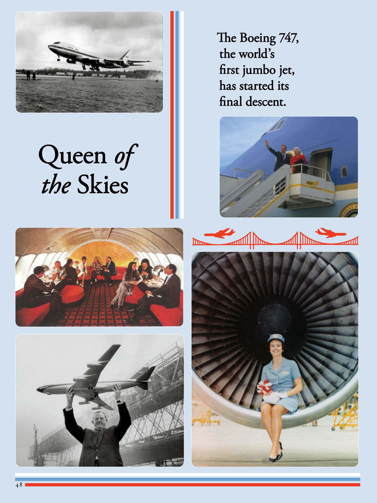

# The Atlantic — July 2026

## Page 50

---

### Queen of of

**【标题翻译】** 的女王

### Queen

**【标题翻译】** 女王

### the

**【标题翻译】** 这

### the Skies

**【标题翻译】** 天空

### Skies

**【标题翻译】** 天空

### The Boeing 747,

**【标题翻译】** 波音 747、

### The Boeing 747,

**【标题翻译】** 波音 747、

### the world’s

**【标题翻译】** 世界上的

### the world’s

**【标题翻译】** 世界上的

### first jumbo jet,

**【标题翻译】** 第一架大型喷气式飞机，

### first jumbo jet,

**【标题翻译】** 第一架大型喷气式飞机，

### has started its

**【标题翻译】** 已经开始其

### has started its

**【标题翻译】** 已经开始其

### final descent.

**【标题翻译】** 最后下降。

### final descent.

**【标题翻译】** 最后下降。
