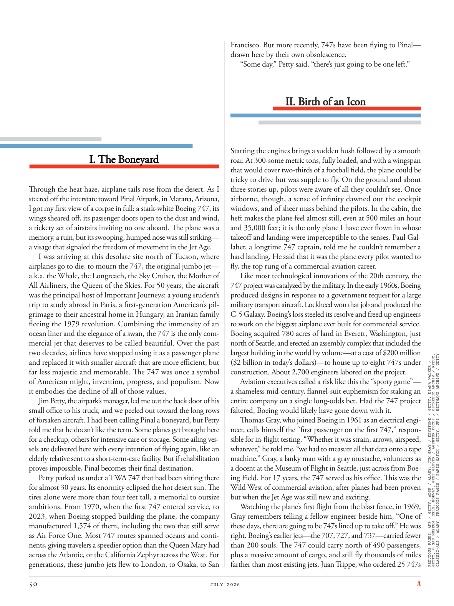

# The Atlantic — July 2026

## Page 52

---

#### I. The Boneyard

**【副标题翻译】** 一、墓地

#### I. The Boneyard

**【副标题翻译】** 一、墓地

Through the heat haze, airplane tails rose from the desert. As I steered off the interstate toward Pinal Airpark, in Marana, Arizona, I got my first view of a corpse in full: a stark-white Boeing 747, its wings sheared off, its passenger doors open to the dust and wind, a rickety set of airstairs inviting no one aboard. The plane was a memory, a ruin, but its swooping, humped nose was still striking— a visage that signaled the freedom of movement in the Jet Age.

**【中文翻译】** 透过热雾，飞机尾翼从沙漠中升起。当我驶离州际公路前往亚利桑那州马拉纳的皮纳尔机场时，我第一次看到了一具完整的尸体：一架纯白色的波音 747，机翼被剪断，乘客舱门在灰尘和风中敞开，摇摇欲坠的登机梯不允许任何人登机。这架飞机已成为记忆，一片废墟，但它的俯冲、隆起的机头仍然引人注目——这一面貌标志着喷气机时代的行动自由。

I was arriving at this desolate site north of Tucson, where airplanes go to die, to mourn the 747, the original jumbo jet— a.k.a. the Whale, the Longreach, the Sky Cruiser, the Mother of All Airliners, the Queen of the Skies. For 50 years, the aircraft was the principal host of Important Journeys: a young student’s trip to study abroad in Paris, a firstgeneration American’s pilgrimage to their ancestral home in Hungary, an Iranian family fleeing the 1979 revolution. Combining the immensity of an ocean liner and the elegance of a swan, the 747 is the only commercial jet that deserves to be called beautiful. Over the past two decades, airlines have stopped using it as a passenger plane and replaced it with smaller aircraft that are more efficient, but far less majestic and memorable. The 747 was once a symbol of American might, invention, progress, and populism. Now it embodies the decline of all of those values.

**【中文翻译】** 我到达图森北部这个荒凉的地方，飞机在那里消亡，悼念最初的大型喷气式飞机 747——又名“鲸鱼”、“朗里奇”、“天空巡洋舰”、“所有客机之母”、“天空女王”。 50 年来，这架飞机一直是重要旅程的主要承载者：一名年轻学生的巴黎留学之旅、第一代美国人前往匈牙利的祖籍朝圣之旅、一个逃离 1979 年革命的伊朗家庭。 747 结合了远洋客轮的浩瀚与天鹅的优雅，是唯一一款称得上美丽的商用飞机。在过去的二十年里，航空公司已经停止将其用作客机，取而代之的是更高效的小型飞机，但远没有那么雄伟和令人难忘。 747 曾经是美国实力、发明、进步和民粹主义的象征。现在它体现了所有这些价值观的衰落。

Jim Petty, the airpark’s manager, led me out the back door of his small office to his truck, and we peeled out toward the long rows of forsaken aircraft. I had been calling Pinal a boneyard, but Petty told me that he doesn’t like the term. Some planes get brought here for a checkup, others for intensive care or storage. Some ailing vessels are delivered here with every intention of flying again, like an elderly relative sent to a short-term-care facility. But if rehabilitation proves impossible, Pinal becomes their final destination.

**【中文翻译】** 机场经理吉姆·佩蒂（Jim Petty）带我从他小办公室的后门走向他的卡车，然后我们驶向一长排被遗弃的飞机。我一直称皮纳尔为墓地，但佩蒂告诉我他不喜欢这个词。一些飞机被带到这里进行检查，另一些则进行重症监护或存放。一些生病的船只被运送到这里，一心想再次飞行，就像一位年迈的亲戚被送往短期护理机构一样。但如果康复被证明是不可能的，皮纳尔就会成为他们的最终目的地。

Petty parked us under a TWA 747 that had been sitting there for almost 30 years. Its enormity eclipsed the hot desert sun. The tires alone were more than four feet tall, a memorial to outsize ambitions. From 1970, when the first 747 entered service, to 2023, when Boeing stopped building the plane, the company manufactured 1,574 of them, including the two that still serve as Air Force One. Most 747 routes spanned oceans and continents, giving travelers a speedier option than the Queen Mary had across the Atlantic, or the California Zephyr across the West. For generations, these jumbo jets flew to London, to Osaka, to San Francisco. But more recently, 747s have been flying to Pinal— drawn here by their own obsolescence.

**【中文翻译】** 佩蒂把我们停在一架环球航空 747 下，这架飞机已经停在那里近 30 年了。它的巨大让沙漠的炎热阳光黯然失色。仅轮胎就有四英尺多高，这是对宏伟抱负的纪念。从 1970 年第一架 747 投入使用，到 2023 年波音停止制造该飞机，该公司共生产了 1,574 架，其中包括仍作为空军一号使用的两架。大多数 747 航线跨越海洋和大陆，为旅客提供了比玛丽皇后号横渡大西洋或加州和风号横渡西部更快捷的选择。几代人以来，这些大型喷气式飞机飞往伦敦、大阪、旧金山。但最近，747 飞机开始飞往皮纳尔——因为它们本身已经过时了。

“Some day,” Petty said, “there’s just going to be one left.”

**【中文翻译】** “总有一天，”佩蒂说，“就会只剩下一个了。”

#### II. Birth of an Icon

**【副标题翻译】** 二.偶像的诞生

#### II. Birth of an Icon

**【副标题翻译】** 二.偶像的诞生

Starting the engines brings a sudden hush followed by a smooth roar. At 300-some metric tons, fully loaded, and with a wingspan that would cover two-thirds of a football field, the plane could be tricky to drive but was supple to fly. On the ground and about three stories up, pilots were aware of all they couldn’t see. Once airborne, though, a sense of infinity dawned out the cockpit windows, and of sheer mass behind the pilots. In the cabin, the heft makes the plane feel almost still, even at 500 miles an hour and 35,000 feet; it is the only plane I have ever flown in whose takeoff and landing were imperceptible to the senses. Paul Gallaher, a longtime 747 captain, told me he couldn’t remember a hard landing. He said that it was the plane every pilot wanted to fly, the top rung of a commercial-aviation career.

**【中文翻译】** 启动发动机会带来突然的安静，然后是平稳的轰鸣声。这架飞机重达 300 多吨，满载时翼展可覆盖三分之二的足球场，驾驶起来可能很困难，但飞行起来却很灵活。在地面和大约三层楼高的地方，飞行员知道他们看不到的一切。然而，一旦升空，驾驶舱的窗户里就会出现一种无限的感觉，飞行员身后也有一种巨大的感觉。在机舱内，飞机的重量使人感觉几乎是静止的，即使是在时速 500 英里、高度为 35,000 英尺的情况下也是如此。这是我驾驶过的唯一一架起飞和降落时感官无法察觉的飞机。长期担任 747 机长的保罗·加拉赫 (Paul Gallaher) 告诉我，他不记得有过硬着陆。他说，这是每个飞行员都想驾驶的飞机，是商业航空职业生涯的顶峰。

Like most technological innovations of the 20th century, the 747 project was catalyzed by the military. In the early 1960s, Boeing produced designs in response to a government request for a large military transport aircraft. Lockheed won that job and produced the C-5 Galaxy. Boeing’s loss steeled its resolve and freed up engineers to work on the biggest airplane ever built for commercial service.

**【中文翻译】** 与 20 世纪大多数技术创新一样，747 项目也是由军方推动的。 20 世纪 60 年代初，波音公司响应政府对大型军用运输机的要求进行了设计。洛克希德公司赢得了这项工作并生产了 C-5 Galaxy。波音公司的损失坚定了其决心，并让工程师们有时间去研发有史以来最大的商业飞机。

Boeing acquired 780 acres of land in Everett, Washington, just north of Seattle, and erected an assembly complex that included the largest building in the world by volume— at a cost of $200 million ($2 billion in today’s dollars)— to house up to eight 747s under construction. About 2,700 engineers labored on the project.

**【中文翻译】** 波音公司在西雅图北部的华盛顿州埃弗里特购买了 780 英亩的土地，并建造了一座装配大楼，其中包括世界上体积最大的建筑，耗资 2 亿美元（相当于今天的 20 亿美元），可容纳最多 8 架在建的 747 飞机。大约 2,700 名工程师参与了该项目。

Aviation executives called a risk like this the “sporty game”— a shameless mid-century, flannel-suit euphemism for staking an entire company on a single long-odds bet. Had the 747 project faltered, Boeing would likely have gone down with it.

**【中文翻译】** 航空业高管将这样的风险称为“运动游戏”——这是一种无耻的中世纪法兰绒西装委婉说法，指的是把整个公司押在一次高赔率的赌注上。如果 747 项目陷入困境，波音公司很可能也会随之失败。

Thomas Gray, who joined Boeing in 1961 as an electrical engineer, calls himself the “first passenger on the first 747,” responsible for in-flight testing. “Whether it was strain, arrows, airspeed, whatever,” he told me, “we had to measure all that data onto a tape machine.” Gray, a lanky man with a gray mustache, volunteers as a docent at the Museum of Flight in Seattle, just across from Boeing Field. For 17 years, the 747 served as his office. This was the Wild West of commercial aviation, after planes had been proven but when the Jet Age was still new and exciting.

**【中文翻译】** 托马斯·格雷 (Thomas Gray) 于 1961 年加入波音公司担任电气工程师，他称自己是“第一架 747 上的第一位乘客”，负责飞行中的测试。 “无论是应变、箭头、空速还是其他什么，”他告诉我，“我们必须在磁带机上测量所有这些数据。”格雷是一位身材瘦长、留着灰色小胡子的男子，他在西雅图波音机场对面的飞行博物馆当志愿者担任讲解员。 17 年来，747 一直是他的办公室。这是商业航空的狂野西部，当时飞机已经得到验证，但喷气机时代仍然是新鲜而令人兴奋的。

Watching the plane’s first flight from the blast fence, in 1969, Gray remembers telling a fellow engineer beside him, “One of these days, there are going to be 747s lined up to take off.” He was right. Boeing’s earlier jets— the 707, 727, and 737— carried fewer than 200 souls. The 747 could carry north of 490 passengers, plus a massive amount of cargo, and still fly thousands of miles farther than most existing jets. Juan Trippe, who ordered 25 747s

**【中文翻译】** 1969 年，格雷在观看飞机从防爆围栏首次飞行时，对他旁边的一位工程师同事说：“有一天，将会有 747 飞机排队等待起飞。”他是对的。波音公司早期的喷气式飞机——707、727 和 737——载客量不到 200 人。 747 可以运载 490 名乘客以及大量货物，并且仍然比大多数现有喷气式飞机飞行数千英里。胡安·特里普 (Juan Trippe)，订购了 25 747 架

*GETTY; © SAS MUSEUM, OSLO, NORWAY; GENE GLOVER / AGENTUR FOCUS / OSTKREUZ ARCHIV / REDUX;*

*【图注与署名】盖蒂图片社； © SAS 博物馆，挪威奥斯陆； GENE GLOVER / AGENTUR FOCUS / OSTKREUZ ARCHIV / REDUX；*

*CLASSIC-ADS / ALAMY; FRANCOIS PAGES / PARIS MATCH / GETTY; UPI / BETTMANN ARCHIVE / GETTY*

*【图注与署名】经典-ADS / ALAMY；弗朗索瓦·佩吉斯/巴黎比赛/盖蒂图片社； UPI / 贝特曼档案 / 盖蒂图片社*

*PREVIOUS PAGES: AFP / GETTY; ADSR / ALAMY; JIM GRAY / KEYSTONE / GETTY; DIANA WALKER /*

*【图注与署名】上一页：法新社/盖蒂图片社； ADSR/阿拉米；吉姆·格雷 / KEYSTONE / GETTY；戴安娜·沃克 /*
