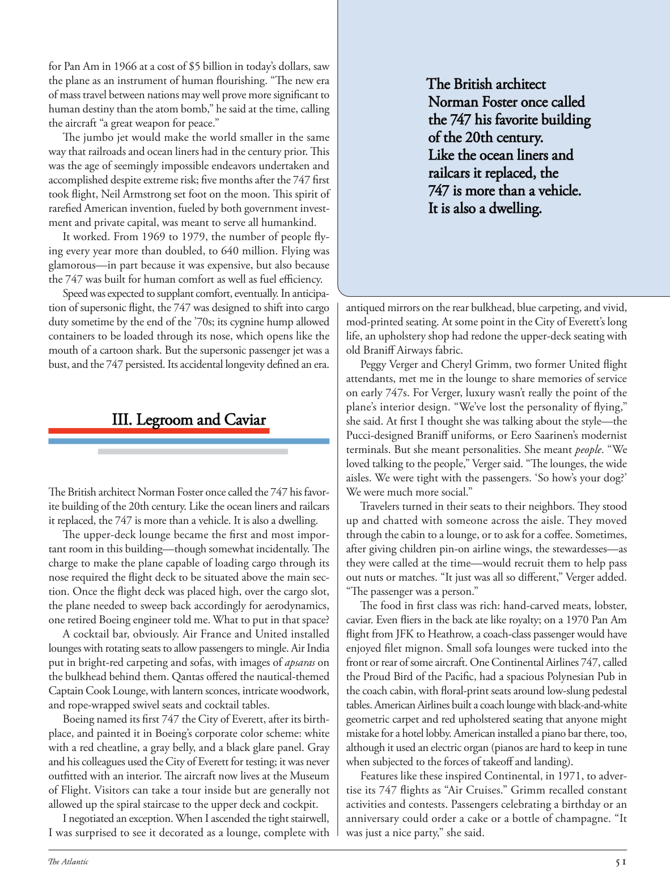

# The Atlantic — July 2026

## Page 53

---

for Pan Am in 1966 at a cost of $5 billion in today’s dollars, saw the plane as an instrument of human flourishing. “The new era of mass travel between nations may well prove more significant to human destiny than the atom bomb,” he said at the time, calling the aircraft “a great weapon for peace.”

**【中文翻译】** 1966 年，泛美航空斥资 50 亿美元（以今天的美元计算）将飞机视为人类繁荣的工具。他当时表示：“国家间大规模旅行的新时代很可能比原子弹对人类命运更重要。”他称这架飞机是“和平的伟大武器”。

The jumbo jet would make the world smaller in the same way that railroads and ocean liners had in the century prior. This was the age of seemingly impossible endeavors undertaken and accomplished despite extreme risk; five months after the 747 first took flight, Neil Armstrong set foot on the moon. This spirit of rarefied American invention, fueled by both government investment and private capital, was meant to serve all humankind.

**【中文翻译】** 大型喷气式飞机将使世界变得更小，就像上个世纪的铁路和远洋客轮一样。在这个时代，人们尽管冒着极大的风险，仍要完成看似不可能的任务。 747 首飞五个月后，尼尔·阿姆斯特朗踏上了月球。这种由政府投资和私人资本共同推动的美国发明精神旨在为全人类服务。

It worked. From 1969 to 1979, the number of people flying every year more than doubled, to 640 million. Flying was glamorous— in part because it was expensive, but also because the 747 was built for human comfort as well as fuel efficiency.

**【中文翻译】** 它起作用了。从 1969 年到 1979 年，乘坐飞机的人数每年都增加一倍以上，达到 6.4 亿人次。飞行是令人着迷的——部分原因是它价格昂贵，但也因为 747 是为了人类舒适度和燃油效率而设计的。

Speed was expected to supplant comfort, eventually. In anticipation of super sonic flight, the 747 was designed to shift into cargo duty sometime by the end of the ’70s; its cygnine hump allowed containers to be loaded through its nose, which opens like the mouth of a cartoon shark. But the super sonic passenger jet was a bust, and the 747 persisted. Its accidental longevity defined an era.

**【中文翻译】** 预计速度最终会取代舒适度。为了实现超音速飞行，747 被设计为在 70 年代末的某个时候转入货运任务；它的天鹅驼峰允许通过它的鼻子装载容器，它的鼻子像卡通鲨鱼的嘴一样张开。但超音速客机却以失败告终，而 747 却坚持了下来。它的意外长寿定义了一个时代。

#### III. Legroom and Caviar

**【副标题翻译】** 三．腿部空间和鱼子酱

#### III. Legroom and Caviar

**【副标题翻译】** 三．腿部空间和鱼子酱

The British architect Norman Foster once called the 747 his favorite building of the 20th century. Like the ocean liners and railcars it replaced, the 747 is more than a vehicle. It is also a dwelling.

**【中文翻译】** 英国建筑师诺曼·福斯特 (Norman Foster) 曾称 747 为他最喜欢的 20 世纪建筑。与它所取代的远洋客轮和轨道车一样，747 不仅仅是一种交通工具。它也是一个住宅。

The upper-deck lounge became the first and most important room in this building— though somewhat incidentally. The charge to make the plane capable of loading cargo through its nose required the flight deck to be situated above the main section. Once the flight deck was placed high, over the cargo slot, the plane needed to sweep back accordingly for aerodynamics, one retired Boeing engineer told me. What to put in that space?

**【中文翻译】** 上层甲板的休息室成为这座建筑中第一个也是最重要的房间——尽管有些偶然。为了使飞机能够通过机头装载货物，飞行甲板必须位于主舱上方。一位退休的波音工程师告诉我，一旦驾驶舱被放置在货舱上方的高处，飞机就需要相应地后掠以适应空气动力学。那个空间要放什么？

A cocktail bar, obviously. Air France and United installed lounges with rotating seats to allow passengers to mingle. Air India put in bright-red carpeting and sofas, with images of apsaras on the bulkhead behind them. Qantas offered the nautical-themed Captain Cook Lounge, with lantern sconces, intricate woodwork, and rope-wrapped swivel seats and cocktail tables.

**【中文翻译】** 显然是鸡尾酒吧。法航和美联航安装了带有旋转座椅的休息室，以便乘客相互交流。印度航空铺设了鲜红色的地毯和沙发，后面的舱壁上挂着飞天的图像。澳洲航空提供航海主题的库克船长休息室，配有灯笼烛台、精致的木制品、绳索缠绕的旋转座椅和鸡尾酒桌。

Boeing named its first 747 the City of Everett, after its birthplace, and painted it in Boeing’s corporate color scheme: white with a red cheatline, a gray belly, and a black glare panel. Gray and his colleagues used the City of Everett for testing; it was never outfitted with an interior. The aircraft now lives at the Museum of Flight. Visitors can take a tour inside but are generally not allowed up the spiral staircase to the upper deck and cockpit.

**【中文翻译】** 波音公司将其第一架 747 以其诞生地命名为埃弗雷特市，并采用波音公司的企业配色方案进行涂装：白色带有红色线条、灰色机腹和黑色眩光面板。格雷和他的同事使用埃弗雷特市进行测试；它从未配备过内饰。这架飞机现在存放在飞行博物馆。游客可以参观内部，但一般不允许通过螺旋楼梯到达上层甲板和驾驶舱。

I negotiated an exception. When I ascended the tight stairwell, I was surprised to see it decorated as a lounge, complete with

**【中文翻译】** 我协商了一个例外。当我登上狭窄的楼梯间时，我惊讶地发现它被装饰成一个休息室，配有

#### The British architect

**【副标题翻译】** 英国建筑师

#### The British architect

**【副标题翻译】** 英国建筑师

#### Norman Foster once called

**【副标题翻译】** 诺曼·福斯特曾经打电话给

#### Norman Foster once called

**【副标题翻译】** 诺曼·福斯特曾经打电话给

#### the 747 his favorite building

**【副标题翻译】** 747 他最喜欢的建筑

#### the 747 his favorite building

**【副标题翻译】** 747 他最喜欢的建筑

#### of the 20th century.

**【副标题翻译】** 20世纪。

#### of the 20th century.

**【副标题翻译】** 20世纪。

#### Like the ocean liners and

**【副标题翻译】** 就像远洋客轮和

#### Like the ocean liners and

**【副标题翻译】** 就像远洋客轮和

#### railcars it replaced, the

**【副标题翻译】** 它所取代的有轨电车，

#### railcars it replaced, the

**【副标题翻译】** 它所取代的有轨电车，

#### 747 is more than a vehicle.

**【副标题翻译】** 747 不仅仅是一辆汽车。

#### 747 is more than a vehicle.

**【副标题翻译】** 747 不仅仅是一辆汽车。

#### It is also a dwelling.

**【副标题翻译】** 它也是一个住宅。

#### It is also a dwelling.

**【副标题翻译】** 它也是一个住宅。

antiqued mirrors on the rear bulkhead, blue carpeting, and vivid, mod-printed seating. At some point in the City of Everett’s long life, an upholstery shop had redone the upper-deck seating with old Braniff Airways fabric.

**【中文翻译】** 后舱壁上的古董镜子、蓝色地毯以及生动的现代印花座椅。在埃弗里特市漫长历史的某个时刻，一家室内装潢店用旧的布兰尼夫航空公司面料重新设计了上层甲板的座椅。

Peggy Verger and Cheryl Grimm, two former United flight attendants, met me in the lounge to share memories of service on early 747s. For Verger, luxury wasn’t really the point of the plane’s interior design. “We’ve lost the personality of flying,” she said. At first I thought she was talking about the style— the Pucci-designed Braniff uniforms, or Eero Saarinen’s modernist terminals. But she meant personalities. She meant people . “We loved talking to the people,” Verger said. “The lounges, the wide aisles. We were tight with the passengers. ‘So how’s your dog?’ We were much more social.”

**【中文翻译】** 两位前美联航空乘人员 Peggy Verger 和 Cheryl Grimm 在休息室与我会面，分享了早期 747 航班的服务回忆。对于韦尔格来说，豪华并不是飞机内部设计的真正重点。 “我们已经失去了飞行的个性，”她说。起初我以为她在谈论风格——Pucci 设计的 Braniff 制服，或者 Eero Saarinen 的现代主义终端。但她指的是个性。她指的是人。 “我们喜欢与人们交谈，”韦尔格说。 “休息室、宽阔的过道。我们与乘客关系密切。‘那么你的狗怎么样了？’我们更加社交。”

Travelers turned in their seats to their neighbors. They stood up and chatted with someone across the aisle. They moved through the cabin to a lounge, or to ask for a coffee. Sometimes, after giving children pin-on airline wings, the stewardesses— as they were called at the time— would recruit them to help pass out nuts or matches. “It just was all so different,” Verger added.

**【中文翻译】** 旅客们把座位让给了邻居。他们站起来和过道对面的一个人聊天。他们穿过机舱来到休息室，或者要一杯咖啡。有时，在给孩子们戴上飞机机翼后，空姐（当时对她们的称呼）会招募他们帮忙分发坚果或火柴。 “一切都如此不同，”韦尔格补充道。

“The passenger was a person.” The food in first class was rich: hand-carved meats, lobster, caviar. Even fliers in the back ate like royalty; on a 1970 Pan Am flight from JFK to Heathrow, a coach-class passenger would have enjoyed filet mignon. Small sofa lounges were tucked into the front or rear of some aircraft. One Continental Airlines 747, called the Proud Bird of the Pacific, had a spacious Polynesian Pub in the coach cabin, with floral-print seats around low-slung pedestal tables. American Airlines built a coach lounge with black-and-white geometric carpet and red upholstered seating that anyone might mistake for a hotel lobby. American installed a piano bar there, too, although it used an electric organ (pianos are hard to keep in tune when subjected to the forces of takeoff and landing).

**【中文翻译】** “这名乘客是一个人。”头等舱的食物很丰富：手工切肉、龙虾、鱼子酱。就连后座的乘客也吃得像皇室成员一样。在 1970 年从肯尼迪机场飞往希思罗机场的泛美航空航班上，经济舱乘客会享用菲力牛排。一些飞机的前部或后部设有小型沙发休息室。美国大陆航空公司的一架 747 客机被称为“太平洋上的骄傲之鸟”，客舱内设有一间宽敞的波利尼西亚酒吧，矮桌周围设有花卉图案的座椅。美国航空建造了一个长途客休息室，配有黑白几何地毯和红色软垫座椅，任何人都可能会误认为是酒店大堂。美国航空也在那里安装了一个钢琴酒吧，尽管它使用的是电子琴（钢琴在受到起飞和着陆的力量时很难保持音调）。

Features like these inspired Continental, in 1971, to advertise its 747 flights as “Air Cruises.” Grimm recalled constant activities and contests. Passengers celebrating a birthday or an anniversary could order a cake or a bottle of champagne. “It was just a nice party,” she said.

**【中文翻译】** 受这些特点的启发，大陆航空于 1971 年将其 747 航班宣传为“空中邮轮”。格林回忆起不断的活动和竞赛。庆祝生日或周年纪念日的乘客可以订购蛋糕或一瓶香槟。 “这只是一个愉快的聚会，”她说。
