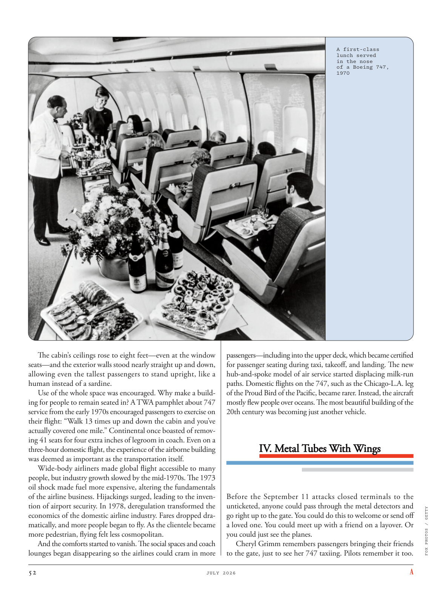

# The Atlantic — July 2026

## Page 54

---

The cabin’s ceilings rose to eight feet— even at the window seats— and the exterior walls stood nearly straight up and down, allowing even the tallest passengers to stand upright, like a human instead of a sardine.

**【中文翻译】** 机舱的天花板高达八英尺（即使是靠窗的座位），外墙几乎笔直地上下直立，即使是最高的乘客也能直立，就像人而不是沙丁鱼一样。

Use of the whole space was encouraged. Why make a building for people to remain seated in? A TWA pamphlet about 747 service from the early 1970s encouraged passengers to exercise on their flight: “Walk 13 times up and down the cabin and you’ve actually covered one mile.” Continental once boasted of removing 41 seats for four extra inches of legroom in coach. Even on a three-hour domestic flight, the experience of the airborne building was deemed as important as the transportation itself.

**【中文翻译】** 鼓励使用整个空间。为什么要建造一座供人们休息的建筑物？环球航空公司关于 747 航班的 1970 年代初期小册子鼓励乘客在飞机上锻炼身体：“在机舱里来回走 13 次，实际上已经走了一英里。”美国大陆航空曾经夸口说，他们在经济舱中取消了 41 个座位，以增加 4 英寸的腿部空间。即使是在三个小时的国内航班上，空中建筑的体验也被认为与交通本身一样重要。

Wide-body airliners made global flight accessible to many people, but industry growth slowed by the mid-1970s. The 1973 oil shock made fuel more expensive, altering the fundamentals of the airline business. Hijackings surged, leading to the invention of airport security. In 1978, deregulation transformed the economics of the domestic airline industry. Fares dropped dramatically, and more people began to fly. As the clientele became more pedestrian, flying felt less cosmopolitan.

**【中文翻译】** 宽体客机使许多人可以乘坐全球航班，但行业增长在 20 世纪 70 年代中期放缓。 1973 年的石油危机导致燃油价格上涨，改变了航空业的基本面。劫机事件激增，导致了机场安全的发明。 1978 年，放松管制改变了国内航空业的经济状况。票价大幅下降，更多的人开始乘坐飞机。随着顾客变得越来越平淡，飞行感觉不再那么国际化了。

And the comforts started to vanish. The social spaces and coach lounges began disappearing so the airlines could cram in more passengers— including into the upper deck, which became certified for passenger seating during taxi, takeoff, and landing. The new hub-and-spoke model of air service started displacing milk-run paths. Domestic flights on the 747, such as the ChicagoL.A. leg of the Proud Bird of the Pacific, became rarer. Instead, the aircraft mostly flew people over oceans. The most beautiful building of the 20th century was becoming just another vehicle.

**【中文翻译】** 舒适开始消失。社交空间和经济舱休息室开始消失，这样航空公司就可以容纳更多的乘客——包括上层甲板，在出租车、起飞和着陆期间，上层甲板上的乘客座位已获得认证。新的轴辐式航空服务模式开始取代牛奶航线。乘坐 747 的国内航班，例如 ChicagoL.A.太平洋骄傲之鸟的腿变得越来越稀有。相反，飞机主要载人飞越海洋。 20 世纪最美丽的建筑正在变成另一辆车。

#### IV. Metal Tubes With Wings

**【副标题翻译】** 四．带翅膀的金属管

#### IV. Metal Tubes With Wings

**【副标题翻译】** 四．带翅膀的金属管

Before the September 11 attacks closed terminals to the un ticketed, anyone could pass through the metal detectors and go right up to the gate. You could do this to welcome or send off a loved one. You could meet up with a friend on a layover. Or you could just see the planes.

**【中文翻译】** 在 9 月 11 日的袭击事件之前，航站楼对未出票的人关闭了，任何人都可以通过金属探测器并直接走到登机口。您可以这样做来欢迎或送别您所爱的人。您可以在中途停留时与朋友见面。或者你可以只看飞机。

Cheryl Grimm remembers passengers bringing their friends to the gate, just to see her 747 taxiing. Pilots remember it too. A first-class lunch served in the nose of a Boeing 747, 1970

**【中文翻译】** 谢丽尔·格里姆 (Cheryl Grimm) 记得，乘客们带着朋友来到登机口，只是为了看她的 747 滑行。飞行员也记得这一点。波音 747 机头供应的头等舱午餐，1970 年

*FOX PHOTOS / GETTY*

*【图注与署名】福克斯照片/盖蒂图片社*
