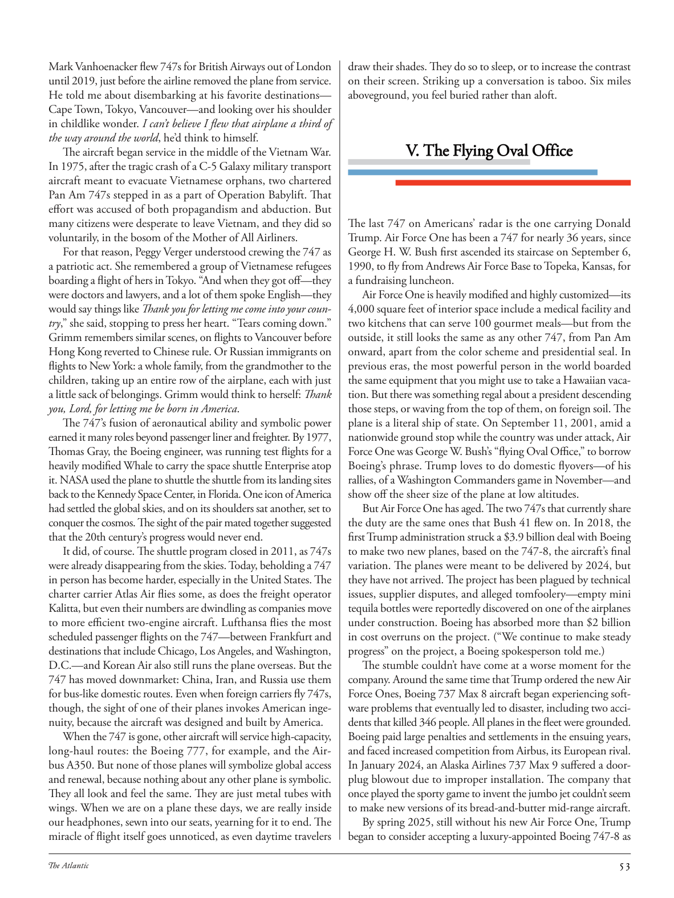

# The Atlantic — July 2026

## Page 55

---

Mark Vanhoenacker flew 747s for British Airways out of London until 2019, just before the airline removed the plane from service. He told me about disembarking at his favorite destinations— Cape Town, Tokyo, Vancouver— and looking over his shoulder in childlike wonder. I can’t believe I flew that airplane a third of the way around the world , he’d think to himself.

**【中文翻译】** 马克·范霍纳克 (Mark Vanhoenacker) 一直为英国航空 (British Airways) 驾驶 747 飞机从伦敦出发，直至 2019 年，随后该航空公司将这架飞机停飞。他告诉我，他在他最喜欢的目的地——开普敦、东京、温哥华——下船后，带着孩子般的惊奇回头望去。我不敢相信我驾驶这架飞机绕地球飞行了三分之一，他心里想。

The aircraft began service in the middle of the Vietnam War. In 1975, after the tragic crash of a C‑5 Galaxy military transport aircraft meant to evacuate Vietnamese orphans, two chartered Pan Am 747s stepped in as a part of Operation Baby lift. That effort was accused of both propagandism and abduction. But many citizens were desperate to leave Vietnam, and they did so voluntarily, in the bosom of the Mother of All Airliners.

**【中文翻译】** 该飞机于越南战争中期开始服役。 1975 年，一架旨在疏散越南孤儿的 C-5 Galaxy 军用运输机发生悲惨事故后，两架泛美包机 747 飞机介入，作为“婴儿升降机行动”的一部分。这一努力被指责为宣传和绑架。但许多公民迫切希望离开越南，而且他们是在“所有航空公司之母”的怀抱中自愿离开的。

For that reason, Peggy Verger understood crewing the 747 as a patriotic act. She remembered a group of Vietnamese refugees boarding a flight of hers in Tokyo. “And when they got off—they were doctors and lawyers, and a lot of them spoke English—they would say things like Thank you for letting me come into your country ,” she said, stopping to press her heart. “Tears coming down.”

**【中文翻译】** 出于这个原因，佩吉·韦尔格 (Peggy Verger) 将在 747 上担任机组人员视为一种爱国行为。她记得一群越南难民在东京登上她的航班。 “当他们下车时——他们是医生和律师，其中很多人会说英语——他们会说‘谢谢你让我来到你们的国家’之类的话，”她说，停下来按压她的心。 “眼泪都下来了。”

Grimm remembers similar scenes, on flights to Vancouver before Hong Kong reverted to Chinese rule. Or Russian immigrants on flights to New York: a whole family, from the grandmother to the children, taking up an entire row of the airplane, each with just a little sack of belongings. Grimm would think to herself: Thank you, Lord, for letting me be born in America .

**【中文翻译】** 格林记得类似的场景，发生在香港回归中国统治之前飞往温哥华的航班上。或者飞往纽约的航班上的俄罗斯移民：一家人，从祖母到孩子，占据了飞机的一整排，每个人只带着一小袋随身物品。格林心里会想：谢谢主啊，让我出生在美国。

The 747’s fusion of aeronautical ability and symbolic power earned it many roles beyond passenger liner and freighter. By 1977, Thomas Gray, the Boeing engineer, was running test flights for a heavily modified Whale to carry the space shuttle Enterprise atop it. NASA used the plane to shuttle the shuttle from its landing sites back to the Kennedy Space Center, in Florida. One icon of America had settled the global skies, and on its shoulders sat another, set to conquer the cosmos. The sight of the pair mated together suggested that the 20th century’s progress would never end.

**【中文翻译】** 747 融合了航空能力和象征力量，使其在客机和货机之外发挥了多种作用。 1977 年，波音公司工程师托马斯·格雷 (Thomas Gray) 正在对一架经过大幅改装的鲸鱼号进行试飞，以搭载企业号航天飞机。美国宇航局使用这架飞机将航天飞机从着陆点送回佛罗里达州的肯尼迪航天中心。美国的一位偶像已经征服了全球天空，而它的肩上又站着另一位偶像，准备征服宇宙。两人交配的景象表明，20 世纪的进步永远不会结束。

It did, of course. The shuttle program closed in 2011, as 747s were already disappearing from the skies. Today, beholding a 747 in person has become harder, especially in the United States. The charter carrier Atlas Air flies some, as does the freight operator Kalitta, but even their numbers are dwindling as companies move to more efficient two‑engine aircraft. Lufthansa flies the most scheduled passenger flights on the 747—between Frankfurt and destinations that include Chicago, Los Angeles, and Washington, D.C.—and Korean Air also still runs the plane overseas. But the 747 has moved down market: China, Iran, and Russia use them for bus‑like domestic routes. Even when foreign carriers fly 747s, though, the sight of one of their planes invokes American inge‑ nuity, because the aircraft was designed and built by America.

**【中文翻译】** 当然，确实如此。由于 747 飞机已经从天空中消失，航天飞机计划于 2011 年结束。如今，亲眼目睹 747 变得更加困难，尤其是在美国。包机航空公司阿特拉斯航空（Atlas Air）和货运运营商卡利塔航空（Kalitta）也运营一些航班，但随着公司转向更高效的双引擎飞机，它们的数量也在减少。汉莎航空运营着最多的 747 定期客运航班（往返于法兰克福和芝加哥、洛杉矶和华盛顿特区等目的地），大韩航空还在海外运营该飞机。但 747 已进入低端市场：中国、伊朗和俄罗斯将其用于类似公共汽车的国内航线。然而，即使外国航空公司驾驶 747 飞机，看到其中一架飞机也会激发美国的聪明才智，因为这架飞机是由美国设计和制造的。

When the 747 is gone, other aircraft will service high‑ capacity, long‑haul routes: the Boeing 777, for example, and the Air‑ bus A350. But none of those planes will symbolize global access and renewal, because nothing about any other plane is symbolic.

**【中文翻译】** 当 747 消失后，其他飞机将提供大容量、长途航线的服务：例如波音 777 和空客 A350。但这些飞机都不会象征全球进入和更新，因为任何其他飞机都没有象征意义。

They all look and feel the same. They are just metal tubes with wings. When we are on a plane these days, we are really inside our headphones, sewn into our seats, yearning for it to end. The miracle of flight itself goes unnoticed, as even daytime travelers draw their shades. They do so to sleep, or to increase the contrast on their screen. Striking up a conversation is taboo. Six miles aboveground, you feel buried rather than aloft.

**【中文翻译】** 它们看起来和感觉都一样。它们只是带有翅膀的金属管。如今，当我们在飞机上时，我们真的是戴着耳机，缝在座位上，渴望一切结束。飞行的奇迹本身并没有引起人们的注意，即使是白天的旅行者也会留下阴影。他们这样做是为了睡觉，或者是为了增加屏幕​​的对比度。主动交谈是禁忌。距地面六英里，您会感觉被埋在地下而不是在高处。

#### V. The Flying Oval Office

**【副标题翻译】** 五、飞行椭圆形办公室

#### V. The Flying Oval Office

**【副标题翻译】** 五、飞行椭圆形办公室

The last 747 on Americans’ radar is the one carrying Donald Trump. Air Force One has been a 747 for nearly 36 years, since George H. W. Bush first ascended its staircase on September 6, 1990, to fly from Andrews Air Force Base to Topeka, Kansas, for a fundraising luncheon.

**【中文翻译】** 美国人关注的最后一架 747 是搭载唐纳德·特朗普 (Donald Trump) 的那架。自乔治·H·W·布什于 1990 年 9 月 6 日首次登上空军一号的楼梯，从安德鲁斯空军基地飞往堪萨斯州托皮卡参加筹款午宴以来，空军一号已经使用 747 近 36 年了。

Air Force One is heavily modified and highly customized— its 4,000 square feet of interior space include a medical facility and two kitchens that can serve 100 gourmet meals— but from the outside, it still looks the same as any other 747, from Pan Am onward, apart from the color scheme and presidential seal. In previous eras, the most powerful person in the world boarded the same equipment that you might use to take a Hawaiian vaca‑ tion. But there was something regal about a president descending those steps, or waving from the top of them, on foreign soil. The plane is a literal ship of state. On September 11, 2001, amid a nationwide ground stop while the country was under attack, Air Force One was George W. Bush’s “flying Oval Office,” to borrow Boeing’s phrase. Trump loves to do domestic flyovers— of his rallies, of a Washington Commanders game in November— and show off the sheer size of the plane at low altitudes.

**【中文翻译】** 空军一号经过大量改造和高度定制——其 4,000 平方英尺的内部空间包括一个医疗设施和两个可提供 100 份美食的厨房——但从外观来看，除了配色方案和总统印章外，它仍然与泛美航空之后的任何其他 747 飞机相同。在以前的时代，世界上最有权势的人所乘坐的设备与您在夏威夷度假时可能使用的设备相同。但一位总统在外国土地上走下这些台阶，或者在台阶上挥手致意，却有一种帝王般的感觉。这架飞机是名副其实的国家舰船。 2001 年 9 月 11 日，在国家遭受攻击的情况下，空军一号在全国范围内停飞，借用波音公司的话来说，空军一号是乔治·W·布什的“飞行椭圆形办公室”。特朗普喜欢在国内进行飞越——他的集会，11 月的华盛顿指挥官比赛——并在低空展示飞机的巨大尺寸。

But Air Force One has aged. The two 747s that currently share the duty are the same ones that Bush 41 flew on. In 2018, the first Trump administration struck a $3.9 billion deal with Boeing to make two new planes, based on the 747‑8, the aircraft’s final variation. The planes were meant to be delivered by 2024, but they have not arrived. The project has been plagued by technical issues, supplier disputes, and alleged tomfoolery— empty mini tequila bottles were reportedly discovered on one of the airplanes under construction. Boeing has absorbed more than $2 billion in cost overruns on the project. (“We continue to make steady progress” on the project, a Boeing spokesperson told me.) The stumble couldn’t have come at a worse moment for the company. Around the same time that Trump ordered the new Air Force Ones, Boeing 737 Max 8 aircraft began experiencing soft‑ ware problems that eventually led to disaster, including two acci‑ dents that killed 346 people. All planes in the fleet were grounded.

**【中文翻译】** 但空军一号已经老化了。目前负责执行任务的两架 747 与 Bush 41 所乘坐的飞机是同一架。 2018 年，第一届特朗普政府与波音公司达成了一项价值 39 亿美元的协议，以 747-8（该飞机的最终版本）为基础生产两架新飞机。这些飞机原定于 2024 年交付，但目前尚未抵达。该项目一直受到技术问题、供应商纠纷和所谓的愚蠢行为的困扰——据报道，在一架正在建造的飞机上发现了空的迷你龙舌兰酒瓶。波音公司已经吸收了该项目超过 20 亿美元的成本超支。 （波音公司的一位发言人告诉我，“我们在该项目上继续取得稳步进展”。）对于该公司来说，这次失误来得正是时候。大约在特朗普订购新款空军一号的同时，波音 737 Max 8 飞机开始出现软件问题，最终导致灾难，其中两起事故导致 346 人死亡。机队中的所有飞机均已停飞。

Boeing paid large penalties and settlements in the ensuing years, and faced increased competition from Airbus, its European rival. In January 2024, an Alaska Airlines 737 Max 9 suffered a door‑ plug blowout due to improper installation. The company that once played the sporty game to invent the jumbo jet couldn’t seem to make new versions of its bread‑and‑butter mid‑range aircraft.

**【中文翻译】** 在接下来的几年里，波音公司支付了巨额罚款和和解金，并面临着来自其欧洲竞争对手空客公司的日益激烈的竞争。 2024 年 1 月，阿拉斯加航空的一架 737 Max 9 由于安装不当而发生门塞爆裂。这家曾经玩过运动游戏来发明大型喷气式飞机的公司似乎无法制造其主要中程飞机的新版本。

By spring 2025, still without his new Air Force One, Trump began to consider accepting a luxury‑appointed Boeing 747‑8 as

**【中文翻译】** 到 2025 年春天，特朗普仍然没有新的空军一号，他开始考虑接受豪华指定的波音 747-8 作为
