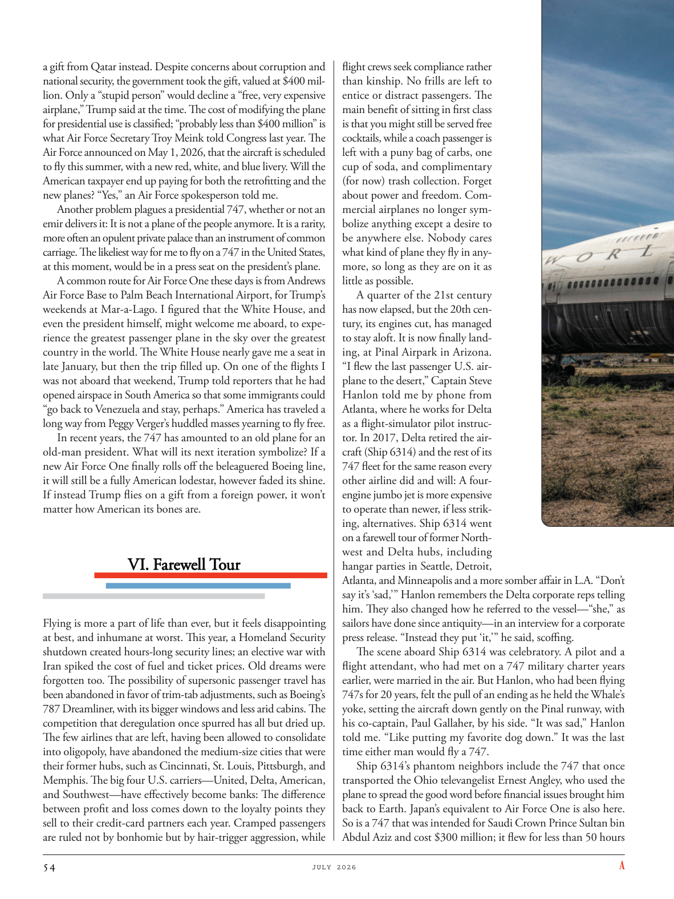

# The Atlantic — July 2026

## Page 56

---

a gift from Qatar instead. Despite concerns about corruption and national security, the government took the gift, valued at $400 million. Only a “stupid person” would decline a “free, very expensive airplane,” Trump said at the time. The cost of modifying the plane for presidential use is classified; “probably less than $400 million” is what Air Force Secretary Troy Meink told Congress last year. The Air Force announced on May 1, 2026, that the aircraft is scheduled to fly this summer, with a new red, white, and blue livery. Will the American taxpayer end up paying for both the retrofitting and the new planes? “Yes,” an Air Force spokesperson told me.

**【中文翻译】** 而是来自卡塔尔的礼物。尽管担心腐败和国家安全，政府还是接受了这份价值 4 亿美元的礼物。特朗普当时表示，只有“愚蠢的人”才会拒绝一架“免费、非常昂贵的飞机”。改装总统专机的费用是保密的；空军部长特洛伊·梅克 (Troy Meink) 去年告诉国会，“可能不到 4 亿美元”。美国空军于 2026 年 5 月 1 日宣布，该飞机计划于今年夏天试飞，并采用新的红、白、蓝涂装。美国纳税人最终会支付改装和新飞机的费用吗？ “是的，”一位空军发言人告诉我。

Another problem plagues a presidential 747, whether or not an emir delivers it: It is not a plane of the people anymore. It is a rarity, more often an opulent private palace than an instrument of common carriage. The likeliest way for me to fly on a 747 in the United States, at this moment, would be in a press seat on the president’s plane.

**【中文翻译】** 另一个问题困扰着总统 747，无论是否由埃米尔交付：它不再是人民的飞机。它非常罕见，更多时候是一座华丽的私人宫殿，而不是普通的交通工具。目前，我在美国乘坐 747 飞机最有可能的方式就是坐在总统专机的新闻座位上。

A common route for Air Force One these days is from Andrews Air Force Base to Palm Beach International Airport, for Trump’s weekends at Mar-a-Lago. I figured that the White House, and even the president himself, might welcome me aboard, to experience the greatest passenger plane in the sky over the greatest country in the world. The White House nearly gave me a seat in late January, but then the trip filled up. On one of the flights I was not aboard that weekend, Trump told reporters that he had opened airspace in South America so that some immigrants could “go back to Venezuela and stay, perhaps.” America has traveled a long way from Peggy Verger’s huddled masses yearning to fly free.

**【中文翻译】** 如今，空军一号的常见航线是从安德鲁斯空军基地飞往棕榈滩国际机场，供特朗普在海湖庄园度周末。我想白宫，甚至总统本人，可能会欢迎我登机，体验世界上最伟大国家上空的最伟大客机。一月底，白宫差点给了我一个座位，但后来行程就满了。在那个周末我没有乘坐的一趟航班上，特朗普告诉记者，他已经开放了南美洲的领空，以便一些移民“也许可以返回委内瑞拉并留下来”。美国已经从佩吉·韦尔杰（Peggy Verger）那群渴望自由飞翔的拥挤人群中走过了很长的路。

In recent years, the 747 has amounted to an old plane for an old-man president. What will its next iteration symbolize? If a new Air Force One finally rolls off the beleaguered Boeing line, it will still be a fully American lodestar, however faded its shine.

**【中文翻译】** 近年来，747对于一位老总统来说已经是一架老飞机了。它的下一次迭代将象征什么？如果一架新的空军一号最终从陷入困境的波音生产线下线，无论它的光芒如何褪色，它仍然将是完全美国的北极星。

If instead Trump flies on a gift from a foreign power, it won’t matter how American its bones are.

**【中文翻译】** 相反，如果特朗普依靠外国势力的礼物而飞翔，那么它的骨头有多美国化就无关紧要了。

#### VI. Farewell Tour

**【副标题翻译】** 六．告别之旅

#### VI. Farewell Tour

**【副标题翻译】** 六．告别之旅

Flying is more a part of life than ever, but it feels disappointing at best, and inhumane at worst. This year, a Homeland Security shutdown created hours-long security lines; an elective war with Iran spiked the cost of fuel and ticket prices. Old dreams were forgotten too. The possibility of super sonic passenger travel has been abandoned in favor of trim-tab adjustments, such as Boeing’s 787 Dreamliner, with its bigger windows and less arid cabins. The competition that deregulation once spurred has all but dried up.

**【中文翻译】** 飞行比以往任何时候都更加成为生活的一部分，但往好了说是令人失望，往坏了说是不人道。今年，国土安全部关闭，造成了长达数小时的安全排队；与伊朗的选择性战争导致燃料成本和机票价格飙升。旧梦也被遗忘了。超音速乘客旅行的可能性已被放弃，取而代之的是调整片调整，例如波音 787 梦想飞机，其窗户更大，客舱更干燥。放松管制曾经引发的竞争几乎已经枯竭。

The few airlines that are left, having been allowed to consolidate into oligopoly, have abandoned the medium-size cities that were their former hubs, such as Cincinnati, St. Louis, Pittsburgh, and Memphis. The big four U.S. carriers— United, Delta, American, and Southwest— have effectively become banks: The difference between profit and loss comes down to the loyalty points they sell to their credit-card partners each year. Cramped passengers are ruled not by bonhomie but by hair-trigger aggression, while flight crews seek compliance rather than kinship. No frills are left to entice or distract passengers. The main benefit of sitting in first class is that you might still be served free cocktails, while a coach passenger is left with a puny bag of carbs, one cup of soda, and complimentary (for now) trash collection. Forget about power and freedom. Commercial airplanes no longer symbolize anything except a desire to be anywhere else. Nobody cares what kind of plane they fly in anymore, so long as they are on it as little as possible.

**【中文翻译】** 剩下的少数航空公司被允许整合为寡头垄断，放弃了它们以前的枢纽中型城市，如辛辛那提、圣路易斯、匹兹堡和孟菲斯。美国四大航空公司——联合航空、达美航空、美国航空和西南航空——实际上已经成为银行：盈亏之间的差异取决于它们每年向信用卡合作伙伴出售的忠诚度积分。拥挤的乘客不是靠友善而是靠一触即发的攻击性来统治的，而机组人员则寻求顺从而不是亲属关系。没有多余的装饰来吸引或分散乘客的注意力。坐在头等舱的主要好处是，你可能仍然可以享用免费鸡尾酒，而长途汽车乘客则可以得到一小袋碳水化合物、一杯苏打水和免费的（目前）垃圾收集服务。忘记权力和自由。除了想去其他地方的愿望之外，商用飞机不再象征任何东西。没人再关心他们乘坐什么类型的飞机，只要他们尽可能少地乘坐飞机即可。

A quarter of the 21st century has now elapsed, but the 20th century, its engines cut, has managed to stay aloft. It is now finally landing, at Pinal Airpark in Arizona.

**【中文翻译】** 21世纪已经过去了四分之一，但引擎关闭的20世纪却依然屹立不倒。现在它终于降落在亚利桑那州的皮纳尔机场。

“I flew the last passenger U.S. airplane to the desert,” Captain Steve Hanlon told me by phone from Atlanta, where he works for Delta as a flight-simulator pilot instructor. In 2017, Delta retired the aircraft (Ship 6314) and the rest of its 747 fleet for the same reason every other airline did and will: A fourengine jumbo jet is more expensive to operate than newer, if less striking, alternatives. Ship 6314 went on a farewell tour of former Northwest and Delta hubs, including hangar parties in Seattle, Detroit, Atlanta, and Minneapolis and a more somber affair in L.A. “Don’t say it’s ‘sad,’ ” Hanlon remembers the Delta corporate reps telling him. They also changed how he referred to the vessel—“she,” as sailors have done since antiquity— in an interview for a corporate press release. “Instead they put ‘it,’ ” he said, scoffing.

**【中文翻译】** “我驾驶着最后一架美国客机飞往沙漠，”机长史蒂夫·汉隆在亚特兰大通过电话告诉我，他在亚特兰大担任达美航空飞行模拟器飞行员教练。 2017 年，达美航空退役了这架飞机（6314 号飞机）及其 747 机队的其余飞机，其原因与其他航空公司过去和将来的原因相同：四引擎大型喷气式飞机的运营成本比更新的（尽管不那么引人注目）替代品更高。 6314 号船对前西北和达美航空枢纽进行了告别之旅，包括在西雅图、底特律、亚特兰大和明尼阿波利斯举行的机库派对，以及在洛杉矶举行的更为阴沉的活动。“不要说这是‘悲伤’，”汉隆记得达美航空公司代表告诉他。他们还改变了他在接受公司新闻稿采访时提到这艘船的方式——“她”，就像自古以来水手们所做的那样。 “相反，他们写的是‘它’，”他嘲笑道。

The scene aboard Ship 6314 was celebratory. A pilot and a flight attendant, who had met on a 747 military charter years earlier, were married in the air. But Hanlon, who had been flying 747s for 20 years, felt the pull of an ending as he held the Whale’s yoke, setting the aircraft down gently on the Pinal runway, with his co-captain, Paul Gallaher, by his side. “It was sad,” Hanlon told me. “Like putting my favorite dog down.” It was the last time either man would fly a 747.

**【中文翻译】** 6314 号船上的场景很值得庆祝。一名飞行员和一名空乘人员多年前在一架 747 军用包机上相识，并在空中结婚。但已经驾驶 747 飞机 20 年的汉隆，当他握住鲸鱼的操纵杆，将飞机轻轻降落在皮纳尔跑道上时，他感受到了结局的拉力，他的副机长保罗·加拉赫 (Paul Gallaher) 就在他身边。 “这很悲伤，”汉隆告诉我。 “就像放下我最喜欢的狗一样。”这是两人最后一次驾驶 747。

Ship 6314’s phantom neighbors include the 747 that once transported the Ohio televangelist Ernest Angley, who used the plane to spread the good word before financial issues brought him back to Earth. Japan’s equivalent to Air Force One is also here.

**【中文翻译】** 6314 号飞船的幽灵邻居包括曾经搭载过俄亥俄州电视布道家欧内斯特·安格利 (Ernest Angley) 的 747 号飞机，他在财务问题将他带回地球之前曾利用这架飞机传播好消息。日本相当于空军一号的飞机也在这里。

So is a 747 that was intended for Saudi Crown Prince Sultan bin Abdul Aziz and cost $300 million; it flew for less than 50 hours

**【中文翻译】** 专为沙特王储苏丹·本·阿卜杜勒·阿齐兹设计、耗资 3 亿美元的 747 也是如此；飞行时间不到 50 小时
