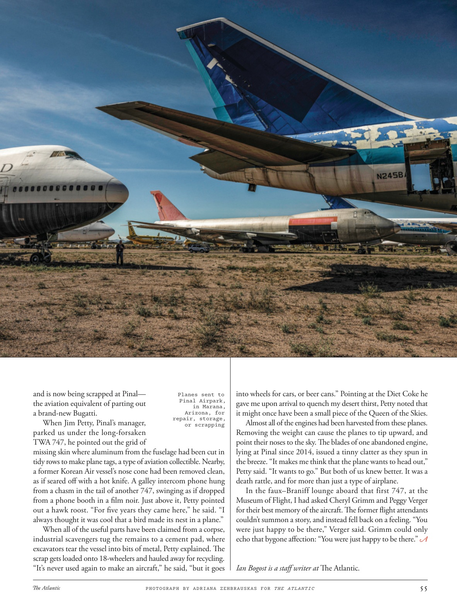

# The Atlantic — July 2026

## Page 57

---

and is now being scrapped at Pinal— the aviation equivalent of parting out a brand-new Bugatti. When Jim Petty, Pinal’s manager, parked us under the longforsaken TWA 747, he pointed out the grid of missing skin where aluminum from the fuselage had been cut in tidy rows to make plane tags, a type of aviation collectible. Nearby, a former Korean Air vessel’s nose cone had been removed clean, as if seared off with a hot knife. A galley intercom phone hung from a chasm in the tail of another 747, swinging as if dropped from a phone booth in a film noir. Just above it, Petty pointed out a hawk roost. “For five years they came here,” he said. “I always thought it was cool that a bird made its nest in a plane.”

**【中文翻译】** 现在正在皮纳尔报废——这相当于拆解一辆全新的布加迪。当皮纳尔的经理吉姆·佩蒂（Jim Petty）把我们停在这架早已被遗弃的环球航空 747 下时，他指出了缺失的蒙皮网格，机身上的铝材被整齐地切割成一排，用于制作飞机标签，这是一种航空收藏品。附近，一艘前大韩航空客机的鼻锥已被拆除干净，就像是用热刀烧掉的一样。一架厨房对讲电话悬挂在另一架 747 飞机尾部的裂缝中，摇摆不定，就像从黑色电影中的电话亭掉下来一样。佩蒂指着它上面有一个鹰栖息地。 “他们来到这里五年了，”他说。 “我一直认为鸟儿在飞机上筑巢很酷。”

When all of the useful parts have been claimed from a corpse, industrial scavengers tug the remains to a cement pad, where excavators tear the vessel into bits of metal, Petty explained. The scrap gets loaded onto 18-wheelers and hauled away for recycling.

**【中文翻译】** 佩蒂解释说，当从尸体上取出所有有用的部件后，工业拾荒者会将遗骸拖到水泥垫上，然后挖掘机将容器撕成金属碎片。废料被装载到 18 轮卡车上并运走进行回收。

“It’s never used again to make an aircraft,” he said, “but it goes into wheels for cars, or beer cans.” Pointing at the Diet Coke he Planes sent to Pinal Airpark, gave me upon arrival to quench my desert thirst, Petty noted that in Marana, it might once have been a small piece of the Queen of the Skies.

**【中文翻译】** “它再也没有被用来制造飞机，”他说，“但它被用来制造汽车的轮子或啤酒罐。”佩蒂指着飞机送到皮纳尔机场时给我解渴的健怡可乐，他指出，在马拉纳，它可能曾经是天空女王的一小块。

Arizona, for repair, storage, Almost all of the engines had been harvested from these planes. or scrapping Removing the weight can cause the planes to tip upward, and point their noses to the sky. The blades of one abandoned engine, lying at Pinal since 2014, issued a tinny clatter as they spun in the breeze. “It makes me think that the plane wants to head out,” Petty said. “It wants to go.” But both of us knew better. It was a death rattle, and for more than just a type of airplane.

**【中文翻译】** 亚利桑那州，用于维修、储存，几乎所有的发动机都是从这些飞机上回收的。或报废 去除重量可能会导致飞机向上倾斜，并使机头指向天空。自 2014 年以来，一台废弃发动机的叶片在微风中旋转时发出轻微的咔哒声。 “这让我觉得飞机要起飞，”佩蒂说。 “它想去。”但我们俩都更清楚。这是临死前的嘎嘎声，而且不仅仅是一种飞机。

In the faux–Braniff lounge aboard that first 747, at the Museum of Flight, I had asked Cheryl Grimm and Peggy Verger for their best memory of the aircraft. The former flight attendants couldn’t summon a story, and instead fell back on a feeling. “You were just happy to be there,” Verger said. Grimm could only echo that bygone affection: “You were just happy to be there.”

**【中文翻译】** 在飞行博物馆第一架 747 飞机的仿布兰尼夫休息室里，我向谢丽尔·格林 (Cheryl Grimm) 和佩吉·韦尔格 (Peggy Verger) 询问了他们对这架飞机最美好的回忆。前空乘人员无法讲述故事，只能依靠感觉。 “你很高兴能在那里，”韦尔格说。格林只能重复过去的感情：“你很高兴能在那里。”

*— Ian Bogost is a staff writer at The Atlantic .*

*【作者署名】伊恩·博格斯特是《大西洋月刊》的特约撰稿人。*

*PHOTOGRAPH BY ADRIANA ZEHBRAUSKAS FOR THE ATLANTIC*

*【图注与署名】摄影：ADRIANA ZEHBRAUSKAS 为《大西洋》拍摄*
