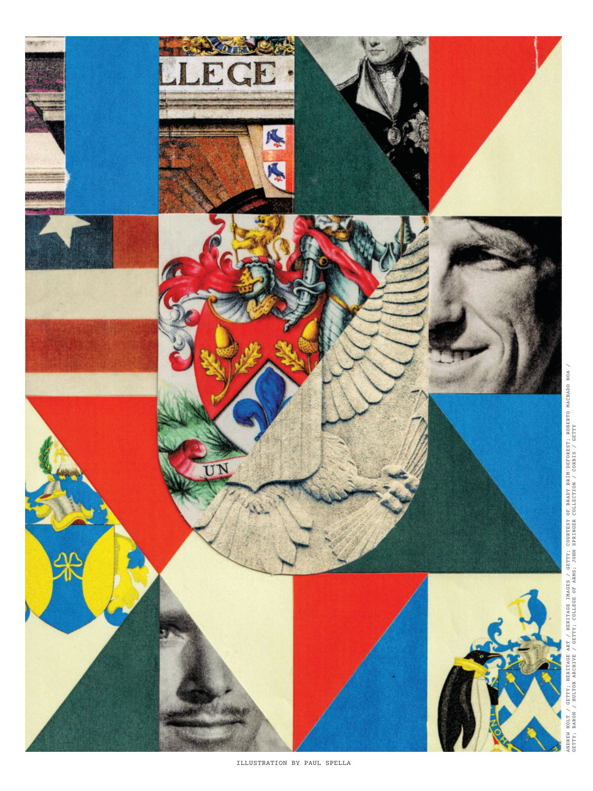

# The Atlantic — July 2026

## Page 58

---

*ILLUSTRATION BY PAUL SPELLA*

*【图注与署名】保罗·斯佩拉插图*

*ANDREW HOLT / GETTY; HERITAGE ART / HERITAGE IMAGES / GETTY; COURTESY OF BRADY BRIM-DEFOREST; ROBERTO MACHADO NOA /*

*【图注与署名】安德鲁·霍尔特/盖蒂图片社；遗产艺术/遗产图像/盖蒂图片社；由 Brady Brim-DEFOREST 提供；罗伯托·马查多·诺亚 /*

*GETTY; BARON / HULTON ARCHIVE / GETTY; COLLEGE OF ARMS; JOHN SPRINGER COLLECTION / CORBIS / GETTY*

*【图注与署名】盖蒂图片社；男爵/赫尔顿档案馆/盖蒂图片社；武器学院；约翰·斯普林格系列 / CORBIS / GETTY*
