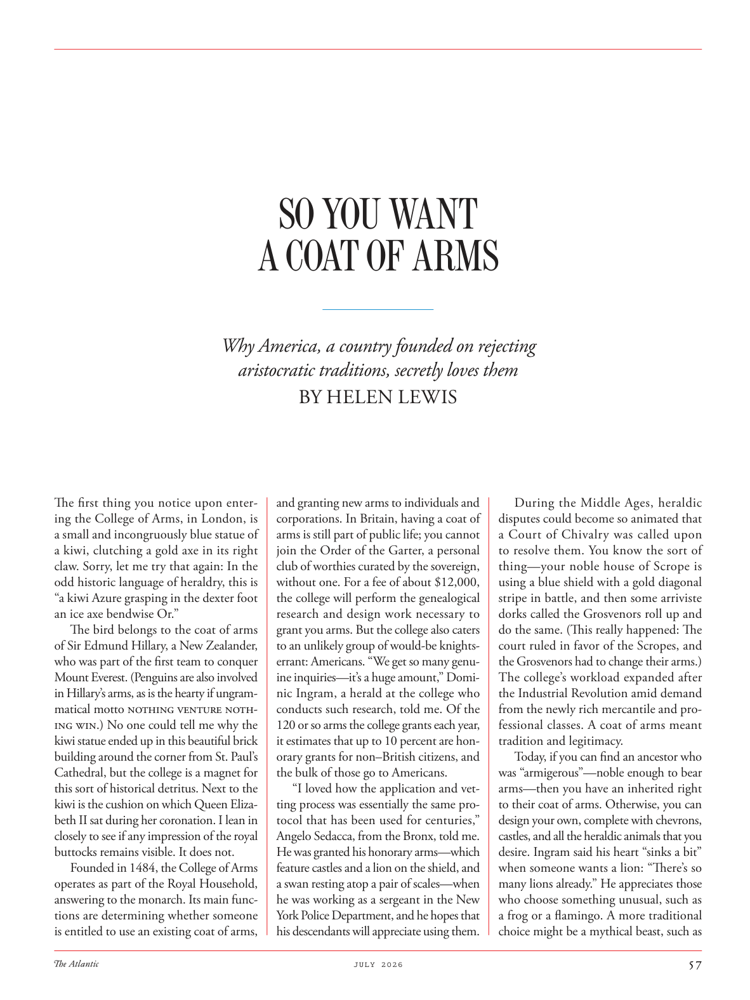

# The Atlantic — July 2026

## Page 59

---

#### Why America, a country founded on rejecting

**【副标题翻译】** 为什么美国是一个以拒绝为基础的国家

The first thing you notice upon entering the College of Arms, in London, is a small and in con gruously blue statue of a kiwi, clutching a gold axe in its right claw. Sorry, let me try that again: In the odd historic language of heraldry, this is “a kiwi Azure grasping in the dexter foot an ice axe bendwise Or.”

**【中文翻译】** 进入伦敦武器学院后，您首先注意到的是一座蓝色的奇异鸟雕像，右爪抓着一把金斧头。抱歉，让我再试一次：用奇怪的纹章历史语言来说，这是“猕猴桃天蓝右脚抓着一把弯曲的冰镐”。

The bird belongs to the coat of arms of Sir Edmund Hillary, a New Zealander, who was part of the first team to conquer Mount Everest. (Penguins are also involved in Hillary’s arms, as is the hearty if ungrammatical motto Nothing venture nothing win.) No one could tell me why the kiwi statue ended up in this beautiful brick building around the corner from St. Paul’s Cathedral, but the college is a magnet for this sort of historical detritus. Next to the kiwi is the cushion on which Queen Elizabeth II sat during her coronation. I lean in closely to see if any impression of the royal buttocks remains visible. It does not.

**【中文翻译】** 这只鸟属于新西兰人埃德蒙·希拉里爵士的徽章，他是第一支征服珠穆朗玛峰团队的成员。 （希拉里的怀里也有企鹅，正如那句不合语法的座右铭：“一事无成，一事无成”。）没有人能告诉我为什么奇异鸟雕像最终会出现在圣保罗大教堂拐角处这座美丽的砖砌建筑中，但学院却吸引着这种历史碎片。猕猴桃旁边是伊丽莎白二世女王加冕时坐的垫子。我凑近了看是否还能看到皇家臀部的痕迹。事实并非如此。

Founded in 1484, the College of Arms operates as part of the Royal Household, answering to the monarch. Its main functions are determining whether someone is entitled to use an existing coat of arms,

**【中文翻译】** 武器学院成立于 1484 年，隶属于皇室，听命于君主。它的主要功能是确定某人是否有权使用现有的徽章，

### SO YOU WANT

**【标题翻译】** 所以你想要的

### A COAT OF ARMS

**【标题翻译】** 徽章

#### aristocratic traditions, secretly loves them

**【副标题翻译】** 贵族传统，暗自喜爱

#### BY HELEN LEWIS

**【副标题翻译】** 作者：海伦·刘易斯

and granting new arms to individuals and corporations. In Britain, having a coat of arms is still part of public life; you cannot join the Order of the Garter, a personal club of worthies curated by the sovereign, without one. For a fee of about $12,000, the college will perform the genealogical research and design work necessary to grant you arms. But the college also caters to an unlikely group of would-be knightserrant: Americans. “We get so many genuine inquiries—it’s a huge amount,” Dominic Ingram, a herald at the college who conducts such research, told me. Of the 120 or so arms the college grants each year, it estimates that up to 10 percent are honorary grants for non–British citizens, and the bulk of those go to Americans.

**【中文翻译】** 并向个人和公司授予新武器。在英国，拥有徽章仍然是公共生活的一部分。如果没有一个人，你就无法加入嘉德勋章，这是一个由君主策划的个人俱乐部。学院将支付大约 12,000 美元的费用，进行必要的家谱研究和设计工作，以授予您武器。但该学院也迎合了一群不太可能成为骑士的人：美国人。 “我们收到了很多真诚的询问——数量巨大，”负责此类研究的学院先驱多米尼克·英格拉姆 (Dominic Ingram) 告诉我。据估计，该学院每年拨款 120 项左右，其中高达 10% 是向非英国公民提供的荣誉拨款，其中大部分都流向了美国人。

“I loved how the application and vetting process was essentially the same protocol that has been used for centuries,” Angelo Sedacca, from the Bronx, told me.

**【中文翻译】** “我喜欢申请和审查过程本质上与已经使用了几个世纪的协议相同，”来自布朗克斯的安吉洛塞达卡告诉我。

He was granted his honorary arms—which feature castles and a lion on the shield, and a swan resting atop a pair of scales—when he was working as a sergeant in the New York Police Department, and he hopes that his descendants will appreciate using them.

**【中文翻译】** 当他在纽约警察局担任警官时，他被授予了荣誉徽章——盾牌上有城堡和狮子，还有一对鳞片上休息的天鹅，他希望他的后代会喜欢使用这些徽章。

During the Middle Ages, heraldic disputes could become so animated that a Court of Chivalry was called upon to resolve them. You know the sort of thing—your noble house of Scrope is using a blue shield with a gold diagonal stripe in battle, and then some arriviste dorks called the Grosvenors roll up and do the same. (This really happened: The court ruled in favor of the Scropes, and the Grosvenors had to change their arms.) The college’s workload expanded after the Industrial Revolution amid demand from the newly rich mercantile and professional classes. A coat of arms meant tradition and legitimacy.

**【中文翻译】** 在中世纪，纹章争议可能变得如此激烈，以至于需要骑士法庭来解决它们。你知道这样的事情——你的斯克罗普贵族家族在战斗中使用带有金色斜条纹的蓝色盾牌，然后一些被称为格罗夫纳家族的暴发户也卷起了同样的事情。 （这确实发生了：法院做出了有利于斯科普斯家族的裁决，格罗夫纳家族不得不改变立场。）工业革命后，由于新富的商业和专业阶层的需求，学院的工作量扩大了。徽章意味着传统和合法性。

Today, if you can find an ancestor who was “armigerous”—noble enough to bear arms—then you have an inherited right to their coat of arms. Otherwise, you can design your own, complete with chevrons, castles, and all the heraldic animals that you desire. Ingram said his heart “sinks a bit” when someone wants a lion: “There’s so many lions already.” He appreciates those who choose something unusual, such as a frog or a flamingo. A more traditional choice might be a mythical beast, such as

**【中文翻译】** 今天，如果你能找到一位“武装”的祖先——高贵到可以携带武器——那么你就有继承他们纹章的权利。或者，您也可以设计自己的徽章、城堡和所有您想要的纹章动物。英格拉姆说，当有人想要一只狮子时，他的心“有点沉”：“已经有很多狮子了。”他欣赏那些选择不寻常的东西的人，比如青蛙或火烈鸟。更传统的选择可能是神兽，例如
