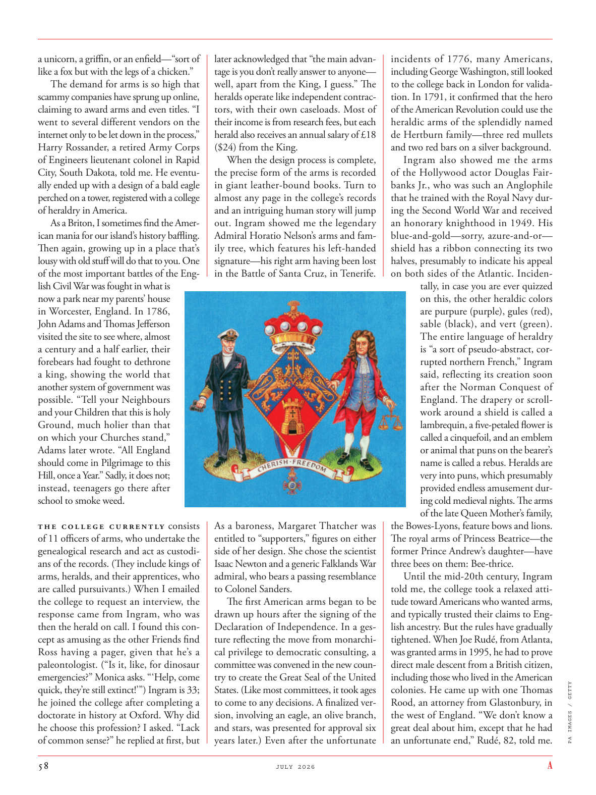

# The Atlantic — July 2026

## Page 60

---

a unicorn, a griffin, or an enfield—“sort of like a fox but with the legs of a chicken.” The demand for arms is so high that scammy companies have sprung up online, claiming to award arms and even titles. “I went to several different vendors on the internet only to be let down in the process,” Harry Rossander, a retired Army Corps of Engineers lieutenant colonel in Rapid City, South Dakota, told me. He eventually ended up with a design of a bald eagle perched on a tower, registered with a college of heraldry in America.

**【中文翻译】** 独角兽、狮鹫或恩菲尔德——“有点像狐狸，但有鸡腿。”对武器的需求如此之高，以至于诈骗公司在网上如雨后春笋般涌现，声称可以授予武器甚至头衔。 “我在互联网上找了几家不同的供应商，但在这个过程中都感到失望，”南达科他州拉皮德城的退役陆军工程兵中校哈利·罗桑德告诉我。他最终设计出了一只栖息在塔上的秃鹰，并在美国纹章学院注册。

As a Briton, I sometimes find the American mania for our island’s history baffling. Then again, growing up in a place that’s lousy with old stuff will do that to you. One of the most important battles of the English Civil War was fought in what is now a park near my parents’ house in Worcester, England. In 1786, John Adams and Thomas Jefferson visited the site to see where, almost a century and a half earli er, their forebears had fought to dethrone a king, showing the world that another system of government was possible. “Tell your Neighbours and your Children that this is holy Ground, much holier than that on which your Churches stand,” Adams later wrote. “All England should come in Pilgrimage to this Hill, once a Year.” Sadly, it does not; instead, teen agers go there after school to smoke weed.

**【中文翻译】** 作为一名英国人，我有时会发现美国人对我们岛屿历史的狂热令人困惑。话又说回来，在一个充满旧东西的地方长大也会对你造成这种影响。英国内战中最重要的战斗之一是在英国伍斯特我父母家附近的一个公园里进行的。 1786 年，约翰·亚当斯 (John Adams) 和托马斯·杰斐逊 (Thomas Jefferson) 访问了该遗址，看看大约一个半世纪前，他们的祖先曾在这里为推翻国王而奋斗，向世界展示另一种政府制度是可能的。 “告诉你的邻居和你的孩子，这是圣地，比你的教堂所在的地方神圣得多，”亚当斯后来写道。 “全英格兰都应该来这座山朝圣，每年一次。”遗憾的是，事实并非如此；相反，青少年放学后去那里吸大麻。

The college currently consists of 11 officers of arms, who undertake the genealogical research and act as custodians of the records. (They include kings of arms, heralds, and their apprentices, who are called pursuivants.) When I emailed the college to request an interview, the response came from Ingram, who was then the herald on call. I found this concept as amusing as the other Friends find Ross having a pager, given that he’s a paleontologist. (“Is it, like, for dinosaur emergencies?” Monica asks. “ ‘Help, come quick, they’re still extinct!’ ”) Ingram is 33; he joined the college after completing a doctorate in history at Oxford. Why did he choose this profession? I asked. “Lack of common sense?” he replied at first, but later acknowledged that “the main advantage is you don’t really answer to anyone— well, apart from the King, I guess.” The heralds operate like independent contractors, with their own caseloads. Most of their income is from research fees, but each herald also receives an annual salary of £18 ($24) from the King.

**【中文翻译】** 该学院目前由 11 名军官组成，他们负责家谱研究并担任记录保管人。 （他们包括纹章国王、传令官和他们的学徒，他们被称为追随者。）当我给学院发电子邮件请求采访时，回复来自英格拉姆，他当时是值班的传令官。我发现这个概念很有趣，就像其他朋友发现罗斯有寻呼机一样有趣，因为他是一名古生物学家。 （“这是恐龙紧急情况吗？”莫妮卡问道。“‘救命，快点，它们还没灭绝！’”）英格拉姆 33 岁；他在牛津大学获得历史博士学位后加入了该学院。他为什么选择这个职业？我问。 “缺乏常识？”他一开始回答道，但后来承认，“主要的好处是你不需要真正向任何人负责——好吧，我想除了国王之外。”先驱者像独立承包商一样运作，有自己的案件量。他们的大部分收入来自研究费，但每位传令官还从国王那里获得 18 英镑（24 美元）的年薪。

When the design process is complete, the precise form of the arms is recorded in giant leather-bound books. Turn to almost any page in the college’s records and an intriguing human story will jump out. Ingram showed me the legendary Admiral Horatio Nelson’s arms and family tree, which features his left-handed signature— his right arm having been lost in the Battle of Santa Cruz, in Tenerife.

**【中文翻译】** 当设计过程完成后，手臂的精确形状被记录在巨大的皮革装订书籍中。翻开学院记录中的几乎任何一页，都会跳出一个有趣的人类故事。英格拉姆向我展示了传奇海军上将霍雷肖·纳尔逊的纹章和家谱，其中有他的左手签名——他的右臂在特内里费岛的圣克鲁斯战役中失去了。

As a baroness, Margaret Thatcher was entitled to “supporters,” figures on either side of her design. She chose the scientist Isaac Newton and a generic Falklands War admiral, who bears a passing resemblance to Colonel Sanders.

**【中文翻译】** 作为男爵夫人，玛格丽特·撒切尔有权拥有“支持者”，即她的设计两边的人物。她选择了科学家艾萨克·牛顿和一位与桑德斯上校非常相似的马岛战争海军上将。

The first American arms began to be drawn up hours after the signing of the Declaration of Independence. In a gesture reflecting the move from monarchical privilege to democratic consulting, a committee was convened in the new country to create the Great Seal of the United States. (Like most committees, it took ages to come to any decisions. A finalized version, involving an eagle, an olive branch, and stars, was presented for approval six years later.) Even after the unfortunate incidents of 1776, many Americans, including George Washington, still looked to the college back in London for validation. In 1791, it confirmed that the hero of the American Revolution could use the heraldic arms of the splendidly named de Hertburn family—three red mullets and two red bars on a silver background.

**【中文翻译】** 《独立宣言》签署几小时后，第一批美国武器就开始起草。为了体现从君主特权到民主协商的转变，在新国家召开了一个委员会来制作美国国玺。 （像大多数委员会一样，花了很长时间才做出决定。六年后，包含一只鹰、一根橄榄枝和星星的最终版本被提交批准。）即使在 1776 年发生不幸事件之后，包括乔治·华盛顿在内的许多美国人仍然向伦敦的学院寻求验证。 1791 年，它确认美国革命英雄可以使用德赫特伯恩家族的纹章——银色背景上的三条红鲻鱼和两条红条。

Ingram also showed me the arms of the Hollywood actor Douglas Fairbanks Jr., who was such an Anglophile that he trained with the Royal Navy during the Second World War and received an honorary knighthood in 1949. His blue-and-gold—sorry, azure-and-or— shield has a ribbon connecting its two halves, presumably to indicate his appeal on both sides of the Atlantic. Incidentally, in case you are ever quizzed on this, the other heraldic colors are purpure (purple), gules (red), sable (black), and vert (green).

**【中文翻译】** 英格拉姆还向我展示了好莱坞演员小道格拉斯·费尔班克斯 (Douglas Fairbanks Jr.) 的纹章，他非常亲英，在第二次世界大战期间在皇家海军接受训练，并于 1949 年获得了荣誉爵士称号。他的蓝色和金色盾牌（对不起，天蓝色和或蓝色）有一条丝带连接着盾牌的两半，大概是为了表明他对大西洋两岸的吸引力。顺便说一句，如果您对此有疑问，其他纹章颜色是 purpure（紫色）、gules（红色）、sable（黑色）和 vert（绿色）。

The entire language of heraldry is “a sort of pseudo-abstract, corrupted northern French,” Ingram said, reflecting its creation soon after the Norman Conquest of England. The drapery or scrollwork around a shield is called a lambrequin, a five-petaled flower is called a cinquefoil, and an emblem or animal that puns on the bearer’s name is called a rebus. Heralds are very into puns, which presumably provided endless amusement during cold medieval nights. The arms of the late Queen Mother’s family, the Bowes-Lyons, feature bows and lions.

**【中文翻译】** 英格拉姆说，整个纹章语言是“一种伪抽象的、腐败的北法语”，反映了诺曼征服英格兰后不久的纹章学语言的产生。盾牌周围的帷幔或涡卷被称为“lambrequin”，五瓣花被称为“cinquefoil”，而与持有者名字双关的徽章或动物被称为“rebus”。先驱们非常喜欢双关语，这大概在寒冷的中世纪夜晚提供了无尽的乐趣。已故王太后家族鲍斯-莱昂家族的纹章上有弓和狮子。

The royal arms of Princess Beatrice— the former Prince Andrew’s daughter—have three bees on them: Bee-thrice. Until the mid-20th century, Ingram told me, the college took a relaxed attitude toward Americans who wanted arms, and typically trusted their claims to English ancestry. But the rules have gradually tightened. When Joe Rudé, from Atlanta, was granted arms in 1995, he had to prove direct male descent from a British citizen, including those who lived in the American

**【中文翻译】** 前安德鲁王子的女儿比阿特丽斯公主的王室纹章上有三只蜜蜂：蜜蜂三次。英格拉姆告诉我，直到 20 世纪中叶，学院对想要武器的美国人都采取宽松的态度​​，并且通常相信他们对英国血统的宣称。但规则已经逐渐收紧。 1995 年，来自亚特兰大的乔·鲁德 (Joe Rudé) 获得武器时，必须证明他是英国公民的直系男性后裔，包括居住在美国的英国公民。

*PA IMAGES / GETTY*

*【图注与署名】PA 图片/盖蒂图片社*

colonies. He came up with one Thomas Rood, an attorney from Glastonbury, in the west of England. “We don’t know a great deal about him, except that he had an unfortunate end,” Rudé, 82, told me.

**【中文翻译】** 殖民地。他想到了托马斯·鲁德（Thomas Rood），他是来自英格兰西部格拉斯顿伯里的一名律师。 “我们对他了解不多，只知道他有一个不幸的结局，”82 岁的鲁德告诉我。
