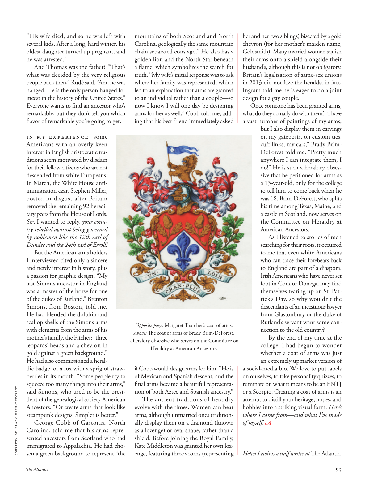

# The Atlantic — July 2026

## Page 61

---

“His wife died, and so he was left with several kids. After a long, hard winter, his oldest daughter turned up pregnant, and he was arrested.”

**【中文翻译】** “他的妻子去世了，留下了几个孩子。经过一个漫长而艰难的冬天，他的大女儿怀孕了，他被捕了。”

And Thomas was the father? “That’s what was decided by the very religious people back then,” Rudé said. “And he was hanged. He is the only person hanged for incest in the history of the United States.”

**【中文翻译】** 托马斯是孩子的父亲？ “这是当时非常虔诚的宗教人士所决定的，”鲁德说。 “他被绞死了。他是美国历史上唯一因乱伦而被绞死的人。”

Everyone wants to find an ancestor who’s remarkable, but they don’t tell you which fl avor of remarkable you’re going to get. I n m y e x p e r i e n c e , some Americans with an overly keen interest in English aristocratic traditions seem motivated by disdain for their fellow citizens who are not descended from white Europeans.

**【中文翻译】** 每个人都想找到一位非凡的祖先，但他们不会告诉你你会得到哪种非凡的味道。根据我的经验，一些对英国贵族传统过于浓厚兴趣的美国人似乎是出于对非欧洲白人后裔的同胞的蔑视。

In March, the White House antiimmigration czar, Stephen Miller, posted in disgust after Britain removed the remaining 92 hereditary peers from the House of Lords.

**【中文翻译】** 今年 3 月，英国将剩余 92 名世袭贵族逐出上议院后，白宫反移民沙皇斯蒂芬·米勒 (Stephen Miller) 发表了不满的言论。

Sir , I wanted to reply, your country rebelled against being governed by noblemen like the 12th earl of Dundee and the 24th earl of Erroll !

**【中文翻译】** 先生，我想回答一下，你们的国家反抗了十二代邓迪伯爵和二十四代埃罗尔伯爵这样的贵族统治！

But the American arms holders I interviewed cited only a sincere and nerdy interest in history, plus a passion for graphic design. “My last Simons ancestor in England was a master of the horse for one of the dukes of Rutland,” Brenton Simons, from Boston, told me.

**【中文翻译】** 但我采访的美国武器持有者只提到了对历史的真诚而书呆子的兴趣，以及对平面设计的热情。 “我在英国的最后一位西蒙斯祖先是拉特兰公爵之一的马术大师，”来自波士顿的布伦顿·西蒙斯告诉我。

He had blended the dolphin and scallop shells of the Simons arms with elements from the arms of his mother’s family, the Fitches: “three leopards’ heads and a chevron in gold against a green background.”

**【中文翻译】** 他将西蒙斯家族的海豚和扇贝壳与他母亲家族菲奇家族的元素融合在一起：“绿色背景下的三个豹头和金色 V 形图案。”

He had also commissioned a heraldic badge, of a fox with a sprig of strawberries in its mouth. “Some people try to squeeze too many things into their arms,”

**【中文翻译】** 他还委托制作了一枚纹章徽章，徽章上有一只嘴里衔着草莓枝的狐狸。 “有些人试图把太多的东西塞进怀里，”

*COURTESY OF BRADY BRIM-DEFOREST*

*【图注与署名】由 Brady Brim-DEFOREST 提供*

said Simons, who used to be the president of the genealogical society American Ancestors. “Or create arms that look like steampunk designs. Simpler is better.”

**【中文翻译】** 曾担任美国祖先家谱协会主席的西蒙斯说道。 “或者创造看起来像蒸汽朋克设计的手臂。越简单越好。”

George Cobb of Gastonia, North Carolina, told me that his arms represented ancestors from Scotland who had immigrated to Appalachia. He had chosen a green background to represent “the mountains of both Scotland and North Carolina, geologically the same mountain chain separated eons ago.” He also has a golden lion and the North Star beneath a fl ame, which symbolizes the search for truth. “My wife’s initial response was to ask where her family was represented, which led to an explanation that arms are granted to an individual rather than a couple—so now I know I will one day be designing arms for her as well,” Cobb told me, adding that his best friend immediately asked Opposite page: Margaret Th atcher’s coat of arms.

**【中文翻译】** 北卡罗来纳州加斯托尼亚的乔治·科布告诉我，他的手臂代表了从苏格兰移民到阿巴拉契亚的祖先。他选择了绿色背景来代表“苏格兰和北卡罗来纳州的山脉，在地质上，同一条山脉在亿万年前就分开了”。他还有一只金狮和火焰下的北极星，象征着对真理的追求。 “我妻子的第一反应是询问她的家人在哪里有代表，这导致了一个解释，武器是授予个人而不是夫妇的——所以现在我知道有一天我也会为她设计武器，”科布告诉我，并补充说他最好的朋友立即问了对面的页面：玛格丽特·撒切尔的徽章。

Above: The coat of arms of Brady Brim-DeForest, a heraldry obsessive who serves on the Committee on Heraldry at American Ancestors. if Cobb would design arms for him. “He is of Mexican and Spanish descent, and the final arms became a beautiful representation of both Aztec and Spanish ancestry.”

**【中文翻译】** 上图：布雷迪·布里姆·德福雷斯特 (Brady Brim-DeForest) 的纹章，他是一名纹章迷，在美国祖先纹章委员会任职。如果科布愿意为他设计手臂的话。 “他有墨西哥和西班牙血统，最后的手臂成为阿兹特克和西班牙血统的美丽代表。”

The ancient traditions of heraldry evolve with the times. Women can bear arms, although unmarried ones traditionally display them on a diamond (known as a lozenge) or oval shape, rather than a shield. Before joining the Royal Family, Kate Middleton was granted her own lozenge, featuring three acorns (representing her and her two siblings) bisected by a gold chevron (for her mother’s maiden name, Goldsmith). Many married women squish their arms onto a shield alongside their husband’s, although this is not obligatory.

**【中文翻译】** 纹章学的古老传统随着时代的发展而发展。女性可以携带武器，尽管未婚女性传统上将武器展示为菱形（称为菱形）或椭圆形，而不是盾牌。在加入王室之前，凯特·米德尔顿获得了自己的菱形徽章，上面有三个橡子（代表她和她的两个兄弟姐妹），中间被一个金色 V 形徽章（代表她母亲的娘家姓氏戈德史密斯）一分为二。许多已婚妇女将手臂与丈夫并排放在盾牌上，尽管这不是强制性的。

Britain’s legalization of same-sex unions in 2013 did not faze the heralds; in fact, Ingram told me he is eager to do a joint design for a gay couple.

**【中文翻译】** 2013年英国同性婚姻合法化并没有让先驱们感到不安。事实上，英格拉姆告诉我，他渴望为一对同性恋情侣进行联合设计。

Once someone has been granted arms, what do they actually do with them? “I have a vast number of paintings of my arms, but I also display them in carvings on my gateposts, on custom ties, cuff links, my cars,” Brady BrimDeForest told me. “Pretty much anywhere I can integrate them, I do!” He is such a heraldry obsessive that he petitioned for arms as a 15-year-old, only for the college to tell him to come back when he was 18. Brim-DeForest, who splits his time among Texas, Maine, and a castle in Scotland, now serves on the Committee on Heraldry at American Ancestors.

**【中文翻译】** 一旦有人获得武器，他们实际上会用这些武器做什么？ “我有大量关于我手臂的画作，但我也会在门柱、定制领带、袖扣、我的汽车上展示它们，”布雷迪·布里姆德福雷斯特告诉我。 “几乎任何我可以将它们整合在一起的地方，我都会这样做！”他对纹章十分痴迷，15 岁时就向学校申请获得武器，但学院却告诉他在 18 岁时回来。布里姆-德福雷斯特经常往返于德克萨斯州、缅因州和苏格兰的一座城堡之间，现在是美国祖先纹章委员会的成员。

As I listened to stories of men searching for their roots, it occurred to me that even white Americans who can trace their forebears back to England are part of a diaspora.

**【中文翻译】** 当我听到人们寻根的故事时，我突然想到，即使是祖先可以追溯到英国的美国白人也是侨民的一部分。

Irish Americans who have never set foot in Cork or Donegal may find themselves tearing up on St. Patrick’s Day, so why wouldn’t the descendants of an incestuous lawyer from Glastonbury or the duke of Rutland’s servant want some connection to the old country?

**【中文翻译】** 从未踏足科克或多尼戈尔的爱尔兰裔美国人可能会发现自己在圣帕特里克节落泪，那么为什么来自格拉斯顿伯里的乱伦律师或拉特兰公爵仆人的后裔不希望与这个古老的国家有一些联系呢？

By the end of my time at the college, I had begun to wonder whether a coat of arms was just an extremely upmarket version of a social-media bio. We love to put labels on ourselves, to take personality quizzes, to ruminate on what it means to be an ENTJ or a Scorpio. Creating a coat of arms is an attempt to distill your heritage, hopes, and hobbies into a striking visual form: Here’s where I came from— and what I’ve made of myself . Helen Lewis is a staff writer at The Atlantic .

**【中文翻译】** 大学毕业时，我开始怀疑徽章是否只是社交媒体简介的极其高档版本。我们喜欢给自己贴标签，喜欢做性格测验，喜欢思考成为 ENTJ 或天蝎座意味着什么。创作徽章是一种尝试，将你的传统、希望和爱好提炼成一种引人注目的视觉形式：这就是我来自的地方——以及我对自己的塑造。海伦·刘易斯是《大西洋月刊》的特约撰稿人。
