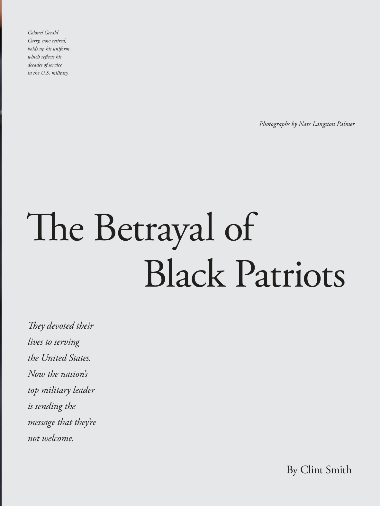

# The Atlantic — July 2026

## Page 63

---

Colonel Gerald Curry, now retired, holds up his uniform, which reflects his decades of service in the U.S. military.

**【中文翻译】** 现已退休的杰拉尔德·库里上校举起他的制服，这反映了他在美国军队服役数十年的经历。

### The Betrayal of

**【标题翻译】** 的背叛

#### They devoted their

**【副标题翻译】** 他们奉献了自己的

#### lives to serving

**【副标题翻译】** 活着就是为了服务

#### the United States.

**【副标题翻译】** 美国。

#### Now the nation’s

**【副标题翻译】** 现在国家的

#### top military leader

**【副标题翻译】** 最高军事领导人

#### is sending the

**【副标题翻译】** 正在发送

#### message that they’re

**【副标题翻译】** 消息说他们是

#### not welcome.

**【副标题翻译】** 不受欢迎。

### Black Patriots

**【标题翻译】** 黑人爱国者队

Photographs by Nate Langston Palmer

**【中文翻译】** 内特·兰斯顿·帕尔默摄影

### By Clint Smith

**【标题翻译】** 克林特·史密斯
